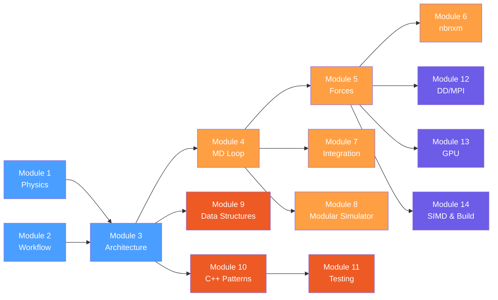

# GROMACS Codebase Learning Curriculum

> **Audience:** Junior C++ developers and computational biologists who want to deeply understand the GROMACS molecular dynamics simulation engine — a ~2M line C++ codebase with 45+ modules.

---

## How to Use This Curriculum

Each module is a self-contained markdown file with:

- **Conceptual explanations** with diagrams (Mermaid)
- **Code fragments** from the actual GROMACS source (with file paths and line numbers)
- **Exercises** that send you into the codebase to discover things yourself
- **Key takeaways** summarizing the most important points

Read the modules in order within each phase. The exercises are essential — reading about code is not the same as reading code.

---

## Curriculum Map



---

## Phase 1: Foundations (Modules 1-3)

Build the physics vocabulary, user workflow understanding, and high-level architecture map.

| # | Module | What You'll Learn |
|---|--------|-------------------|
| 01 | [Physics Foundations](01-physics-foundations.md) | Newton's equations, potential energy terms, ensembles, GROMACS units |
| 02 | [Workflow & Tools](02-workflow-and-tools.md) | The pdb2gmx → grompp → mdrun pipeline, file formats, command dispatch |
| 03 | [Architecture Overview](03-architecture-overview.md) | The 45+ module map, `LegacySimulatorData`, namespace conventions, builder patterns |

## Phase 2: The Simulation Engine (Modules 4-8)

Dissect the MD loop, force calculations, integration, constraints, and the modern modular simulator.

| # | Module | What You'll Learn |
|---|--------|-------------------|
| 04 | [The MD Loop](04-md-loop.md) | `do_md()` structure, step decisions, force flags, global vs local state |
| 05 | [Force Calculation](05-force-calculation.md) | `do_force()`, three force categories, neighbor search, `t_forcerec` |
| 06 | [nbnxm Non-Bonded](06-nbnxm-nonbonded.md) | Verlet list, NxM clusters, SIMD kernels, GPU kernels |
| 07 | [Integration & Constraints](07-integration-constraints.md) | Leap-frog, velocity Verlet, thermostats, barostats, LINCS/SETTLE |
| 08 | [Modular Simulator](08-modular-simulator.md) | `ISimulatorElement`, signaller pattern, composable simulation steps |

## Phase 3: Data Structures & C++ Patterns (Modules 9-11)

Deep dive into core data types, C++ idioms, and the testing infrastructure.

| # | Module | What You'll Learn |
|---|--------|-------------------|
| 09 | [Core Data Structures](09-data-structures.md) | `t_state`, `t_forcerec`, topology hierarchy, `t_inputrec` |
| 10 | [C++ Patterns & Idioms](10-cpp-patterns.md) | `ArrayRef`, `PaddedVector`, `EnumerationArray`, builders, RAII, strong typing |
| 11 | [Testing Infrastructure](11-testing.md) | Google Test, `TestReferenceData`, parameterized tests, floating-point tolerance |

## Phase 4: Advanced Topics (Modules 12-14)

Domain decomposition, GPU acceleration, SIMD abstractions, and the build system.

| # | Module | What You'll Learn |
|---|--------|-------------------|
| 12 | [Domain Decomposition & MPI](12-parallelism.md) | Spatial decomposition, halo exchange, PME-PP separation, load balancing |
| 13 | [GPU Acceleration](13-gpu-acceleration.md) | `DeviceBuffer<T>`, stream management, CUDA/SYCL/HIP backends, CPU/GPU overlap |
| 14 | [SIMD & Build System](14-simd-and-build.md) | `SimdReal`, backend implementations, CMake configuration |

---

## Recommended Reading Order

### For computational biologists (physics-first path):

```
1 → 2 → 3 → 9 → 10 → 4 → 5 → 7 → 6 → 8 → 11 → 12 → 13 → 14
```

### For C++ developers (code-first path):

```
2 → 3 → 10 → 9 → 1 → 4 → 5 → 7 → 11 → 6 → 8 → 12 → 13 → 14
```

### For HPC/GPU specialists (performance-first path):

```
1 → 2 → 3 → 4 → 5 → 6 → 14 → 13 → 12 → 7 → 8 → 9 → 10 → 11
```

---

## Prerequisites

- **C++ fundamentals:** classes, templates, smart pointers, move semantics, virtual functions
- **Basic physics:** Newton's laws, potential energy, forces
- **Basic Linux/CLI:** navigating directories, running commands
- **Git:** cloning, navigating commit history

Optional but helpful:
- CMake build system basics
- MPI concepts (ranks, communicators)
- GPU programming concepts (kernels, device memory, streams)

---

## Source Code Navigation Tips

All file references in these modules use paths relative to the GROMACS repository root. For example:

```
src/gromacs/math/units.h          ← physical constants
src/programs/gmx.cpp              ← the main() entry point
src/gromacs/mdrun/md.cpp          ← the MD simulation loop
```

To follow along effectively:
1. Clone the GROMACS repository
2. Use an IDE with C++ indexing (CLion, VS Code with clangd, etc.)
3. Build with CMake to get full symbol resolution
4. Use `grep -rn` or your IDE's search to find symbols across the codebase
