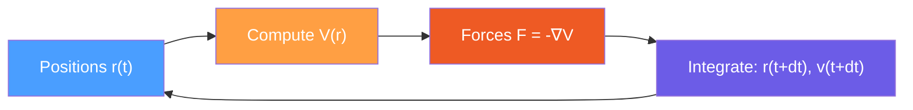
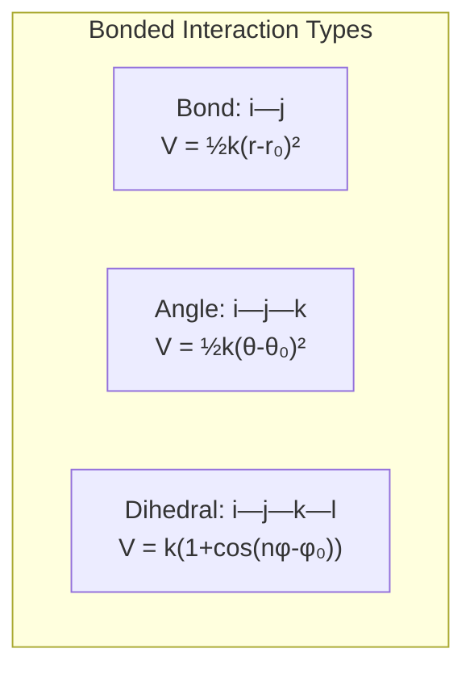
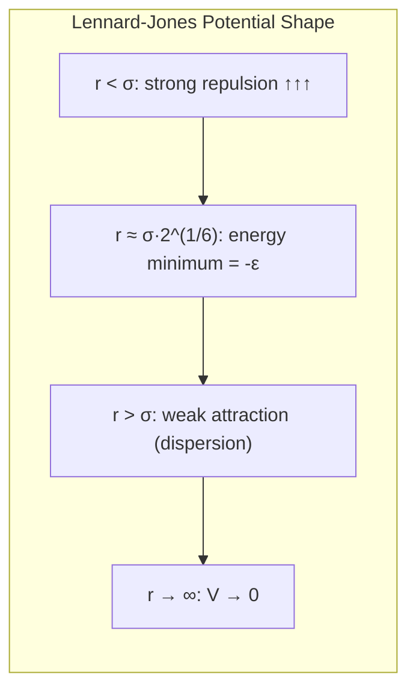

# Module 1: Molecular Dynamics — The Physics in 30 Minutes

> **Goal:** Build the physics vocabulary you need to read GROMACS source code. Every variable name, function parameter, and data structure in GROMACS maps to a physics concept — this module gives you that mapping.

> **Prerequisites:** High-school physics (Newton's laws), basic calculus (derivatives, gradients)

---

## 1.1 What is Molecular Dynamics?

Molecular dynamics (MD) simulates the motion of atoms over time by numerically solving Newton's equations of motion:

$$\mathbf{F}_i = m_i \mathbf{a}_i = m_i \frac{d^2 \mathbf{r}_i}{dt^2}$$

For each atom $i$ with mass $m_i$ at position $\mathbf{r}_i$, the force $\mathbf{F}_i$ determines the acceleration. We compute forces from a potential energy function $V$:

$$\mathbf{F}_i = -\nabla_i V(\mathbf{r}_1, \mathbf{r}_2, \ldots, \mathbf{r}_N)$$

That's it — the entire foundation of MD is:

1. Compute the potential energy $V$ from atomic positions
2. Compute forces as $\mathbf{F} = -\nabla V$
3. Integrate Newton's equations to get new positions and velocities
4. Repeat



Each cycle around this loop is one **timestep** (typically $\Delta t = 2$ femtoseconds = 0.002 ps). A typical simulation runs millions of steps to reach microsecond timescales.

---

## 1.2 The Potential Energy Function

The potential energy $V$ in a classical force field is a sum of terms, each modeling a different type of interaction:

$$V = V_{\text{bonded}} + V_{\text{non-bonded}}$$

### Bonded Interactions

These act between atoms connected by chemical bonds (or near-neighbor bonds):

| Term | Formula | What It Models |
|------|---------|----------------|
| **Bond stretch** | $V_b = \frac{1}{2} k_b (r - r_0)^2$ | Covalent bond vibration |
| **Angle bend** | $V_a = \frac{1}{2} k_\theta (\theta - \theta_0)^2$ | Bond angle vibration |
| **Proper dihedral** | $V_d = k_\phi (1 + \cos(n\phi - \phi_0))$ | Torsion around bonds |
| **Improper dihedral** | $V_{id} = \frac{1}{2} k_\xi (\xi - \xi_0)^2$ | Out-of-plane bending |



**In the code:** Bonded force functions live in `src/gromacs/listed_forces/bonded.h`. Here are the key geometry functions:

```cpp
// src/gromacs/listed_forces/bonded.h

// Compute the angle θ between three atoms i-j-k
// Returns the angle in radians; also outputs cos(θ) and PBC shift vectors
real bond_angle(const rvec xi, const rvec xj, const rvec xk,
                const t_pbc* pbc,
                rvec r_ij, rvec r_kj,    // output: displacement vectors
                real* costh,              // output: cos(theta)
                int* t1, int* t2);        // output: PBC shift indices

// Compute the dihedral angle φ for four atoms i-j-k-l
// Returns φ in radians; also outputs the plane normals m and n
real dih_angle(const rvec xi, const rvec xj, const rvec xk, const rvec xl,
               const t_pbc* pbc,
               rvec r_ij, rvec r_kj, rvec r_kl,
               rvec m, rvec n,           // output: plane normals
               int* t1, int* t2, int* t3);

// Given dV/dφ (the derivative of energy w.r.t. dihedral angle),
// distribute forces onto the four atoms
void do_dih_fup(int i, int j, int k, int l,
                real ddphi,              // dV/dφ — the force magnitude
                rvec r_ij, rvec r_kj, rvec r_kl,
                rvec m, rvec n,
                rvec4 f[],               // force array, updated in place
                rvec fshift[],
                const t_pbc* pbc, const rvec* x,
                int t1, int t2, int t3);
```

Notice the pattern: **geometry functions** compute angles from positions, then **force functions** use $dV/d\theta$ or $dV/d\phi$ to distribute forces back onto atoms. This separation of geometry from energy evaluation is a key design pattern throughout GROMACS.

### Non-Bonded Interactions

These act between all atom pairs (subject to distance cutoffs):

| Term | Formula | What It Models |
|------|---------|----------------|
| **Lennard-Jones** | $V_{LJ} = 4\epsilon\left[\left(\frac{\sigma}{r}\right)^{12} - \left(\frac{\sigma}{r}\right)^{6}\right]$ | Van der Waals (repulsion + dispersion) |
| **Coulomb** | $V_C = \frac{q_i q_j}{4\pi\epsilon_0 r}$ | Electrostatic interactions |

The Lennard-Jones potential has two parameters per atom type:
- $\epsilon$ — depth of the energy well (attraction strength)
- $\sigma$ — distance at which the potential crosses zero (effective atom size)



**In the code:** The Coulomb interaction type is configurable:

```cpp
// api/legacy/include/gromacs/mdtypes/md_enums.h
enum class CoulombInteractionType : int
{
    Cut,      // Plain cutoff — truncate at r_c
    RF,       // Reaction field — dielectric continuum beyond cutoff
    Pme,      // Particle-Mesh Ewald — exact long-range via FFT
    Ewald,    // Direct Ewald summation
    P3mAD,    // P3M with analytic derivatives
    Fmm,      // Fast Multipole Method
    // ...
    Count, Default = Cut
};

enum class VanDerWaalsType : int
{
    Cut,      // Plain cutoff
    Switch,   // Smoothly switch to zero near cutoff
    Shift,    // Shift potential to zero at cutoff
    Pme,      // LJ-PME (Lennard-Jones with Ewald treatment)
    // ...
    Count, Default = Cut
};
```

**Why does electrostatics need special treatment?** The Coulomb potential ($1/r$) decays slowly — a simple cutoff creates artifacts. Particle-Mesh Ewald (PME) solves this by splitting the interaction into a short-range part (real space) and a long-range part (reciprocal space, computed via FFT). This is one of the most computationally expensive parts of MD and lives in `src/gromacs/ewald/`.

---

## 1.3 Time Integration

We can't solve Newton's equations analytically for $N$ interacting particles, so we use **numerical integration**. The most common algorithm in GROMACS is the **leap-frog** integrator:

$$\mathbf{v}\left(t + \frac{\Delta t}{2}\right) = \mathbf{v}\left(t - \frac{\Delta t}{2}\right) + \frac{\mathbf{F}(t)}{m} \Delta t$$

$$\mathbf{r}(t + \Delta t) = \mathbf{r}(t) + \mathbf{v}\left(t + \frac{\Delta t}{2}\right) \Delta t$$

The name "leap-frog" comes from the fact that velocities and positions are evaluated at interleaved half-steps — they "leap" over each other:

```
Time:     t-dt/2     t      t+dt/2    t+dt    t+3dt/2
           |         |         |         |         |
Velocity:  v --------+-------> v --------+-------> v
                     |                   |
Position:            r ----------------> r ----------------> r
                     |                   |
Force:              F(r) computed here  F(r) computed here
```

**In the code:** GROMACS supports multiple integrators:

```cpp
// api/legacy/include/gromacs/mdtypes/md_enums.h
enum class IntegrationAlgorithm : int
{
    MD,          // Leap-frog molecular dynamics (the default)
    Steep,       // Steepest descent energy minimization
    CG,          // Conjugate gradient minimization
    BD,          // Brownian dynamics (Langevin without inertia)
    NM,          // Normal mode analysis
    LBFGS,       // L-BFGS energy minimization
    TPI,         // Test particle insertion
    SD1,         // Stochastic dynamics (Langevin)
    VV,          // Velocity Verlet
    VVAK,        // Velocity Verlet with Andersen KE averaging
    Mimic,       // MiMiC QM/MM coupling
    Count, Default = MD
};
```

The **timestep** $\Delta t$ must be small enough to resolve the fastest motion in the system. For atomistic simulations with hydrogen atoms, $\Delta t = 2$ fs is typical (with constraints on bond lengths, see Module 7). Without constraints, $\Delta t = 1$ fs is required.

---

## 1.4 Ensembles and Thermodynamics

A real experiment has controlled temperature and pressure. Pure Newton's equations give **NVE** (constant Number of particles, Volume, Energy) — the microcanonical ensemble. To simulate real conditions, we couple to thermostats and barostats:

| Ensemble | What's Constant | What Fluctuates | GROMACS Settings |
|----------|----------------|-----------------|------------------|
| **NVE** | N, V, E | T, P | `tcoupl = no`, `pcoupl = no` |
| **NVT** | N, V, T | E, P | `tcoupl = v-rescale` (or others), `pcoupl = no` |
| **NPT** | N, P, T | E, V | `tcoupl = v-rescale`, `pcoupl = Parrinello-Rahman` |

GROMACS does **not** have a dedicated `Ensemble` enum — the ensemble is implicitly determined by which couplings are active. This is reflected in the code:

```cpp
// api/legacy/include/gromacs/mdtypes/md_enums.h

enum class TemperatureCoupling : int
{
    No,              // No thermostat → contributes to NVE
    Berendsen,       // Weak coupling (not rigorous for NVT)
    NoseHoover,      // Extended Lagrangian (proper NVT)
    VRescale,        // Velocity rescaling (proper NVT, recommended)
    Andersen,        // Stochastic collision thermostat
    AndersenMassive, // Reassign all velocities
    Count, Default = No
};

enum class PressureCoupling : int
{
    No,              // No barostat → constant volume
    Berendsen,       // Weak coupling (not rigorous for NPT)
    ParrinelloRahman,// Extended Lagrangian (proper NPT, recommended)
    Mttk,            // Martyna-Tobias-Tuckerman-Klein
    CRescale,        // C-Rescale barostat
    Count, Default = No
};
```

A function like `integratorHasConservedEnergyQuantity()` in `api/legacy/include/gromacs/mdtypes/inputrec.h` checks whether the current combination of integrator and coupling produces a conserved quantity (which is total energy for NVE, or a modified Hamiltonian for NVT/NPT).

---

## 1.5 Periodic Boundary Conditions (PBC)

We can't simulate an infinite liquid, so we simulate a small box and tile it infinitely in all directions. Each atom interacts with the **nearest image** of every other atom:

```
┌─────────┐┌─────────┐┌─────────┐
│  image   ││  image   ││  image   │
│  (-1,1)  ││  (0,1)   ││  (1,1)   │
└─────────┘└─────────┘└─────────┘
┌─────────┐┌═════════╗┌─────────┐
│  image   │║ PRIMARY ║│  image   │
│  (-1,0)  │║   BOX   ║│  (1,0)   │
└─────────┘╚═════════╝└─────────┘
┌─────────┐┌─────────┐┌─────────┐
│  image   ││  image   ││  image   │
│  (-1,-1) ││  (0,-1)  ││  (1,-1)  │
└─────────┘└─────────┘└─────────┘
```

The **minimum image convention** says: for any pair of atoms, use the shortest distance considering all periodic images. This is why many GROMACS functions take a `const t_pbc* pbc` parameter — see the `bond_angle()` signature above.

```cpp
// api/legacy/include/gromacs/mdtypes/md_enums.h
enum class PbcType : int
{
    Xyz   = 0,  // Full 3D periodicity (most common)
    No    = 1,  // No periodicity (gas phase, clusters)
    XY    = 2,  // Periodic in x,y only (surfaces)
    Screw = 3,  // Screw periodicity
    Unset = 4,
    Count = 5, Default = Xyz
};
```

---

## 1.6 GROMACS Internal Unit System

GROMACS uses a specific set of internal units chosen for numerical convenience with molecular systems:

| Quantity | GROMACS Unit | SI Equivalent |
|----------|-------------|---------------|
| **Length** | nm (nanometer) | $10^{-9}$ m |
| **Time** | ps (picosecond) | $10^{-12}$ s |
| **Mass** | u (atomic mass unit, dalton) | $1.661 \times 10^{-27}$ kg |
| **Energy** | kJ/mol | — |
| **Temperature** | K (kelvin) | — |
| **Charge** | e (electron charge) | $1.602 \times 10^{-19}$ C |
| **Velocity** | nm/ps | — |
| **Force** | kJ/(mol·nm) | — |
| **Pressure** | bar | $10^5$ Pa |

All physical constants are centralized in a single file — this is a strict GROMACS policy:

```cpp
// api/legacy/include/gromacs/math/units.h

// "No constants (apart from 0, 1 or 2) should
//  be anywhere else in the code."

namespace gmx {

// NIST 2018 CODATA values — many are exact by definition
constexpr real c_avogadro       = 6.02214076e23;    // 1/mol (exact)
constexpr real c_boltzmann      = 1.380649e-23;      // J/K (exact)
constexpr real c_electronCharge = 1.602176634e-19;   // C (exact)
constexpr real c_amu            = 1.66053906660e-27;  // kg

// Derived constants in GROMACS units
constexpr real c_boltz          = c_universalGasConstant / c_kilo;
//                                 ≈ 0.00831446   kJ/(mol·K)
//  This is k_B * N_A / 1000, converting to kJ/mol

constexpr real c_one4PiEps0     = 1.0 / (4 * M_PI * c_epsilon0);
//  Coulomb constant in GROMACS units: e²·mol/(kJ·nm)
//  ≈ 138.935   so V = 138.935 * q_i * q_j / r (in kJ/mol, with r in nm)

constexpr real c_speedOfLight   = 2.99792458e05;     // nm/ps (exact)
constexpr real c_bohr2Nm        = 0.0529177210903;   // Bohr radius in nm
constexpr real c_rad2Deg        = 180.0 / M_PI;
constexpr real c_deg2Rad        = M_PI / 180.0;
```

The Coulomb constant `c_one4PiEps0 ≈ 138.935` is one of the most frequently encountered numbers in GROMACS — it converts $q_i q_j / r$ (with charges in $e$, distance in nm) to energy in kJ/mol.

---

## 1.7 Constraint Algorithms

In many force fields, bond lengths to hydrogen atoms vibrate at very high frequencies (~3000 cm⁻¹), requiring tiny timesteps to resolve. Instead, we **constrain** these bonds to fixed lengths, allowing larger timesteps:

| Algorithm | What It Constrains | Key Feature |
|-----------|-------------------|-------------|
| **LINCS** | Bond lengths | Fast, iterative, parallelizable; the default |
| **SHAKE** | Bond lengths | Iterative, older algorithm |
| **SETTLE** | Rigid water (3 atoms) | Analytical, exact — specialized for water |

```cpp
// api/legacy/include/gromacs/mdtypes/md_enums.h
enum class ConstraintAlgorithm : int
{
    Lincs,   // Linear Constraint Solver (default)
    Shake,   // SHAKE algorithm
    Count, Default = Lincs
};
```

SETTLE is not in this enum because it's not a general constraint solver — it's a special-case analytical algorithm only for rigid 3-site water molecules (like SPC, TIP3P). It's implemented in `src/gromacs/mdlib/settle.h`.

---

## 1.8 Summary: Physics → Code Mapping

| Physics Concept | GROMACS Code Location |
|----------------|----------------------|
| Physical constants, unit system | `api/legacy/include/gromacs/math/units.h` |
| Bonded force geometry (angles, dihedrals) | `src/gromacs/listed_forces/bonded.h` |
| Integrator type selection | `IntegrationAlgorithm` in `mdtypes/md_enums.h` |
| Electrostatics method | `CoulombInteractionType` in `mdtypes/md_enums.h` |
| Van der Waals method | `VanDerWaalsType` in `mdtypes/md_enums.h` |
| Thermostat selection | `TemperatureCoupling` in `mdtypes/md_enums.h` |
| Barostat selection | `PressureCoupling` in `mdtypes/md_enums.h` |
| Periodic boundary conditions | `PbcType` in `mdtypes/md_enums.h` |
| Constraint algorithm | `ConstraintAlgorithm` in `mdtypes/md_enums.h` |
| Bonded force dispatch | `calculateSimpleBond()` in `listed_forces/bonded.h` |
| SIMD-optimized bonded kernels | `BondedKernelFlavor` enum in `listed_forces/bonded.h` |

---

## Exercises

### Exercise 1.1: Explore the Unit System
Open `api/legacy/include/gromacs/math/units.h` and answer:
1. What is the value of `c_one4PiEps0`? What does it physically represent?
2. Why is `c_speedOfLight` = 299792.458 instead of 3×10⁸? (Hint: what are the units?)
3. Find `c_boltz`. Why is it ~0.00831 instead of the textbook value 1.38×10⁻²³?
4. What NIST CODATA year are the constants from?

### Exercise 1.2: Read Bond Angle Parameters
Open `src/gromacs/listed_forces/bonded.h` and answer:
1. How many atoms does `bond_angle()` take as input?
2. What is the `costh` output parameter? Why compute cos(θ) instead of θ directly?
3. What does `do_dih_fup()` do with the `ddphi` parameter?
4. What is `BondedKernelFlavor::ForcesSimdWhenAvailable`? Why can't it be used for perturbed parameters?

### Exercise 1.3: List the Integrators
Open `api/legacy/include/gromacs/mdtypes/md_enums.h` and:
1. List all `IntegrationAlgorithm` values. Which ones are actual dynamics integrators vs. optimization algorithms?
2. What does the `EI_DYNAMICS(e)` macro test for?
3. What is `SD2Removed` and why is it kept in the enum?
4. Find `PressureCouplingType` — what's the difference between `Isotropic` and `SemiIsotropic`?

### Exercise 1.4: Ensembles in Practice
Without looking at a reference, fill in this table, then verify against the enum definitions:

| Ensemble | `TemperatureCoupling` | `PressureCoupling` |
|----------|----------------------|-------------------|
| NVE | ? | ? |
| NVT | ? | ? |
| NPT | ? | ? |

---

## Key Takeaways

1. **MD is a loop:** positions → potential energy → forces → integration → new positions
2. **Forces come from a potential** $V$, which is a sum of bonded (bonds, angles, dihedrals) and non-bonded (LJ, Coulomb) terms
3. **Electrostatics is expensive** — PME uses FFTs to handle the slow $1/r$ decay
4. **Ensembles are implicit** in GROMACS — they emerge from the combination of integrator + thermostat + barostat
5. **All constants live in one file** (`units.h`) — this is a strict policy, not a suggestion
6. **GROMACS units** (nm, ps, u, kJ/mol) are chosen so that common molecular quantities are order-1 numbers

---

*Next: [Module 2 — The GROMACS Workflow: From PDB to Trajectory](02-workflow-and-tools.md)*
