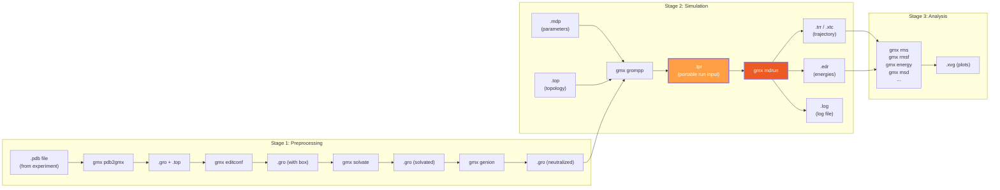
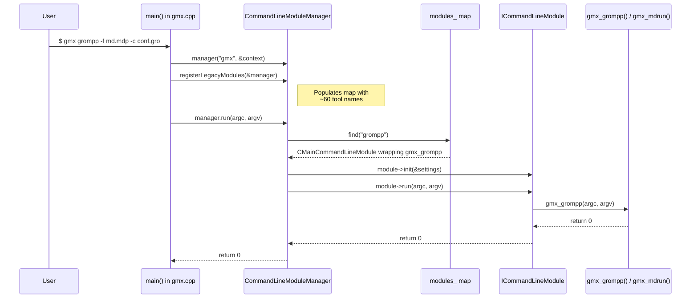
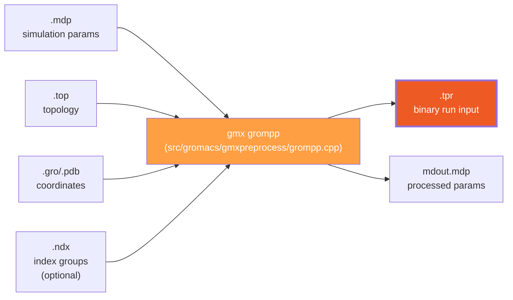

# Module 2: The GROMACS Workflow — From PDB to Trajectory

> **Goal:** Understand the three-stage GROMACS pipeline (preprocessing → simulation → analysis), all file formats, and how the `gmx` command dispatches to individual tools. By the end, you'll be able to trace the code path from `main()` to any GROMACS tool.

> **Prerequisites:** [Module 1 (Physics Foundations)](01-physics-foundations.md)

---

## 2.1 The Three-Stage Pipeline

Every GROMACS project follows the same pattern:



The **critical file** in this pipeline is the `.tpr` (portable run input). It bundles everything needed for simulation into a single binary file: coordinates, topology, and all simulation parameters. This is what makes GROMACS runs reproducible.

---

## 2.2 File Formats

| Extension | Full Name | Content | Binary? | Stage |
|-----------|-----------|---------|---------|-------|
| `.pdb` | Protein Data Bank | Atomic coordinates (from experiment) | No | Input |
| `.gro` | GROMOS format | Coordinates + velocities + box | No | Preprocessing |
| `.top` | Topology | Force field parameters, molecules, bonds | No | Preprocessing |
| `.mdp` | Molecular Dynamics Parameters | Simulation settings (integrator, dt, nsteps, ...) | No | Preprocessing |
| **`.tpr`** | **Portable Run Input** | **Coordinates + topology + parameters (everything)** | **Yes (XDR)** | **Simulation** |
| `.trr` | Trajectory (full precision) | Positions, velocities, forces per frame | Yes (XDR) | Output |
| `.xtc` | Trajectory (compressed) | Positions only, lossy compression | Yes (XDR) | Output |
| `.edr` | Energy file | Energy terms, temperature, pressure per step | Yes (XDR) | Output |
| `.log` | Log file | Human-readable simulation progress | No | Output |
| `.cpt` | Checkpoint | Full restart state | Yes | Output |
| `.ndx` | Index file | Named groups of atom indices | No | Any |
| `.xvg` | XVG plot | Grace-compatible x-y data | No | Analysis |

**XDR** (External Data Representation) is a platform-independent binary format. GROMACS uses it for all binary files, ensuring portability across architectures.

---

## 2.3 The `gmx` Entry Point — 74 Lines That Run Everything

The entire GROMACS executable is dispatched from a tiny `main()`:

```cpp
// src/programs/gmx.cpp  (the complete relevant section)
int main(int argc, char* argv[])
{
    gmx::CommandLineProgramContext& context =
        gmx::initForCommandLine(&argc, &argv);
    try
    {
        gmx::CommandLineModuleManager manager("gmx", &context);
        registerTrajectoryAnalysisModules(&manager);  // modern C++ tools
        registerLegacyModules(&manager);              // classic tools
        manager.addHelpTopic(gmx::createSelectionHelpTopic());
        int rc = manager.run(argc, argv);             // ← DISPATCH HAPPENS HERE
        gmx::finalizeForCommandLine();
        return rc;
    }
    catch (const std::exception& ex)
    {
        gmx::printFatalErrorMessage(stderr, ex);
        return gmx::processExceptionAtExitForCommandLine(ex);
    }
}
```

That's it. The entire `gmx` binary is a **module manager** that:

1. Creates a `CommandLineModuleManager`
2. Registers all tools (grompp, mdrun, pdb2gmx, energy, rms, ...) into a `std::map<string, module>`
3. Looks up `argv[1]` in the map (e.g., "grompp")
4. Calls `module->run(argc, argv)` on the matched tool

This is a clean **Command Pattern** — each tool is an `ICommandLineModule` with a `run()` method.

---

## 2.4 Command Dispatch Architecture



### The ICommandLineModule Interface

Every GROMACS tool implements this interface:

```cpp
// src/gromacs/commandline/cmdlinemodule.h
class ICommandLineModule
{
public:
    virtual const char* name() const = 0;             // e.g., "grompp"
    virtual const char* shortDescription() const = 0; // one-line help
    virtual void init(CommandLineModuleSettings* settings) = 0;
    virtual int  run(int argc, char* argv[]) = 0;     // ← runs the tool
    virtual void writeHelp(const CommandLineHelpContext& context) const = 0;
};
```

### Three Registration Mechanisms

Tools are registered in `src/programs/legacymodules.cpp`:

```cpp
// src/programs/legacymodules.cpp

void registerLegacyModules(CommandLineModuleManager* manager)
{
    // Mechanism 1: C-function pointer wrapper (most tools)
    // Wraps a C-style main function: int gmx_tool(int argc, char* argv[])
    registerModule(manager, &gmx_grompp, "grompp",
                   "Make a run input file");

    // Mechanism 2: NoNice variant (for compute-heavy tools like mdrun)
    // Same as above but disables CPU nice-level adjustment
    registerModuleNoNice(manager, &gmx::gmx_mdrun, "mdrun",
                         "Perform a simulation, do a normal mode analysis "
                         "or an energy minimization");

    // Mechanism 3: Modern C++ factory (newer tools like pdb2gmx)
    // Uses ICommandLineOptionsModule with typed option parsing
    gmx::ICommandLineOptionsModule::registerModuleFactory(
        manager, gmx::pdb2gmxInfo::name,
        gmx::pdb2gmxInfo::shortDescription,
        &gmx::pdb2gmxInfo::create);
}
```

The tools are organized into named groups for `gmx help`:

```cpp
// src/programs/legacymodules.cpp — tool groups
group = manager->addModuleGroup("Running a simulation");
group.addModule("grompp");
group.addModule("mdrun");
group.addModule("convert-tpr");

group = manager->addModuleGroup("Generating topologies and coordinates");
group.addModule("pdb2gmx");
group.addModule("editconf");
group.addModule("solvate");
group.addModule("insert-molecules");
group.addModule("genion");
```

---

## 2.5 grompp: The Preprocessor

`grompp` (GROMACS preprocessor) reads human-readable input files and produces the binary `.tpr`:



The key steps inside `gmx_grompp()` (in `src/gromacs/gmxpreprocess/grompp.cpp`):

```
gmx_grompp(argc, argv)                              [line ~2080]
  │
  ├── parse_common_args(...)                         [line ~2240]  Parse flags
  ├── get_ir(mdparin, ...)                           [line ~2268]  Read .mdp → t_inputrec
  ├── check_ir(...)                                  [line ~2298]  Validate parameters
  ├── new_status(...)                                [line ~2342]  Read .top → gmx_mtop_t
  ├── set_vsites(...)                                [line ~2372]  Configure virtual sites
  ├── do_index(...)                                  [line ~2583]  Set up index groups
  ├── set_verlet_buffer(...)                         [line ~2673]  Calculate Verlet buffer
  ├── triple_check(...)                              [line ~2704]  Final validation
  └── write_tpx_state(fn, ir, &state, sys)           [line ~2918]  Write .tpr ← THE OUTPUT
```

---

## 2.6 The .tpr File: Binary Structure

The `.tpr` file is a self-contained binary snapshot of everything needed to run a simulation. It's written and read using XDR serialization:

```cpp
// api/legacy/include/gromacs/fileio/tpxio.h

struct TpxFileHeader
{
    bool bIr     = false;  // input record (simulation parameters) present?
    bool bBox    = false;  // simulation box present?
    bool bTop    = false;  // topology present?
    bool bX      = false;  // coordinates present?
    bool bV      = false;  // velocities present?
    int  natoms  = 0;      // total number of atoms
    int  fileVersion = 0;  // format version (for backward compatibility)
    int64_t sizeOfTprBody = 0;  // body size in bytes
};
```

**How it's written** (inside `write_tpx_state` in `src/gromacs/fileio/tpxio.cpp`):

```cpp
void write_tpx_state(const std::filesystem::path& fn,
                     const t_inputrec* ir,
                     const t_state* state,
                     const gmx_mtop_t& mtop)
{
    // 1. Fill header from live data
    TpxFileHeader tpx = populateTpxHeader(*state, ir, &mtop);

    // 2. Serialize body to in-memory buffer (big-endian XDR)
    InMemorySerializer serializer(EndianSwapBehavior::SwapIfHostIsLittleEndian);
    do_tpx_body(&serializer, &tpx, ...);
    //   └── writes: state (box, coords, velocities)
    //              → topology (atoms, bonds, interactions)
    //              → inputrec (all .mdp parameters)

    // 3. Write header + body to disk
    XdrSerializer fileSerializer(fn, "w");
    do_tpxheader(&fileSerializer, &tpx, ...);     // header first
    doTpxBodyBuffer(&fileSerializer, tprBody);     // then body
}
```

**How it's read** — the two-phase design for MPI:

```cpp
// Phase 1: Main rank reads the file
PartialDeserializedTprFile partial = read_tpx_state(fn, ir, state, mtop);

// Phase 2: Broadcast raw bytes to all MPI ranks, then each deserializes
PbcType pbcType = completeTprDeserialization(&partial, ir, state, x, v, mtop);
```

This two-phase design exists because only the main MPI rank reads from disk. The raw bytes are broadcast to all ranks, which then each deserialize independently — avoiding the need for every rank to read the file.

---

## 2.7 mdrun: From .tpr to Trajectory

`mdrun` is the actual simulation engine. Its internal architecture is covered in detail in [Module 3 (Architecture)](03-architecture-overview.md) and [Module 4 (The MD Loop)](04-md-loop.md), but here's the high-level dispatch:

```
$ gmx mdrun -s run.tpr -deffnm output

main()  →  CommandLineModuleManager  →  gmx_mdrun()
  └── Mdrunner::mdrunner()           [src/gromacs/mdrun/runner.cpp]
        ├── Read .tpr (via read_tpx_state)
        ├── Broadcast topology to all MPI ranks
        ├── Set up domain decomposition, GPU assignment
        ├── Initialize force calculation, constraints, etc.
        ├── SimulatorBuilder.build(useModularSimulator)
        │     ├── true  → ModularSimulator
        │     └── false → LegacySimulator
        └── simulator->run()
              └── do_md() / do_steep() / do_cg() / ...
```

---

## 2.8 The Complete Dispatch Chain (Traced Example)

Here's every function call from the command line to the first force calculation, for `gmx grompp`:

```
$ gmx grompp -f md.mdp -c conf.gro -p topol.top -o run.tpr

main()                                          [src/programs/gmx.cpp]
  └── CommandLineModuleManager::run(argc, argv) [cmdlinemodulemanager.cpp]
        └── processCommonOptions()
              └── findModuleByName("grompp")     // exact string lookup in map
        └── module->run(argc, argv)
              └── CMainCommandLineModule::run()  // unwraps the C function pointer
                    └── gmx_grompp(argc, argv)   [src/gromacs/gmxpreprocess/grompp.cpp]
                          ├── parse_common_args()
                          ├── get_ir()           // .mdp → t_inputrec
                          ├── check_ir()         // validate
                          ├── new_status()       // .top → gmx_mtop_t
                          ├── do_index()         // index groups
                          ├── triple_check()     // final validation
                          └── write_tpx_state()  // → run.tpr
                                └── do_tpx_body()
                                      ├── do_tpx_state_first()  // box, step, lambda
                                      ├── do_tpx_mtop()         // topology
                                      ├── do_tpx_state_second() // coordinates, velocities
                                      └── do_tpx_ir()           // inputrec
```

---

## Exercises

### Exercise 2.1: Read the Entry Point
Open `src/programs/gmx.cpp` (it's very short) and answer:
1. How many lines is the file? How many are actual code vs. includes/comments?
2. What happens if you type `gmx nonexistent-tool`? Trace the error path.
3. What's the difference between `registerTrajectoryAnalysisModules` and `registerLegacyModules`?

### Exercise 2.2: Trace the Tool Registry
Open `src/programs/legacymodules.cpp` and:
1. Count how many tools are registered (count the `registerModule` / `registerModuleNoNice` / `registerModuleFactory` calls).
2. Find `mdrun` — why does it use `registerModuleNoNice` instead of `registerModule`?
3. Find `pdb2gmx` — how does its registration differ from `grompp`?
4. List all the tool groups (e.g., "Running a simulation", "Generating topologies...").

### Exercise 2.3: Understand .tpr Structure
Open `api/legacy/include/gromacs/fileio/tpxio.h` and:
1. What fields does `TpxFileHeader` contain?
2. Why is there both `read_tpx_state` and `completeTprDeserialization`? What's the two-phase design for?
3. Find `write_tpx_state` — what four pieces of data does it need?

### Exercise 2.4: Explore grompp
Open `src/gromacs/gmxpreprocess/grompp.cpp` and:
1. Find the `t_filenm fnm[]` array — list all the file types that grompp accepts.
2. Find the `write_tpx_state` call. What is the last thing grompp does before returning?
3. What does `triple_check()` do? (Look for its call.)

---

## Key Takeaways

1. **Everything flows through `gmx`** — a single binary with a command dispatch pattern (`argv[1]` → module lookup → `run()`)
2. **The .tpr file is the contract** between preprocessing and simulation — it bundles coordinates, topology, and parameters into one portable binary
3. **grompp is a validator** as much as a translator — it catches invalid settings before you waste compute time
4. **XDR serialization** makes .tpr files portable across platforms and architectures
5. **The two-phase .tpr read** (read on main rank → broadcast → deserialize) is designed for MPI scalability
6. **Three registration mechanisms** coexist: C function pointer wrapping, no-nice variant, and modern C++ factory — reflecting GROMACS's gradual modernization

---

*Previous: [Module 1 — Physics Foundations](01-physics-foundations.md)*
*Next: [Module 3 — Architecture Overview](03-architecture-overview.md)*
