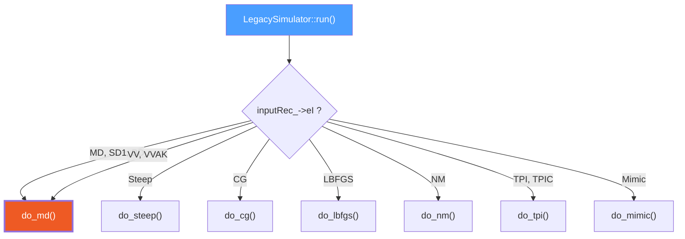
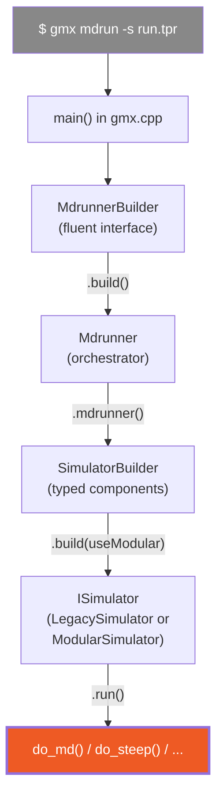
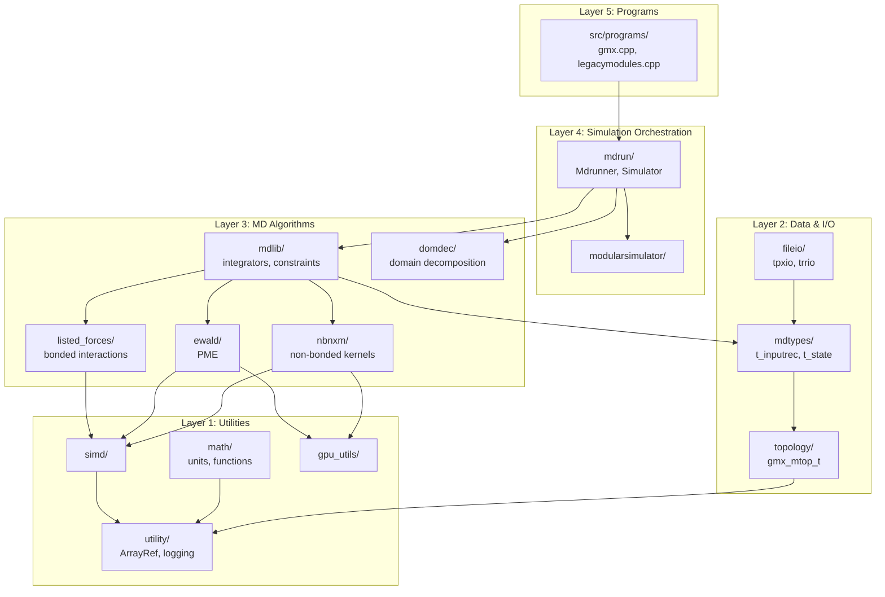

# Module 3: Architecture Overview — The 45-Module Map

> **Goal:** Build a mental map of the entire GROMACS codebase. Understand the module hierarchy, namespace conventions, the `LegacySimulatorData` "table of contents," and the three-layer builder pattern that constructs the simulator.

> **Prerequisites:** [Module 1 (Physics)](01-physics-foundations.md), [Module 2 (Workflow)](02-workflow-and-tools.md)

---

## 3.1 Directory Layout

GROMACS has three top-level source directories:

```
src/
├── programs/          ← The gmx binary: main(), tool registration
│   ├── gmx.cpp        (entry point, ~74 lines)
│   └── legacymodules.cpp  (registers all tools)
│
├── gromacs/           ← The engine: 45+ modules, all the science
│   ├── mdrun/         (simulation orchestration)
│   ├── mdlib/         (core MD algorithms)
│   ├── nbnxm/         (non-bonded kernels)
│   ├── listed_forces/ (bonded interactions)
│   ├── ewald/         (PME electrostatics)
│   ├── ... (40+ more)
│   └── utility/       (general utilities)
│
├── testutils/         ← Test infrastructure (reference data, helpers)
│
└── api/
    └── legacy/
        └── include/gromacs/  ← Public headers (installed API)
```

The distinction between `src/gromacs/` (implementation) and `api/legacy/include/gromacs/` (public API headers) is important. Many types you'll encounter in function signatures (like `t_inputrec`, `PbcType`, or the unit constants) are defined in the API headers, not in `src/`.

---

## 3.2 The Complete Module Map

Here are all modules under `src/gromacs/`, grouped by domain:

### Simulation Core

| Module | Purpose |
|--------|---------|
| `mdrun/` | Simulation orchestration: `Mdrunner`, `SimulatorBuilder`, `LegacySimulator`, `do_md()` |
| `mdlib/` | Core MD algorithms: integrators, constraints (LINCS, SETTLE), coupling, force reduction |
| `modularsimulator/` | Element-based simulation architecture (modern replacement for `do_md()`) |
| `mdtypes/` | Core data types: `t_inputrec`, `t_state`, `t_forcerec`, `gmx_enerdata_t` |
| `mdrunutility/` | MD runner utilities: restart handling, multisim, logging |

### Force Calculation

| Module | Purpose |
|--------|---------|
| `nbnxm/` | Non-bonded interactions: Verlet pair lists, NxM cluster kernels (CPU + GPU) |
| `listed_forces/` | Bonded interactions: bonds, angles, dihedrals, CMAP, 1-4 interactions |
| `ewald/` | PME electrostatics: real-space + reciprocal-space Ewald summation |
| `fmm/` | Fast Multipole Method (alternative to PME) |
| `tables/` | Lookup tables for non-bonded potential/force evaluation |

### Topology & Data

| Module | Purpose |
|--------|---------|
| `topology/` | Molecular topology: `gmx_mtop_t`, atoms, bonds, interaction definitions |
| `fileio/` | File I/O: .tpr, .trr, .xtc, .edr, .gro readers/writers |
| `coordinateio/` | Coordinate file reading/writing |
| `trajectory/` | Trajectory frame data structures |
| `serialization/` | Serialization framework (XDR, in-memory) |

### Parallelism & Hardware

| Module | Purpose |
|--------|---------|
| `domdec/` | Domain decomposition: spatial decomposition, halo exchange |
| `gpu_utils/` | GPU abstraction: `DeviceBuffer<T>`, stream management, CUDA/SYCL/HIP |
| `hardware/` | Hardware detection: CPU features, GPU devices |
| `taskassignment/` | GPU/CPU task assignment decision logic |
| `simd/` | SIMD abstraction: `SimdReal`, `SimdInt32`, backend implementations |
| `fft/` | FFT wrappers (FFTW, cuFFT, etc.) |
| `timing/` | Wall-clock and cycle-counter timing |

### Preprocessing & Analysis

| Module | Purpose |
|--------|---------|
| `gmxpreprocess/` | Preprocessing tools: grompp, pdb2gmx, solvate |
| `gmxana/` | Analysis tools: rms, rmsf, energy, msd, etc. |
| `trajectoryanalysis/` | Modern trajectory analysis framework |
| `analysisdata/` | Analysis data management |
| `selection/` | Atom selection language |
| `energyanalysis/` | Energy file analysis |
| `correlationfunctions/` | Autocorrelation and cross-correlation |
| `statistics/` | Statistical utilities |

### Applied Forces & Special Methods

| Module | Purpose |
|--------|---------|
| `applied_forces/` | External forces: electric fields, density fitting |
| `pulling/` | Center-of-mass pulling, enforced rotation |
| `restraint/` | External restraint potentials API |
| `essentialdynamics/` | Essential dynamics / targeted MD |
| `swap/` | Ion/molecule swapping (computational electrophysiology) |
| `imd/` | Interactive Molecular Dynamics (VMD interface) |
| `mimic/` | MiMiC QM/MM interface |

### Utilities

| Module | Purpose |
|--------|---------|
| `math/` | Math functions, matrix operations, units, vectors |
| `pbcutil/` | Periodic boundary condition utilities |
| `random/` | Random number generators |
| `utility/` | Logging, exceptions, string handling, `ArrayRef`, `EnumerationArray` |
| `linearalgebra/` | Linear algebra routines |
| `mdspan/` | Multi-dimensional array views |
| `compat/` | Compatibility utilities (`not_null`, pointer wrappers) |
| `commandline/` | Command-line parsing |
| `options/` | Option parsing framework |
| `onlinehelp/` | Help system |
| `gmxlib/` | Legacy core library (network, FLOP counting) |

---

## 3.3 Naming Conventions

GROMACS has a dual naming system reflecting its C-to-C++ evolution:

### Legacy C-style (still prevalent)

```cpp
// Prefix conventions:
gmx_mtop_t     // gmx_ prefix, _t suffix → C struct
t_inputrec     // t_ prefix → C struct
t_forcerec     // t_ prefix → C struct
t_state        // t_ prefix → C struct
t_commrec      // t_ prefix → C struct
gmx_enerdata_t // gmx_ prefix, _t suffix → C struct
gmx_wallcycle  // gmx_ prefix → C struct (no _t)
```

These types live at **global scope** (no namespace). They are passed around as raw pointers. You'll see them everywhere in function signatures.

### Modern C++ style

```cpp
namespace gmx {

class Constraints;           // CamelCase class names
class VirtualSitesHandler;
class MDAtoms;
class StopHandlerBuilder;    // Builder pattern suffix
class ObservablesReducerBuilder;

enum class IntegrationAlgorithm : int { ... };  // Scoped enums
enum class TemperatureCoupling : int { ... };

template<typename T>
class ArrayRef;              // Utility templates

}  // namespace gmx
```

**The boundary between old and new is visible in `LegacySimulatorData`** — its constructor takes both C-style pointers (`t_commrec*`, `t_forcerec*`) and modern C++ references (`const MDLogger&`, `Constraints*`).

---

## 3.4 LegacySimulatorData: The "Table of Contents"

The single most informative type in GROMACS is `LegacySimulatorData` in `src/gromacs/mdrun/isimulator.h`. It holds every handle the simulator needs — reading its member list is like reading the table of contents of the entire simulation engine.

```cpp
// src/gromacs/mdrun/isimulator.h

class LegacySimulatorData
{
public:
    // 36 members — grouped by function:

    // === Logging & Communication ===
    FILE*                        fpLog_;               // C-style log file
    t_commrec*                   cr_;                  // MPI communication record
    const gmx_multisim_t*        ms_;                  // Multi-simulation coordinator
    const MDLogger&              mdLog_;                // C++ structured logger
    const gmx_output_env_t*      oenv_;                // Text output settings

    // === Run Configuration ===
    int                          nFile_;               // Number of file options
    const t_filenm*              fnm_;                 // File name entries
    const MdrunOptions&          mdrunOptions_;         // Command-line options
    const StartingBehavior       startingBehavior_;    // Fresh / restart / append

    // === Physics Input ===
    const t_inputrec*            inputRec_;            // ALL .mdp settings
    const gmx_mtop_t&            topGlobal_;           // Full system topology
    gmx_localtop_t*              top_;                 // Domain-decomposed topology

    // === State ===
    t_state*                     stateGlobal_;         // Full state (main rank only)
    t_state*                     state_;               // Local state (this domain)
    ObservablesHistory*          observablesHistory_;   // History for continuation

    // === Atoms & Forces ===
    MDAtoms*                     mdAtoms_;             // Atom parameters
    t_forcerec*                  fr_;                  // Force calculation parameters
    gmx_enerdata_t*              enerd_;               // Energy accumulation
    gmx_ekindata_t*              ekind_;               // Kinetic energy data

    // === Constraints & Virtual Sites ===
    Constraints*                 constr_;              // LINCS / SETTLE
    VirtualSitesHandler*         virtualSites_;        // Virtual sites
    gmx_enfrot*                  enforcedRotation_;    // Enforced rotation

    // === Special Methods ===
    pull_t*                      pullWork_;            // COM pulling
    SwapCoords*                  swap_;                // Ion swapping
    ImdSession*                  imdSession_;          // Interactive MD
    BoxDeformation*              deform_;              // Box deformation
    gmx_membed_t*                membed_;              // Membrane embedding

    // === Performance & Scheduling ===
    t_nrnb*                      nrnb_;                // FLOP accounting
    gmx_wallcycle*               wallCycleCounters_;   // Performance timers
    gmx_walltime_accounting*     wallTimeAccounting_;  // Wall time tracking
    MdrunScheduleWorkload*       runScheduleWork_;     // Per-step work schedule

    // === Module System ===
    IMDOutputProvider*           outputProvider_;       // Output file writing
    const MDModulesNotifiers&    mdModulesNotifiers_;   // Checkpoint notifications
    ObservablesReducerBuilder*   observablesReducerBuilder_; // Reduction coordinator

    // === Replica Exchange & Stopping ===
    const ReplicaExchangeParameters& replExParams_;    // Replica exchange
    std::unique_ptr<StopHandlerBuilder> stopHandlerBuilder_; // Stop conditions
    bool                         doRerun_;             // Rerun mode flag
};
```

Think of this as the "dependency injection container" for the simulator. Every subsystem the simulation needs is accessible through one of these 36 handles.

---

## 3.5 The ISimulator Interface

The simulator itself is remarkably simple:

```cpp
// src/gromacs/mdrun/isimulator.h

class ISimulator
{
public:
    virtual void run() = 0;          // The only method
    virtual ~ISimulator() = default;
};
```

Two classes implement `ISimulator`:

| Simulator | Architecture | When Used |
|-----------|-------------|-----------|
| `LegacySimulator` | Function-based: dispatches to `do_md()`, `do_steep()`, etc. | Default for most simulations |
| `ModularSimulator` | Element-based: composable `ISimulatorElement` steps | Modern approach, gradually replacing legacy |

```cpp
// src/gromacs/mdrun/legacysimulator.h

class LegacySimulator : public ISimulator,        // satisfies the interface
                         private LegacySimulatorData  // gets all data members
{
    using LegacySimulatorData::LegacySimulatorData;

    void run() override;  // Dispatches based on inputRec_->eI (integrator type)
};
```

The private inheritance is intentional: `LegacySimulatorData` is an implementation detail, not part of the `ISimulator` contract. When `run()` is called, it checks the integrator type and dispatches:



The `do_md()` function (in `src/gromacs/mdrun/md.cpp`, ~2200 lines) is the main simulation loop — covered in detail in Module 4.

---

## 3.6 The Three-Layer Builder Pattern

GROMACS uses a layered builder pattern to construct the simulator. Here's the full chain from command line to `simulator->run()`:



### Layer 1: MdrunnerBuilder → Mdrunner

`MdrunnerBuilder` uses a **fluent interface** (each method returns `MdrunnerBuilder&`):

```cpp
// src/gromacs/mdrun/runner.h

class MdrunnerBuilder final
{
public:
    explicit MdrunnerBuilder(std::unique_ptr<MDModules>,
                             not_null<SimulationContext*>);

    Mdrunner build();  // Produces a fully initialized Mdrunner

    // Fluent builder methods (each returns MdrunnerBuilder&):
    MdrunnerBuilder& addHardwareDetectionResult(const gmx_hw_info_t*);
    MdrunnerBuilder& addNonBonded(const char* nbpu_opt);
    MdrunnerBuilder& addElectrostatics(const char* pme_opt, const char* pme_fft_opt);
    MdrunnerBuilder& addBondedTaskAssignment(const char* bonded_opt);
    MdrunnerBuilder& addUpdateTaskAssignment(const char* update_opt);
    MdrunnerBuilder& addFilenames(ArrayRef<const t_filenm>);
    MdrunnerBuilder& addSimulationMethod(MdrunOptions, real, StartingBehavior);
    MdrunnerBuilder& addDomainDecomposition(DomdecOptions);
    // ... more
};
```

### Layer 2: Mdrunner::mdrunner() → SimulatorBuilder

`Mdrunner::mdrunner()` in `runner.cpp` (~1500 lines) is the main orchestration function. It:

1. Reads the `.tpr` file
2. Broadcasts topology to all MPI ranks
3. Detects hardware and assigns GPU tasks
4. Initializes subsystems (force record, constraints, virtual sites)
5. Feeds everything into `SimulatorBuilder`

### Layer 3: SimulatorBuilder → ISimulator

`SimulatorBuilder` uses **typed component groups** instead of a single constructor with 36 parameters:

```cpp
// src/gromacs/mdrun/simulatorbuilder.h

// Each group is a small named struct:
struct SimulatorStateData {
    t_state* globalState_p;
    t_state* localState_p;
    ObservablesHistory* observablesHistory_p;
    gmx_enerdata_t* enerdata_p;
    gmx_ekindata_t* ekindata_p;
};

struct SimulatorEnv {
    FILE* fplog_;
    t_commrec* commRec_;
    const gmx_multisim_t* multisimCommRec_;
    const MDLogger& logger_;
    gmx_output_env_t* outputEnv_;
    ObservablesReducerBuilder* observablesReducerBuilder_;
};

// ... 10 more groups

class SimulatorBuilder
{
public:
    // Overloaded add() for each group:
    void add(SimulatorConfig&&);
    void add(SimulatorStateData&&);
    void add(SimulatorEnv&&);
    void add(Profiling&&);
    void add(ConstraintsParam&&);
    void add(LegacyInput&&);
    void add(InteractiveMD&&);
    void add(SimulatorModules&&);
    void add(CenterOfMassPulling&&);
    void add(IonSwapping&&);
    void add(TopologyData&&);
    void add(BoxDeformationHandle&&);
    void add(MembedHolder&&);
    void add(std::unique_ptr<StopHandlerBuilder>);
    void add(ReplicaExchangeParameters&&);

    // The factory method:
    std::unique_ptr<ISimulator> build(bool useModularSimulator);
};
```

The `build()` method decides which simulator to create:

```cpp
std::unique_ptr<ISimulator> SimulatorBuilder::build(bool useModularSimulator)
{
    // Validates all required components are present (throws APIError otherwise)

    if (useModularSimulator)
        return std::make_unique<ModularSimulator>(...);

    return std::make_unique<LegacySimulator>(...);
}
```

Both simulators receive identical `LegacySimulatorData` content — only the execution architecture differs.

---

## 3.7 The Big Picture: From Command to Computation

Putting it all together:

```
$ gmx mdrun -s run.tpr

main()                                             [src/programs/gmx.cpp]
  └── CommandLineModuleManager::run()
        └── gmx_mdrun()                           [via CMainCommandLineModule]
              └── MdrunnerBuilder                  [Layer 1: configure]
                    .addFilenames(...)
                    .addNonBonded("auto")
                    .addElectrostatics("auto", "auto")
                    .build()
                        └── Mdrunner::mdrunner()   [Layer 2: orchestrate]
                              ├── read_tpx_state() → .tpr → t_inputrec, t_state, gmx_mtop_t
                              ├── completeTprDeserialization() → broadcast to all ranks
                              ├── init_forcerec()  → t_forcerec
                              ├── init_constraints() → Constraints
                              ├── decide: useModularSimulator?
                              │
                              └── SimulatorBuilder [Layer 3: assemble]
                                    .add(SimulatorConfig{...})
                                    .add(SimulatorStateData{...})
                                    .add(SimulatorEnv{...})
                                    .add(LegacyInput{...})
                                    ... (12 more groups)
                                    .build(useModularSimulator)
                                        └── ISimulator::run()
                                              └── do_md()     [~2200 lines]
                                                    └── while (!bLastStep) {
                                                          do_force()
                                                          update_coords()
                                                          ...
                                                        }
```

---

## 3.8 Module Dependency Hierarchy

The modules form a layered dependency graph. Lower layers never depend on higher layers:



---

## 3.9 The `src/gromacs/mdrun/` Directory

This directory is the nexus of the simulation engine:

| File | Purpose |
|------|---------|
| `isimulator.h` | `ISimulator` interface + `LegacySimulatorData` (the 36-member bundle) |
| `legacysimulator.h/.cpp` | `LegacySimulator` — dispatches to `do_md`, `do_steep`, etc. |
| `md.cpp` | **`do_md()`** — the main MD loop (~2200 lines), covered in Module 4 |
| `minimize.h/.cpp` | Energy minimizers: `do_steep`, `do_cg`, `do_lbfgs`, `do_nm` |
| `rerun.cpp` | `do_rerun()` — re-evaluate forces on an existing trajectory |
| `mimic.cpp` | `do_mimic()` — MiMiC QM/MM workflow |
| `tpi.cpp` | `do_tpi()` — test particle insertion |
| `runner.h/.cpp` | `Mdrunner` + `MdrunnerBuilder` — top-level orchestration |
| `simulatorbuilder.h/.cpp` | `SimulatorBuilder` + typed parameter groups |
| `mdmodules.h/.cpp` | `MDModules` — manages active MD modules |
| `shellfc.h/.cpp` | Shell/Drude polarizable particle support |
| `replicaexchange.h/.cpp` | Replica exchange algorithms |
| `simulationcontext.h/.cpp` | `SimulationContext` — MPI communicator context |
| `simulationinput.h/.cpp` | `SimulationInput` — input data container |
| `simulationinputhandle.h/.cpp` | Shared ownership wrapper for `SimulationInput` |

---

## Exercises

### Exercise 3.1: Categorize LegacySimulatorData Members
Open `src/gromacs/mdrun/isimulator.h` and categorize all 36 members of `LegacySimulatorData` into these groups:
- State & positions
- Force calculation
- Input parameters
- Communication & parallelism
- Constraints & special methods
- Performance monitoring
- Output & logging

### Exercise 3.2: Trace the Builder Chain
Starting from `src/gromacs/mdrun/runner.cpp`:
1. Find where `SimulatorBuilder` is created.
2. List all `simulatorBuilder.add(...)` calls — how many are there?
3. Find the `simulatorBuilder.build(useModularSimulator)` call.
4. How is `useModularSimulator` determined? (Search for `ModularSimulator::isInputCompatible`.)

### Exercise 3.3: Module Classification
Without looking at the table above, open `src/gromacs/` and classify these modules by function:
- `nbnxm/`
- `utility/`
- `domdec/`
- `gmxpreprocess/`
- `modularsimulator/`
- `simd/`
- `ewald/`
- `topology/`

### Exercise 3.4: Old vs. New Types
Find examples of:
1. Three C-style types (prefix `t_` or `gmx_`) still used throughout the codebase
2. Three modern C++ classes in the `gmx::` namespace
3. Where they interact (hint: look at function signatures in `isimulator.h`)

### Exercise 3.5: Draw the Architecture
Using the information in this module, draw your own diagram of the dispatch chain from `gmx mdrun -s run.tpr` to `do_md()`, labeling each file and key function. Compare with Section 3.7.

---

## Key Takeaways

1. **45+ modules** organized in a layered dependency graph — lower layers (utility, math, simd) never depend on higher ones (mdrun, programs)
2. **`LegacySimulatorData` is the rosetta stone** — its 36 members are handles to every subsystem the simulator needs
3. **Three builder layers** (`MdrunnerBuilder` → `Mdrunner::mdrunner()` → `SimulatorBuilder`) progressively assemble the simulator
4. **Dual naming conventions** (C-style `t_`/`gmx_` at global scope vs. C++ `gmx::CamelCase`) reflect the ongoing modernization
5. **Two simulator architectures** coexist: `LegacySimulator` (function-based) and `ModularSimulator` (element-based), selected at runtime based on .mdp settings
6. **`ISimulator` is one method: `run()`** — the simplest possible interface, with all complexity in construction

---

*Previous: [Module 2 — Workflow & Tools](02-workflow-and-tools.md)*
*Next: [Module 4 — The Main Simulation Loop](04-md-loop.md) (Phase 2)*
