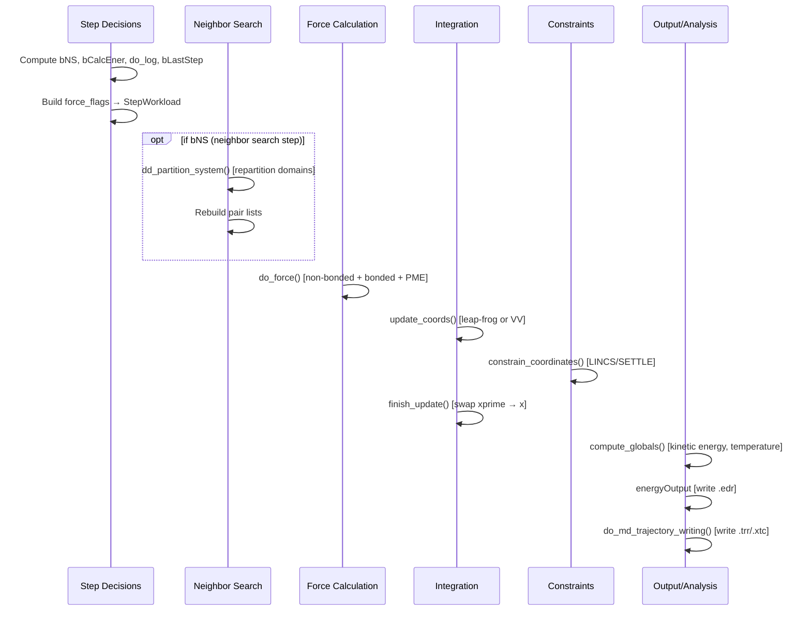
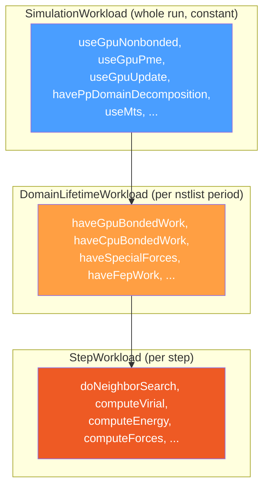

# Module 4: The Main Simulation Loop — `do_md()` Dissected

> **Goal:** Understand the structure of the ~2200-line `do_md()` function — the heart of GROMACS. You'll learn how per-step decisions are made, how force flags control computation, and how the three workload scopes (simulation, domain, step) compose into a precise schedule of work each timestep.

> **Prerequisites:** [Module 1 (Physics)](01-physics-foundations.md), [Module 2 (Workflow)](02-workflow-and-tools.md), [Module 3 (Architecture)](03-architecture-overview.md)

---

## 4.1 Where `do_md()` Lives

`do_md()` is a member function of `LegacySimulator`, not a free function:

```cpp
// src/gromacs/mdrun/md.cpp, line 187
void gmx::LegacySimulator::do_md()
```

It takes **no parameters** — all state is accessed through the 36 member variables inherited from `LegacySimulatorData` (see [Module 3](03-architecture-overview.md)). This means you'll see names like `inputRec_`, `state_`, `stateGlobal_`, `fr_`, `runScheduleWork_` used directly throughout the function.

---

## 4.2 The Big Picture: One MD Step

Before diving into 2200 lines of code, here's what happens in a single MD step:



---

## 4.3 The Main Loop Structure

The loop is deceptively simple:

```cpp
// src/gromacs/mdrun/md.cpp

// Pre-loop initialization (~lines 641-809)
int64_t step     = ir->init_step;   // absolute step number (>0 on restart)
int64_t step_rel = 0;               // relative step from this run's start
bFirstStep = TRUE;

// Check if already done before entering
bLastStep = (bLastStep || (ir->nsteps >= 0 && step_rel > ir->nsteps));

while (!bLastStep)                   // line 868
{
    // ~~~ 1300 lines of one MD step ~~~

    step++;                          // line 2138
    step_rel++;                      // line 2139
    bFirstStep = FALSE;
    bInitStep  = FALSE;
}
// End of main MD loop                line 2172
```

`bLastStep` is checked (and potentially set) in three places each iteration:

```cpp
// 1. Exact step count check (line 894)
bLastStep = (step_rel == ir->nsteps);

// 2. External stop signal (line 927) — e.g., walltime limit, user signal
bLastStep = bLastStep || stopHandler->stoppingAfterCurrentStep(step);

// 3. Pre-loop guard (line 867) — prevents entering if already past nsteps
bLastStep = (bLastStep || (ir->nsteps >= 0 && step_rel > ir->nsteps));
```

---

## 4.4 The `do_per_step()` Pattern

Nearly every periodic action in the loop is gated by `do_per_step()`:

```cpp
// src/gromacs/mdlib/stat.h, lines 79-89
inline bool do_per_step(int64_t step, int64_t nstep)
{
    if (nstep != 0)
    {
        return (step % nstep) == 0;
    }
    else
    {
        return false;   // nstep == 0 means "disabled"
    }
}
```

This is a simple modulo check with a safety guard: if `nstep` is 0, the action is disabled. It's used to gate:

| Action | Parameter | Typical Value |
|--------|-----------|---------------|
| Neighbor search | `ir->nstlist` | 10-40 |
| Energy calculation | `ir->nstcalcenergy` | 100 |
| Energy output | `ir->nstenergy` | 500-1000 |
| Log output | `ir->nstlog` | 1000 |
| Trajectory output | `ir->nstxout` / `ir->nstvout` | 5000-50000 |
| COM removal | `ir->nstcomm` | 100 |
| Temperature coupling | `ir->nsttcouple` | Often = nstlist |
| Pressure coupling | `ir->nstpcouple` | Often = nstlist |

---

## 4.5 Boolean Decision Variables

At the start of each iteration, a cascade of booleans determines exactly what work to do. These are all computed **before** any physics work begins:

### Neighbor Search Decision

```cpp
// Is this an nstlist boundary step?
const bool bNStList = (ir->nstlist > 0 && step % ir->nstlist == 0);

// Full NS decision: first step OR periodic OR triggered by exchange/repartition
const bool bNS = (bFirstStep || bNStList || bExchanged || bNeedRepartition);
```

### Energy and Virial Decisions

```cpp
const bool do_ene = (do_per_step(step, ir->nstenergy) || bLastStep);
const bool do_log = (do_per_step(step, ir->nstlog)
                     || (bFirstStep && startingBehavior_ == StartingBehavior::NewSimulation)
                     || bLastStep);

// Energy calculation frequency (may differ from output frequency)
const bool bCalcEnerStep = do_per_step(step, ir->nstcalcenergy);
const bool needEnergyAndVirial = do_ene || do_log || bDoReplEx;
const bool bCalcEner = bCalcEnerStep || needEnergyAndVirial;

// Virial needs an IIFE to handle VV integrator complexity:
const bool bCalcVir = [&]() -> bool {
    if (EI_VV(ir->eI) && (!bInitStep))
        return bCalcEnerStep || needEnergyAndVirial
               || doPressureCoupling(step) || doPressureCoupling(step - 1);
    else
        return bCalcEnerStep || needEnergyAndVirial || doPressureCoupling(step);
}();
```

### Global Communication Decision

```cpp
// Do we need a global MPI reduction this step?
const bool bGStat = (bCalcVir || bCalcEner || bStopCM
                     || do_per_step(step, nstglobalcomm)
                     || (EI_VV(ir->eI) && inputrecNvtTrotter(ir)
                         && do_per_step(step - 1, nstglobalcomm)));
```

`★ Insight ─────────────────────────────────────`
The decision cascade reveals a key optimization: **most steps compute only forces**. Energy/virial calculation, global communication, and output happen at widely spaced intervals. The boolean variables act as a per-step "execution plan" — computed once, then used throughout the step.
`─────────────────────────────────────────────────`

---

## 4.6 Force Flags: Legacy Bitmask → Modern StepWorkload

GROMACS has a dual system for controlling what gets computed each step.

### Legacy Force Flags (bitmask)

```cpp
// src/gromacs/mdlib/force_flags.h
#define GMX_FORCE_STATECHANGED              (1u << 0u)
#define GMX_FORCE_NS                        (1u << 2u)   // do neighbor search
#define GMX_FORCE_LISTED                    (1u << 4u)   // bonded forces
#define GMX_FORCE_NONBONDED                 (1u << 6u)   // non-bonded forces
#define GMX_FORCE_FORCES                    (1u << 7u)   // compute forces (not just energies)
#define GMX_FORCE_VIRIAL                    (1u << 8u)   // compute virial
#define GMX_FORCE_ENERGY                    (1u << 9u)   // compute energies
#define GMX_FORCE_DHDL                      (1u << 10u)  // compute dH/dlambda (FEP)
#define GMX_FORCE_DO_NOT_NEED_NORMAL_FORCE  (1u << 11u)  // MTS optimization

// Convenience: all force types
#define GMX_FORCE_ALLFORCES  (GMX_FORCE_LISTED | GMX_FORCE_NONBONDED | GMX_FORCE_FORCES)
```

These are assembled each step:

```cpp
// md.cpp, lines 1121-1128
unsigned int force_flags =
    (GMX_FORCE_STATECHANGED | GMX_FORCE_ALLFORCES
     | (bCalcVir  ? GMX_FORCE_VIRIAL : 0)
     | (bCalcEner ? GMX_FORCE_ENERGY : 0)
     | (computeDHDL ? GMX_FORCE_DHDL : 0));
```

### Modern StepWorkload (named booleans)

The legacy bitmask is translated to a struct of named booleans:

```cpp
// src/gromacs/mdtypes/simulation_workload.h

class StepWorkload {
    bool stateChanged = false;
    bool doNeighborSearch = false;
    bool computeVirial = false;
    bool computeEnergy = false;
    bool computeForces = false;
    bool computeNonbondedForces = false;
    bool computeListedForces = false;
    bool computeSlowForces = false;          // slow MTS forces
    bool computeDhdl = false;
    bool useGpuXBufferOps = false;           // GPU coordinate buffer ops
    bool useGpuFBufferOps = false;           // GPU force buffer ops
    bool useGpuPmeFReduction = false;
    bool useGpuXHalo = false;                // GPU halo exchange
    bool useGpuFHalo = false;
    bool haveGpuPmeOnThisRank = false;
    bool computePmeOnSeparateRank = false;
    bool useOnlyMtsCombinedForceBuffer = false;
    // ...
};
```

The bridge function `setupStepWorkload()` does the translation:

```cpp
// src/gromacs/taskassignment/decidesimulationworkload.cpp
StepWorkload setupStepWorkload(const int legacyFlags, ...)
{
    StepWorkload flags;
    flags.stateChanged     = ((legacyFlags & GMX_FORCE_STATECHANGED) != 0);
    flags.doNeighborSearch = ((legacyFlags & GMX_FORCE_NS) != 0);
    flags.computeVirial    = ((legacyFlags & GMX_FORCE_VIRIAL) != 0);
    flags.computeEnergy    = ((legacyFlags & GMX_FORCE_ENERGY) != 0);
    // ... GPU flags derived from SimulationWorkload booleans
    return flags;
}
```

---

## 4.7 Three Workload Scopes

GROMACS uses three nested scopes of work configuration, matching three timescales:



All three are bundled in `MdrunScheduleWorkload`:

```cpp
// src/gromacs/mdtypes/simulation_workload.h
class MdrunScheduleWorkload {
    SimulationWorkload     simulationWork;   // set once at startup
    DomainLifetimeWorkload domainWork;       // updated at each NS step
    StepWorkload           stepWork;         // updated every step
};
```

Accessed in `do_md()` via `runScheduleWork_->stepWork`, `runScheduleWork_->simulationWork`, etc.

---

## 4.8 Global vs Local State

One of the trickiest aspects of GROMACS is the dual state representation:

| | `stateGlobal_` | `state_` |
|---|---|---|
| **Contains** | All N atoms | Only this MPI rank's domain |
| **Non-null on** | Main rank only | All ranks |
| **Used for** | Checkpoints, replica exchange, domain partitioning input | All per-step physics (forces, integration) |

On neighbor-search steps, local state is collected back to global before repartitioning:

```cpp
// md.cpp, line ~998
if (bNS && haveDDAtomOrdering(*cr_))
{
    dd_collect_state(cr_->dd, state_, stateGlobal_);
    // ... then repartition atoms across ranks:
    dd_partition_system(fpLog_, mdLog_, step, cr_, stateGlobal_, topGlobal_, ...);
}
```

---

## 4.9 Annotated Step Sequence

Here is the complete ordered sequence within `while (!bLastStep)`:

| Phase | Operation | Key Call |
|-------|-----------|----------|
| **0. Timer** | Start step wallclock | `wallcycle_start(Step)` |
| **1. Decisions** | Compute `bLastStep`, time `t` | `bLastStep = (step_rel == ir->nsteps)` |
| **2. Lambdas** | Update FEP lambda values | `state_->lambda = currentLambdas(...)` |
| **3. Booleans** | Compute all per-step booleans | `bNS`, `do_log`, `bCalcEner`, `bCalcVir`, `bGStat` |
| **4. Workload** | Build domain + step workloads | `setupDomainLifetimeWorkload()`, `setupStepWorkload()` |
| **5. Vsites** | Construct virtual site positions | `virtualSites_->construct(...)` |
| **6. DD** | Domain decomposition (if `bNS`) | `dd_partition_system(...)` |
| **7. Forces** | **Force calculation** | **`do_force(...)`** |
| **8. VV-1** | Velocity Verlet first half (if VV) | `integrateVVFirstStep(...)` |
| **9. FEP** | Expanded ensemble dynamics | `ExpandedEnsembleDynamics(...)` |
| **10. Copy** | GPU state → host (if needed) | `stateGpu->copyCoordinatesFromGpu(...)` |
| **11. Output** | **Trajectory writing** | `do_md_trajectory_writing(...)` |
| **12. IMD** | Interactive MD communication | `imdSession_->run(...)` |
| **13. T-couple** | Andersen thermostat (if used) | `update_randomize_velocities(...)` |
| **14. P-setup** | Pressure coupling pre-update | `update_pcouple_before_coordinates(...)` |
| **15. Integrate** | **Coordinate update (leap-frog)** | `upd.update_coords(...)` |
| **16. Constrain** | **Apply constraints** | `constrain_coordinates(constr_, ...)` |
| **17. SD-2** | SD second half (if SD integrator) | `upd.update_sd_second_half(...)` |
| **18. Finalize** | Swap `xprime` → `x` | `upd.finish_update(...)` |
| **19. Globals** | Kinetic energy, pressure, signals | `compute_globals(...)` |
| **20. COM** | Remove center-of-mass velocity | `process_and_stopcm_grp(...)` |
| **21. P-update** | Pressure coupling post-coordinates | `update_pcouple_after_coordinates(...)` |
| **22. Energy** | Write energy to .edr | `energyOutput.addDataAtEnergyStep(...)` |
| **23. Log** | Print step to log/energy file | `energyOutput.printStepToEnergyFile(...)` |
| **24. RepEx** | Replica exchange (if enabled) | `replica_exchange(...)` |
| **25. Swap** | Ion/water swapping | `do_swapcoords(...)` |
| **26. Advance** | Increment step counters | `step++; step_rel++;` |
| **27. Timer** | Stop step wallclock | `wallcycle_stop(Step)` |

---

## 4.10 The Force Calculation Call

The most computationally expensive line in the entire loop:

```cpp
// md.cpp, line ~1251
do_force(fpLog_, cr_, *inputRec_, mdModulesNotifiers_, awh.get(),
         enforcedRotation_, imdSession_, pullWork_,
         step, nrnb_, wallCycleCounters_,
         top_, state_->box, state_->x.arrayRefWithPadding(),
         state_->v.arrayRefWithPadding(),
         &state_->hist, &f.view(), vir_force,
         mdAtoms_->mdatoms(), enerd_, state_->lambda,
         fr_, *runScheduleWork_, virtualSites_.get(), mu_tot,
         t, ed, longRangeNonbondeds_.get(),
         DDBalanceRegionHandler(cr_->dd));
```

This single call orchestrates all three force categories (non-bonded, bonded, PME) — see [Module 5](05-force-calculation.md) for the full dissection.

---

## Exercises

### Exercise 4.1: Trace the Boolean Cascade
Open `src/gromacs/mdrun/md.cpp` and for step number 50 with `nstlist=10, nstenergy=100, nstlog=1000`, determine:
1. Is `bNS` true? (Is 50 a multiple of 10?)
2. Is `bCalcEner` true? (Is it an energy calculation step?)
3. Is `do_log` true?
4. What force flags would be set?

### Exercise 4.2: Find the Loop Boundaries
In `md.cpp`:
1. Find the line where the `while (!bLastStep)` loop begins.
2. Find where `step++` and `step_rel++` happen.
3. Find all three places where `bLastStep` is set.
4. What is the first physics operation inside the loop body?

### Exercise 4.3: Understand the Workload Hierarchy
Open `src/gromacs/mdtypes/simulation_workload.h`:
1. List 5 fields from `SimulationWorkload` that are constant for the whole run.
2. List 3 fields from `DomainLifetimeWorkload` that change at domain decomposition.
3. List 5 fields from `StepWorkload` that change every step.
4. How are all three bundled together? (Find `MdrunScheduleWorkload`.)

### Exercise 4.4: Force Flags to StepWorkload
Open `src/gromacs/mdlib/force_flags.h`:
1. What bit pattern does `GMX_FORCE_ALLFORCES` expand to?
2. If `bCalcVir` is false and `bCalcEner` is true, which flags are set?
3. Find `setupStepWorkload()` in `src/gromacs/taskassignment/decidesimulationworkload.cpp` and trace how `GMX_FORCE_VIRIAL` maps to `StepWorkload::computeVirial`.

---

## Key Takeaways

1. **`do_md()` is a method of `LegacySimulator`** — it accesses all 36 `LegacySimulatorData` members directly (no parameters needed)
2. **The loop runs on `!bLastStep`** — checked before entry, at the start of each step, and after the stop handler
3. **`do_per_step(step, nstXxx)`** gates every periodic action — a simple modulo check that returns false when disabled (nstep=0)
4. **Booleans are computed upfront** — all decisions about what to compute this step happen before any physics work begins
5. **Three workload scopes** match three timescales: simulation (constant), domain (per nstlist), step (per step)
6. **The force flags bridge old and new** — legacy `GMX_FORCE_*` bitmask is translated to modern `StepWorkload` named booleans
7. **Global vs local state** — `stateGlobal_` (full system, main rank only) vs `state_` (this domain, all ranks)

---

*Previous: [Module 3 — Architecture Overview](03-architecture-overview.md)*
*Next: [Module 5 — Force Calculation](05-force-calculation.md)*
