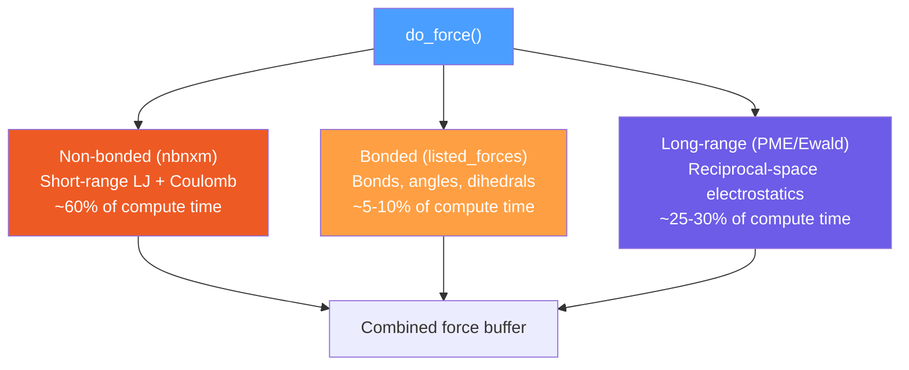
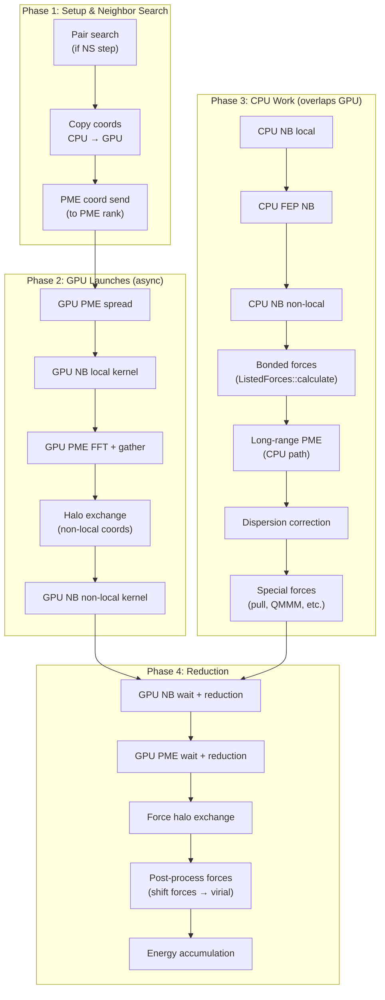
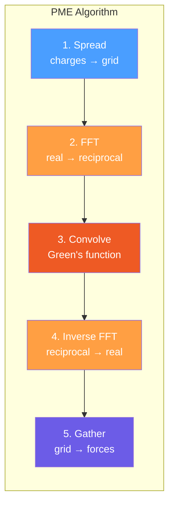

# Module 5: Force Calculation — The Heart of the Engine

> **Goal:** Understand `do_force()` — the single most expensive function call in an MD simulation. You'll learn how the three force categories (non-bonded, bonded, long-range) are orchestrated, how force buffers flow, and how the `t_forcerec` structure ties everything together.

> **Prerequisites:** [Module 4 (MD Loop)](04-md-loop.md)

---

## 5.1 The Three Force Categories

Every MD step computes forces as the sum of three categories:



---

## 5.2 The `do_force()` Signature

```cpp
// src/gromacs/mdlib/force.h, lines 109-137
void do_force(FILE*                         fplog,
              const t_commrec*              cr,
              const t_inputrec&             inputrec,
              const MDModulesNotifiers&     mdModulesNotifiers,
              Awh*                          awh,
              gmx_enfrot*                   enforcedRotation,
              ImdSession*                   imdSession,
              pull_t*                       pull_work,
              int64_t                       step,
              t_nrnb*                       nrnb,
              gmx_wallcycle*                wcycle,
              const gmx_localtop_t*         top,
              const matrix                  box,
              ArrayRefWithPadding<RVec>     coordinates,
              ArrayRef<RVec>                velocities,
              const history_t*              hist,
              ForceBuffersView*             force,         // ← output
              tensor                        vir_force,     // ← output virial
              const t_mdatoms*              mdatoms,
              gmx_enerdata_t*               enerd,         // ← output energies
              ArrayRef<const real>          lambda,
              t_forcerec*                   fr,            // ← the force record
              const MdrunScheduleWorkload&  runScheduleWork,
              VirtualSitesHandler*          vsite,
              rvec                          mu_tot,
              double                        t,
              gmx_edsam*                    ed,
              CpuPpLongRangeNonbondeds*     longRangeNonbondeds,
              const DDBalanceRegionHandler&  ddBalanceRegionHandler);
```

The implementation spans **lines 1578-2721** of `src/gromacs/mdlib/sim_util.cpp` (~1140 lines).

---

## 5.3 The `t_forcerec` Structure — Force Record

`t_forcerec` (in `src/gromacs/mdtypes/forcerec.h`) is the central data structure for force calculation. Think of it as the "configuration object" that stores everything needed to compute forces:

```cpp
// src/gromacs/mdtypes/forcerec.h (key fields from lines 130-282)
struct t_forcerec
{
    // === Interaction parameters ===
    std::unique_ptr<interaction_const_t> ic;   // cutoffs, Ewald coefficients, PME order
    real rlist;                                 // pair-list cutoff (nm)
    real fudgeQQ;                               // 1-4 electrostatic fudge factor

    // === Non-bonded engine ===
    std::unique_ptr<nonbonded_verlet_t> nbv;   // THE nbnxm non-bonded machinery
    std::vector<real> nbfp;                     // LJ parameters (C6/C12, pre-scaled)
    int ntype;                                  // number of atom types

    // === Bonded forces ===
    std::vector<ListedForces> listedForces;     // bonded calculation objects (1, or 2 for MTS)
    std::unique_ptr<ListedForcesGpu> listedForcesGpu;  // GPU bonded forces

    // === Long-range ===
    gmx_pme_t* pmedata;                         // PME data structure
    std::unique_ptr<CpuPpLongRangeNonbondeds> longRangeNonbondeds;

    // === Auxiliary ===
    std::vector<RVec> shift_vec;                // 27 PBC shift vectors
    std::vector<ForceHelperBuffers> forceHelperBuffers;  // shift-force buffers
    std::vector<int32_t> atomInfo;              // per-atom flags (charge, LJ, perturbed)
    std::unique_ptr<DispersionCorrection> dispersionCorrection;

    // === GPU infrastructure ===
    StatePropagatorDataGpu* stateGpu;           // GPU-resident state
    DeviceStreamManager* deviceStreamManager;
    std::unique_ptr<PmePpCommGpu> pmePpCommGpu; // GPU PME-PP communication
};
```

The LJ parameters are stored pre-scaled for efficiency:

```cpp
// Access macros (forcerec.h, lines 288-292)
#define C6(nbfp, ntp, ai, aj)   (nbfp)[2 * ((ntp) * (ai) + (aj))]
#define C12(nbfp, ntp, ai, aj)  (nbfp)[2 * ((ntp) * (ai) + (aj)) + 1]
// NOTE: C6 and C12 are pre-multiplied by 6.0 and 12.0 respectively
// to save FLOPS in the inner kernel loop
```

---

## 5.4 Force Buffer Architecture

Forces flow through a layered buffer system:

```
ForceBuffers               ← owns memory (PaddedHostVector<RVec>)
└── ForceBuffersView       ← non-owning view (passed to do_force)
    └── ForceOutputs       ← per-step output descriptors (created inside do_force)
        ├── ForceWithShiftForces  ← main force + 27 shift-vector forces (for virial)
        └── ForceWithVirial       ← forces that compute their own virial (PME, pulling)
```

Up to three `ForceOutputs` instances exist simultaneously in one step:

```cpp
// sim_util.cpp, inside do_force()
ForceOutputs forceOutMtsLevel0;   // fast forces (every step)
ForceOutputs forceOutMtsLevel1;   // slow forces (every nstlist steps, for MTS)
ForceOutputs forceOutNonbonded;   // non-bonded forces (separate for buffer ops)
// Without MTS, all three point to the same underlying buffer.
```

**Why shift forces?** The virial of short-range pair interactions across periodic boundaries is computed via the shift-vector technique: instead of tracking all `r_ij` vectors, GROMACS accumulates forces into 27 bins (one per PBC shift vector) and reconstructs the virial tensor from these sums. This is much cheaper than the direct method.

---

## 5.5 The `do_force()` Pipeline

Here's the complete sequence of operations:



### Detailed Call Sequence (with line references in `sim_util.cpp`)

| Phase | Operation | Lines | What Happens |
|-------|-----------|-------|--------------|
| **Search** | `doPairSearch()` | ~1621 | Build neighbor pair lists from grid |
| **GPU PME** | `launchPmeGpuSpread()` | ~1759 | Spread charges onto PME grid (GPU) |
| **NB local** | `do_nb_verlet(Local)` | ~1815 | Launch local NB kernel (GPU or CPU) |
| **GPU PME** | `launchPmeGpuFftAndGather()` | ~1831 | FFT, solve, gather PME forces (GPU) |
| **Halo** | `dd_move_x()` | ~1850 | Exchange non-local coordinates |
| **NB nonlocal** | `do_nb_verlet(NonLocal)` | ~1925 | Launch non-local NB kernel |
| **Dipole** | `calc_mu()` | ~2042 | Compute system dipole moment |
| **Energy reset** | `reset_enerdata()` | ~2062 | Zero energy accumulators |
| **CPU NB** | `do_nb_verlet(Local, CPU)` | ~2090 | CPU non-bonded forces |
| **FEP NB** | `dispatchFreeEnergyCpuKernels()` | ~2110 | Free energy NB interactions |
| **NB reduce** | `atomdata_add_nbat_f_to_f()` | ~2136 | NB forces → main buffer |
| **Bonded** | `listedForces.calculate()` | ~2172 | Bonds, angles, dihedrals, restraints |
| **PME** | `longRangeNonbondeds->calculate()` | ~2221 | CPU PME calculation |
| **Dispersion** | `dispersionCorrection->calculate()` | ~2237 | Long-range LJ correction |
| **Special** | `computeSpecialForces()` | ~2293 | Pulling, QMMM, applied forces |
| **GPU wait** | `gpu_wait_finish_task()` | ~2356 | Wait for GPU NB completion |
| **PME wait** | `pmeGpuWaitAndReduce()` | ~2488 | Wait for GPU PME completion |
| **Halo F** | `dd_move_f()` | ~2440 | Exchange non-local forces |
| **Post** | `postProcessForceWithShiftForces()` | ~2644 | Shift forces → virial tensor |
| **Accum** | `accumulatePotentialEnergies()` | ~2703 | Sum all energy contributions |

`★ Insight ─────────────────────────────────────`
The key to understanding `do_force()` is the **overlap strategy**: GPU kernels are launched early and asynchronously, then CPU work proceeds in parallel. The GPU results are collected only after the CPU work is done. This CPU/GPU overlap is what makes GROMACS fast on heterogeneous hardware.
`─────────────────────────────────────────────────`

---

## 5.6 Non-Bonded Forces (nbnxm)

The internal dispatch function `do_nb_verlet()`:

```cpp
// sim_util.cpp, lines 428-473
static void do_nb_verlet(t_forcerec* fr, const interaction_const_t* ic,
                         gmx_enerdata_t* enerd, const StepWorkload& stepWork,
                         const InteractionLocality ilocality, const int clearF,
                         const int64_t step, t_nrnb* nrnb, gmx_wallcycle* wcycle)
{
    // ...
    nbv->dispatchNonbondedKernel(ilocality, *ic, stepWork, clearF,
        fr->shift_vec,
        enerd->grpp.energyGroupPairTerms[...LJSR...],
        enerd->grpp.energyGroupPairTerms[...CoulombSR...],
        nrnb);
}
```

`InteractionLocality` separates local atoms (this domain) from non-local atoms (halo region):
- **Local**: atoms owned by this MPI rank
- **NonLocal**: atoms in the halo (needed for pair interactions crossing domain boundaries)

See [Module 6](06-nbnxm-nonbonded.md) for the deep dive into the NxM cluster algorithm.

---

## 5.7 Bonded Forces (listed_forces)

```cpp
// sim_util.cpp, lines 2172-2218
if (stepWork.computeListedForces)
{
    for (int mtsIndex = 0; mtsIndex < numMtsLevels; mtsIndex++)
    {
        ListedForces& listedForces = fr->listedForces[mtsIndex];
        listedForces.calculate(wcycle, box, coordinates, xWholeMolecules,
                               fr->fcdata.get(), hist, &forceOutputs, fr, &pbc,
                               enerd, nrnb, lambda, charges, ...stepWork);
    }
}
```

The `ListedForces` class (in `src/gromacs/listed_forces/listed_forces.h`) organizes bonded interactions into groups:

```cpp
class ListedForces {
public:
    enum class InteractionGroup : int {
        Pairs,      // 1-4 pair interactions
        Dihedrals,  // proper/improper dihedrals, CMAP
        Angles,     // bond angles
        Rest,       // bonds, restraints, everything else
        Count
    };

    void calculate(gmx_wallcycle* wcycle, const matrix box,
                   ArrayRefWithPadding<const RVec> coordinates,
                   /* ... many parameters ... */
                   const StepWorkload& stepWork);
};
```

Threading is managed by `bonded_threading_t`: interactions are partitioned across OpenMP threads, each writing to thread-local force buffers that are reduced after all threads finish.

---

## 5.8 Long-Range Forces (PME)

PME (Particle-Mesh Ewald) computes the long-range part of electrostatic interactions:



The CPU interface:

```cpp
// src/gromacs/ewald/pme.h
int gmx_pme_do(gmx_pme_t* pme,
               ArrayRef<const RVec> coordinates,
               ArrayRef<RVec> forces,              // ← output
               ArrayRef<const real> chargeA,
               /* ... */
               real* energy_q, real* energy_lj,    // ← output
               real lambda_q, real lambda_lj,
               real* dvdlambda_q, real* dvdlambda_lj,
               const StepWorkload& stepWork);
```

The GPU pipeline is split into asynchronous stages:

```cpp
// Launched early (overlaps with CPU work):
pme_gpu_launch_spread(...);              // charges → grid
pme_gpu_launch_complex_transforms(...);  // FFT + convolve
pme_gpu_launch_gather(...);              // grid → forces

// Collected later:
pme_gpu_wait_and_reduce(...);            // blocking wait + add to force buffer
```

PME can run on:
- **Same rank as PP** (particle-particle): all on one process
- **Separate PME rank**: dedicated MPI rank(s) for PME, communicating via `gmx_pme_send_coordinates()` and `pme_receive_force_ener()`

```cpp
// src/gromacs/ewald/pme.h
enum class PmeRunMode {
    None,    // no PME on this rank
    CPU,     // all PME on CPU
    GPU,     // all PME on GPU
    Mixed,   // spread+gather on GPU, FFT+solve on CPU
};
```

---

## 5.9 Force Reduction Flow

After all three categories compute their forces, results must be combined:

```
Non-bonded forces (nbnxm internal format)
    └── nbv->atomdata_add_nbat_f_to_f()  ← converts + accumulates into main buffer
            └── ForceOutputs.forceWithShiftForces

Bonded forces
    └── directly accumulated into ForceOutputs.forceWithShiftForces
        (thread-local buffers reduced after OMP parallel region)

PME forces
    └── accumulated into ForceOutputs.forceWithVirial
        (separate virial tracking — PME computes its own virial tensor)

Special forces (pulling, AWH, etc.)
    └── accumulated into ForceOutputs.forceWithVirial

Final post-processing:
    postProcessForceWithShiftForces()
        └── shift forces → virial contribution
    postProcessForces()
        └── ForceWithVirial → add to main force buffer + virial tensor
```

---

## Exercises

### Exercise 5.1: Trace do_force
Open `src/gromacs/mdlib/sim_util.cpp` and:
1. Find the `do_force()` function definition. How many lines is it?
2. Find all calls to `do_nb_verlet()`. How many are there? Which use `InteractionLocality::Local` vs `NonLocal`?
3. Find the `listedForces.calculate()` call. What loop does it sit inside?

### Exercise 5.2: Explore t_forcerec
Open `src/gromacs/mdtypes/forcerec.h` and:
1. Find `nbv` — what type is it? This is the entire non-bonded engine in one member.
2. Find `pmedata` — why is it a raw pointer instead of `unique_ptr`?
3. Find `listedForces` — why is it a `std::vector`? When would it have more than one element?
4. What does `nbfp` store? Why are C6/C12 pre-scaled by 6 and 12?

### Exercise 5.3: Understand Force Buffers
Find `ForceBuffersView` and `ForceOutputs` in `src/gromacs/mdtypes/`:
1. What's the difference between `ForceWithShiftForces` and `ForceWithVirial`?
2. Why does PME use `ForceWithVirial` instead of `ForceWithShiftForces`?
3. How many `ForceOutputs` instances exist during one step with MTS enabled?

### Exercise 5.4: GPU/CPU Overlap
In `sim_util.cpp`:
1. Find where GPU non-bonded kernels are launched. Find where their results are collected.
2. What CPU work happens between the launch and the wait?
3. Find the PME GPU pipeline stages (`launchPmeGpuSpread`, `launchPmeGpuFftAndGather`, `pmeGpuWaitAndReduce`).

---

## Key Takeaways

1. **`do_force()` orchestrates three categories**: non-bonded (nbnxm), bonded (listed_forces), and long-range (PME)
2. **`t_forcerec` is the force configuration object** — it holds the non-bonded engine (`nbv`), PME data, bonded handlers, and interaction parameters
3. **Force buffers are layered**: `ForceBuffers` → `ForceBuffersView` → `ForceOutputs` with separate shift-force and virial-force tracking
4. **GPU work is launched asynchronously early**, then CPU work proceeds in parallel, and GPU results are collected late — this overlap is critical for performance
5. **PME can run on separate MPI ranks** — communicating coordinates and forces between PP and PME ranks
6. **Non-bonded forces use a special internal format** (nbnxm atom data) and must be explicitly reduced into the main force buffer

---

*Previous: [Module 4 — The MD Loop](04-md-loop.md)*
*Next: [Module 6 — nbnxm Non-Bonded Deep Dive](06-nbnxm-nonbonded.md)*
