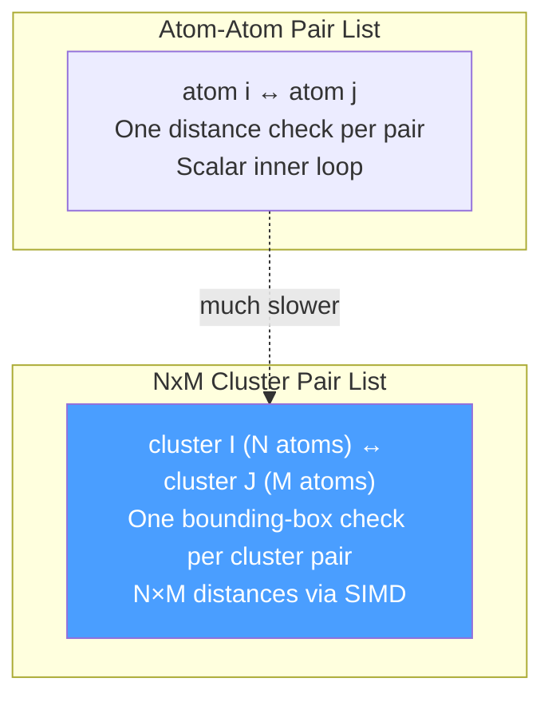
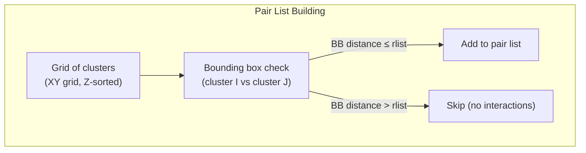

# Module 6: Non-Bonded Interactions — The nbnxm Deep Dive

> **Goal:** Understand the NxM cluster algorithm that computes short-range non-bonded forces — the most computationally expensive part of MD simulation. You'll learn how atoms are spatially hashed into clusters, how pair lists are built, how SIMD and GPU kernels exploit the cluster layout, and how dynamic pruning amortizes the cost.

> **Prerequisites:** [Module 5 (Force Calculation)](05-force-calculation.md)

---

## 6.1 Why Clusters?

Classical MD computes pairwise LJ + Coulomb forces for all atom pairs within a cutoff distance. A naive approach checks all $N^2$ pairs — too expensive. GROMACS uses two key optimizations:

1. **Verlet neighbor lists**: Only rebuild the pair list every `nstlist` steps; add a buffer distance to account for atom drift between rebuilds
2. **Cluster-based pair lists**: Instead of atom-atom pairs, store **cluster-cluster** pairs where each cluster is a group of spatially nearby atoms

The cluster approach maps perfectly to SIMD (process M atoms per instruction) and GPU (process warps of atoms in parallel).



---

## 6.2 Cluster Sizes

| Kernel Type | i-cluster | j-cluster | Target Hardware |
|-------------|-----------|-----------|-----------------|
| `Cpu4x4_PlainC` | 4 | 4 | Reference (any CPU) |
| `Cpu4xN_Simd_4xN` | 4 | SIMD width (4 or 8) | SSE4/AVX2 |
| `Cpu4xN_Simd_2xNN` | 4 | SIMD width / 2 | AVX2/AVX-512 |
| `Gpu8x8x8` | 8 (in 8-cluster super-clusters) | 8 | CUDA/HIP/SYCL |
| `Cpu1x1_PlainC` | 1 | 1 | Free energy perturbation |

```cpp
// src/gromacs/nbnxm/nbnxm_enums.h
enum class NbnxmKernelType : int {
    NotSet = 0,
    Cpu4x4_PlainC,       // reference plain-C, 4x4 layout
    Cpu4xN_Simd_4xN,     // SIMD 4xM kernel (j-width = SIMD width)
    Cpu4xN_Simd_2xNN,    // SIMD 2xMM kernel (j-width = SIMD width / 2)
    Gpu8x8x8,            // GPU kernel
    Cpu8x8x8_PlainC,     // reference C using GPU pairlist layout
    Cpu1x1_PlainC,       // atom-pair list (for FEP)
    Count
};

enum class PairlistType : int {
    Simple4x2,
    Simple4x4,
    Simple4x8,
    Hierarchical8x8x8,   // GPU: 8-atom clusters in 8-cluster super-clusters
    Simple1x1,
    Count
};
```

On AVX2 (8-wide single precision), **both** `Cpu4xN_Simd_4xN` (→ 4x8) and `Cpu4xN_Simd_2xNN` (→ 4x4 with doubled registers) are available.

---

## 6.3 Spatial Grid Construction

Atoms are organized into a 2D grid in XY, then sorted by Z within each column:

```
Step 1: Hash atoms by XY → column index
Step 2: Sort atoms by Z within each column
Step 3: Pack consecutive atoms into clusters of size N
Step 4: Compute bounding box for each cluster
```

```cpp
// src/gromacs/nbnxm/grid.h

struct GridDimensions {
    RVec lowerCorner, upperCorner, gridSize;
    real atomDensity;
    real cellSize[2];           // cell edge along X and Y
    real invCellSize[2];
    int  numCells[2];           // number of columns along X and Y
};

class Grid {
    struct Geometry {
        bool isSimple_;              // true = CPU, false = GPU hierarchical
        int  numAtomsICluster_;      // 4 (CPU) or 8 (GPU)
        int  numAtomsJCluster_;      // 2, 4, or 8 (CPU) or 8 (GPU)
        int  numAtomsPerBin_;        // atoms per bin
        int  numAtomsICluster2Log_;  // for fast >> shifting
        PairlistType pairlistType_;
    };

    // Key data:
    HostVector<int> numAtomsPerColumn_;              // real atoms per XY column
    HostVector<int> columnToBin_;                     // first bin for each column
    std::vector<BoundingBox> iClusterBoundingBoxes_;  // BB per i-cluster
    std::vector<int32_t> flags_;                      // cluster flags
    std::vector<unsigned int> fep_;                   // FEP bits per cluster atom
};
```

Each cluster gets a **bounding box** — a tight axis-aligned box around its atoms:

```cpp
// src/gromacs/nbnxm/boundingbox.h
struct BoundingBox {
    struct Corner {
        float x, y, z, padding;   // 4th float for SIMD 4-wide loads
    };
    Corner lower;
    Corner upper;
};
```

The padding float allows loading a corner as a single 128-bit SIMD value — a micro-optimization that matters in the inner loop.

---

## 6.4 Pair List Construction

The pair search compares cluster bounding boxes to quickly cull non-interacting pairs:



The pair list stores cluster pairs with exclusion masks:

### CPU Pair List

```cpp
// src/gromacs/nbnxm/pairlist.h

// i-entry: identifies an i-cluster and its j-cluster range
struct nbnxn_ci_t {
    int ci;              // i-cluster index
    int shift;           // PBC shift | interaction flags
    int cj_ind_start;    // start index into cj array
    int cj_ind_end;      // end index into cj array
};

// j-entry: one j-cluster with its exclusion mask
struct nbnxn_cj_t {
    int cj;              // j-cluster index
    unsigned int excl;   // bit mask: bit (i*jSize + j) = 1 means "interact"
};

struct NbnxnPairlistCpu {
    int na_ci, na_cj;              // cluster sizes
    real rlist;                     // construction radius

    FastVector<nbnxn_ci_t> ci;         // inner (pruned) i-entries
    FastVector<nbnxn_ci_t> ciOuter;    // outer (full) i-entries
    JClusterList cj;                    // inner j-entries
    FastVector<nbnxn_cj_t> cjOuter;    // outer j-entries
};
```

### GPU Pair List

```cpp
// For GPU, clusters are organized into super-clusters (8 clusters of 8 atoms = 64 atoms)

struct nbnxn_sci_t {
    int sci;                // super-cluster index
    int shift;              // PBC shift + flags
    int cjPackedBegin;      // start in cjPacked
    int cjPackedEnd;        // end in cjPacked
};

struct nbnxn_cj_packed_t {
    int cj[4];                      // 4 j-cluster indices (packed for warp efficiency)
    nbnxn_im_ei_t imei[2];         // interaction masks per warp split
};

struct NbnxnPairlistGpu {
    int na_ci, na_cj, na_sc;       // cluster + super-cluster sizes
    HostVector<nbnxn_sci_t> sci;   // super-cluster entries
    PackedJClusterList cjPacked;   // j-cluster groups of 4
    HostVector<nbnxn_excl_t> excl; // exclusion bits
};
```

---

## 6.5 Classical vs Dynamic Pruning

The **Verlet buffer** adds extra distance to the cutoff to account for atom drift between pair list rebuilds:

```
rlist = rc + rbuffer
where:
  rc      = interaction cutoff (e.g., 1.0 nm)
  rbuffer = safety margin for atom displacement over nstlist steps
```

### Classical Pruning

`rlistOuter == rlistInner`. The full pair list is rebuilt every `nstlist` steps. Simple but the list can be large.

### Dynamic Pruning

```
rlistOuter > rlistInner

Outer list: built with rlistOuter (wider, accounts for full nstlist displacement)
Inner list: pruned from outer list using rlistInner (tighter, accounts for nstlistPrune displacement)
```

```cpp
// src/gromacs/nbnxm/pairlistparams.h
struct PairlistParams {
    PairlistType pairlistType;
    real rlistOuter;            // radius for full (outer) list
    real rlistInner;            // radius for pruned (inner/working) list
    bool useDynamicPruning;     // whether dynamic pruning is active
    int  nstlistPrune;          // steps between pruning
    int  numRollingPruningParts; // GPU: divide list into N parts for rolling pruning
    int  lifetime;              // list lifetime = nstlist
};
```

On GPU, **rolling pruning** divides the list into `numRollingPruningParts` parts that are pruned in rotation each step, spreading the cost over time.

```
Dynamic pruning is used when: rlistInner < 0.99 * rlistOuter AND nstlistPrune < lifetime
```

---

## 6.6 Kernel Dispatch

The kernel dispatch follows a two-level table lookup:

```cpp
// src/gromacs/nbnxm/kerneldispatch.cpp

void nonbonded_verlet_t::dispatchNonbondedKernel(...)
{
    switch (kernelSetup().kernelType) {
        case NbnxmKernelType::Cpu4x4_PlainC:
        case NbnxmKernelType::Cpu4xN_Simd_4xN:
        case NbnxmKernelType::Cpu4xN_Simd_2xNN:
        case NbnxmKernelType::Cpu1x1_PlainC:
            nbnxn_kernel_cpu(pairlistSet, kernelSetup(), nbat_, ic, ...);
            break;
        case NbnxmKernelType::Gpu8x8x8:
            gpu_launch_kernel(gpuNbv_, stepWork, iLocality);
            break;
        case NbnxmKernelType::Cpu8x8x8_PlainC:
            nbnxn_kernel_gpu_ref(pairlistSet.gpuList(), nbat_, ic, ...);
            break;
    }
}
```

Inside `nbnxn_kernel_cpu()`, two indices select the concrete function pointer:

```cpp
// Coulomb type: RF, tabulated, Ewald analytical, twin-cutoff variants
const int coulkt = static_cast<int>(getCoulombKernelType(...));

// VdW type: LJ-cut + geometric/LB combining, LJ-Ewald, force/potential switch
const int vdwkt = getVdwKernelType(...);

// Then the lookup:
switch (kernelType) {
    case Cpu4xN_Simd_4xN:
        nbnxmKernelNoenerSimd4xm[coulkt][vdwkt](pairlist, ...);
        break;
    case Cpu4xN_Simd_2xNN:
        nbnxmKernelNoenerSimd2xmm[coulkt][vdwkt](pairlist, ...);
        break;
    // ...
}
```

Three tables exist per kernel layout:
- `nbnxmKernelNoenerSimd4xm[coulkt][vdwkt]` — force only
- `nbnxmKernelEnerSimd4xm[coulkt][vdwkt]` — force + single energy group
- `nbnxmKernelEnergrpSimd4xm[coulkt][vdwkt]` — force + per-group energies

---

## 6.7 Inside a SIMD Kernel

The actual kernel is a template function in `src/gromacs/nbnxm/simd_kernel.h`:

```cpp
template<KernelLayout         kernelLayout,      // r4xM or r2xMM
         KernelCoulombType    coulombType,
         VdwCutoffCheck       vdwCutoffCheck,
         LJCombinationRule    ljCombinationRule,
         InteractionModifiers vdwModifier,
         LJEwald              ljEwald,
         EnergyOutput         energyOutput>
void nbnxmKernelSimd(const NbnxnPairlistCpu& pairlist,
                     const nbnxn_atomdata_t& nbat,
                     const interaction_const_t& ic,
                     const rvec* shift_vec,
                     nbnxn_atomdata_output_t* out)
```

Seven template parameters are resolved at compile time, generating **~108 specialized kernel variants** per layout (one `.cpp` file each in `kernels_simd_4xm/`). The naming convention:

```
kernel_Elec{Coulomb}_Vdw{LJtype}_{F|VF|VgrpF}.cpp

Examples:
  kernel_ElecRF_VdwLJCombGeom_F.cpp        (force only, reaction field, LJ geometric)
  kernel_ElecEwaldAna_VdwLJEwCombGeom_VF.cpp (force+energy, analytical Ewald, LJ-Ewald)
```

### The Inner Loop Pattern (pseudocode)

```cpp
for each i_entry in pairlist.ci:
    // Load 4 i-atom coordinates (broadcast into SIMD registers)
    ix0 = simdLoad(x[ci*4 + 0]);  // atom 0 x-coord broadcast to all lanes
    // ... for all 4 i-atoms, x/y/z

    for each j_entry in pairlist.cj[ci.start .. ci.end]:
        // Load M j-atom coordinates as one SIMD register
        jx = simdLoad(x[cj*M + 0..M-1]);

        // Compute 4×M distances in parallel
        for i = 0..3:
            dx = ix[i] - jx;  dy = iy[i] - jy;  dz = iz[i] - jz;
            rsq = dx*dx + dy*dy + dz*dz;

            // Apply exclusion mask
            rsq = selectByMask(rsq, excl_bits);

            // Within cutoff? (SIMD comparison → mask)
            withinCutoff = (rsq < rc*rc);

            // Compute LJ + Coulomb force for all M pairs simultaneously
            rinv = invsqrt(rsq);
            // ... LJ: F_lj = 12*C12/r^14 - 6*C6/r^8
            // ... Coulomb: F_c = qq * (1/r^2) * erfc_approx(beta*r)

            // Accumulate forces
            f_ix[i] -= fx;  f_jx += fx;
```

---

## 6.8 GPU Kernels

The GPU uses 8-atom clusters organized into super-clusters of 64 atoms. The pair list uses packed j-cluster groups of 4 for warp-efficient memory access:

```
Super-cluster I (64 atoms = 8 clusters × 8 atoms)
    × j-cluster group (4 j-clusters × 8 atoms = 32 atoms)

Each warp processes one (super-cluster, j-group) pair
= 64 × 32 = 2048 potential interactions
```

GPU backends live in separate subdirectories:
- `src/gromacs/nbnxm/cuda/` — CUDA (NVIDIA)
- `src/gromacs/nbnxm/hip/` — HIP (AMD ROCm)
- `src/gromacs/nbnxm/sycl/` — SYCL (Intel/AMD/NVIDIA)
- `src/gromacs/nbnxm/opencl/` — OpenCL

---

## 6.9 The `nonbonded_verlet_t` Interface

The public interface bundles everything:

```cpp
// src/gromacs/nbnxm/nbnxm.h
class nonbonded_verlet_t {
public:
    // Grid construction
    void putAtomsOnGrid(const matrix box, int gridIndex,
                        const RVec& lowerCorner, const RVec& upperCorner,
                        Range<int> atomRange, real atomDensity,
                        ArrayRef<const int32_t> atomInfo,
                        ArrayRef<const RVec> x, ...);

    // Pair list construction
    void constructPairlist(InteractionLocality iLocality,
                           const ListOfLists<int>& exclusions,
                           int64_t step, t_nrnb* nrnb) const;

    // Coordinate conversion (atom order → nbnxm cluster order)
    void convertCoordinates(AtomLocality locality, ArrayRef<const RVec> coordinates);
    void convertCoordinatesGpu(AtomLocality locality, DeviceBuffer<RVec> d_x, ...);

    // Kernel dispatch
    void dispatchNonbondedKernel(InteractionLocality iLocality,
                                 const interaction_const_t& ic,
                                 const StepWorkload& stepWork, ...);

    // Force reduction (nbnxm format → standard atom-order format)
    void atomdata_add_nbat_f_to_f(AtomLocality locality, ArrayRef<RVec> force);

    // Dynamic pruning
    bool isDynamicPruningStepCpu(int64_t step) const;
    bool isDynamicPruningStepGpu(int64_t step) const;
    void dispatchPruneKernelCpu(InteractionLocality, ArrayRef<const RVec> shift_vec) const;
    void dispatchPruneKernelGpu(int64_t step);

    // Queries
    real pairlistInnerRadius() const;
    real pairlistOuterRadius() const;
};
```

---

## 6.10 Data Flow Summary

```
1. putAtomsOnGrid()
   atoms → Grid (XY hash, Z-sort, cluster packing, bounding boxes)

2. constructPairlist()
   Grid × Grid → pair list (BB distance check, exclusion masks)

3. convertCoordinates()
   atom-order coords → nbnxm cluster-order coords in nbnxn_atomdata_t

4. dispatchNonbondedKernel()
   pair list + cluster coords → forces in nbnxn_atomdata_output_t

5. atomdata_add_nbat_f_to_f()
   nbnxm cluster-order forces → atom-order forces in main buffer
```

---

## Exercises

### Exercise 6.1: Understand Cluster Sizes
Open `src/gromacs/nbnxm/nbnxm_enums.h`:
1. List all `NbnxmKernelType` values. Which are CPU? Which are GPU?
2. What is the j-cluster size for `Cpu4xN_Simd_4xN` on AVX2 (8-wide)?
3. What is a "super-cluster" in the GPU layout?

### Exercise 6.2: Explore the Grid
Open `src/gromacs/nbnxm/grid.h`:
1. What are the fields of `Grid::Geometry`?
2. What does `BoundingBox` look like? Why is there a `padding` float?
3. How does `atomToCluster()` convert an atom index to a cluster index?

### Exercise 6.3: Pair List Structure
Open `src/gromacs/nbnxm/pairlist.h`:
1. What does `nbnxn_ci_t` represent? What does `cj_ind_start` to `cj_ind_end` select?
2. What is the `excl` field in `nbnxn_cj_t`? How are exclusions encoded?
3. What's different about `NbnxnPairlistGpu` vs `NbnxnPairlistCpu`?

### Exercise 6.4: Kernel Variants
Open `src/gromacs/nbnxm/kernels_simd_4xm/` directory:
1. Count how many `.cpp` files exist. Why are there so many?
2. Pick one file and read its contents — what does it do?
3. Find the function signature for `nbnxmKernelSimd` in `src/gromacs/nbnxm/simd_kernel.h`. What do the seven template parameters control?

### Exercise 6.5: Dynamic Pruning
Open `src/gromacs/nbnxm/pairlistparams.h`:
1. What fields control dynamic pruning?
2. What is `rlistOuter` vs `rlistInner`?
3. What does `numRollingPruningParts` do for GPU pruning?

---

## Key Takeaways

1. **The NxM cluster algorithm** is GROMACS's core innovation for non-bonded forces — it maps perfectly to SIMD and GPU hardware
2. **Atoms are spatially hashed** into a 2D grid (XY) and Z-sorted within columns, then packed into clusters
3. **Bounding box checks** on cluster pairs rapidly cull non-interacting clusters before any distance computation
4. **~108 kernel variants** per SIMD layout are compiled from a single template, specialized on Coulomb type, VdW type, and energy output
5. **Dynamic pruning** with outer/inner pair lists amortizes rebuild costs — especially important on GPU where rolling pruning distributes work evenly
6. **The `nonbonded_verlet_t` object** bundles grid, pair search, atom data, and kernels into a single interface stored in `t_forcerec::nbv`
7. **GPU super-clusters** (64 atoms) and packed j-groups (4 clusters) are designed for warp-efficient memory access patterns

---

*Previous: [Module 5 — Force Calculation](05-force-calculation.md)*
*Next: [Module 7 — Integration and Constraints](07-integration-constraints.md)*
