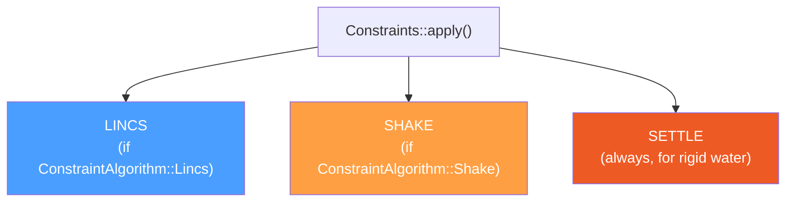

# Module 7: Integration and Constraints

> **Goal:** Understand the mathematics and code of time integration (leap-frog, velocity Verlet), temperature coupling (Berendsen, v-rescale, Nose-Hoover), pressure coupling (Berendsen, Parrinello-Rahman), and constraint algorithms (LINCS, SETTLE). These turn forces into trajectories.

> **Prerequisites:** [Module 1 (Physics)](01-physics-foundations.md), [Module 4 (MD Loop)](04-md-loop.md)

---

## 7.1 The Integration Problem

After `do_force()` computes forces $\mathbf{F}_i$ for each atom, we need to advance positions and velocities by one timestep $\Delta t$. The key class is `Update`:

```cpp
// src/gromacs/mdlib/update.h
class Update {
public:
    Update(const t_inputrec& inputRecord, const gmx_ekindata_t& ekind,
           BoxDeformation* boxDeformation);

    PaddedVector<RVec>* xp();    // intermediate (pre-constraint) coordinates

    void update_coords(...);      // main integration dispatch
    void finish_update(...);      // copy xprime → x for non-frozen atoms
    void update_sd_second_half(...);  // second half of SD integrator
};
```

The `xp()` buffer holds intermediate coordinates — `update_coords()` writes new positions there, then constraints correct them, and `finish_update()` copies the result back.

---

## 7.2 Leap-Frog Integrator

The default GROMACS integrator. Velocities and positions are staggered by half a timestep:

$$\mathbf{v}\!\left(t + \tfrac{\Delta t}{2}\right) = \lambda \cdot \mathbf{v}\!\left(t - \tfrac{\Delta t}{2}\right) + \frac{\mathbf{F}(t)}{m} \Delta t$$

$$\mathbf{r}(t + \Delta t) = \mathbf{r}(t) + \mathbf{v}\!\left(t + \tfrac{\Delta t}{2}\right) \Delta t$$

where $\lambda$ is the temperature coupling factor (1.0 for NVE).

```
Time:     t-dt/2      t       t+dt/2     t+dt      t+3dt/2
           |          |          |          |          |
Velocity:  v ─────────┼────────> v ─────────┼────────> v
                      |                     |
Position:             r ──────────────────> r ──────────────────> r
                      |                     |
Force:             F(r) computed          F(r) computed
```

### The Simple Implementation

```cpp
// src/gromacs/mdlib/update.cpp, lines ~365-417
template<StoreUpdatedVelocities storeVelocities,
         NumTempScaleValues    numTempScaleValues,
         ParrinelloRahmanVelocityScaling prVelocityScaling,
         typename VelocityType>
static void updateMDLeapfrogSimple(
    int start, int nrend, real dt, real dtPressureCouple,
    const RVec* invMassPerDim, ArrayRef<const t_grp_tcstat> tcstat,
    ArrayRef<const unsigned short> cTC,
    const RVec pRVScaleMatrixDiagonal,
    const RVec* x, RVec* xprime, VelocityType* v, const RVec* f)
{
    for (int a = start; a < nrend; a++)
    {
        real lambdaGroup = tcstat[cTC[a]].lambda;  // T-coupling scale factor

        for (int d = 0; d < DIM; d++)
        {
            // v(t+dt/2) = lambda * v(t-dt/2) + (F/m) * dt
            real vNew = lambdaGroup * v[a][d]
                        + f[a][d] * invMassPerDim[a][d] * dt;

            // Optional Parrinello-Rahman velocity scaling
            if constexpr (prVelocityScaling == ...::Diagonal)
                vNew -= dtPressureCouple * pRVScaleMatrixDiagonal[d] * v[a][d];

            if constexpr (storeVelocities == StoreUpdatedVelocities::Yes)
                v[a][d] = vNew;

            // x(t+dt) = x(t) + v(t+dt/2) * dt
            xprime[a][d] = x[a][d] + vNew * dt;
        }
    }
}
```

`★ Insight ─────────────────────────────────────`
The four template parameters eliminate branches in the inner loop. For a pure NVE simulation, the compiler generates code without any temperature scaling or Parrinello-Rahman checks. GROMACS also has a SIMD variant (`updateMDLeapfrogSimpleSimd`) using fused multiply-add: `v = fma(f * invMass, dt, lambda * v)`.
`─────────────────────────────────────────────────`

### The General Implementation (Nose-Hoover, deformation)

For extended-ensemble integrators, a more complex version handles the Nose-Hoover friction term:

```cpp
// src/gromacs/mdlib/update.cpp, lines ~657-692
if (doNoseHoover)
{
    factorNH = 0.5 * nsttcouple * dt * nh_vxi[gt];  // friction coefficient
}

// Reversible leap-frog (Holian et al. Phys Rev E 52(3):2338, 1995):
real vNew = (lg * vRel[d]
             + (f[n][d] * invMassPerDim[n][d] * dt
                - factorNH * vRel[d]
                - parrinelloRahmanScaledVelocity[d]))
            / (1 + factorNH);    // ← denominator makes it time-reversible

v[n][d]      = vNew;
xprime[n][d] = x[n][d] + vNew * dt;
```

The `(1 + factorNH)` denominator is essential: it makes the Nose-Hoover integration time-reversible, which is required for the conserved quantity to be well-defined.

---

## 7.3 Velocity Verlet Integrator

Velocity Verlet computes velocities at the same time as positions (no half-step staggering):

**Half-step 1 (before forces):**
$$\mathbf{v}\!\left(t + \tfrac{\Delta t}{2}\right) = \mathbf{v}(t) + \frac{\mathbf{F}(t)}{2m} \Delta t$$

**Position update:**
$$\mathbf{r}(t + \Delta t) = \mathbf{r}(t) + \mathbf{v}\!\left(t + \tfrac{\Delta t}{2}\right) \Delta t$$

**Half-step 2 (after new forces):**
$$\mathbf{v}(t + \Delta t) = \mathbf{v}\!\left(t + \tfrac{\Delta t}{2}\right) + \frac{\mathbf{F}(t + \Delta t)}{2m} \Delta t$$

```cpp
// src/gromacs/mdlib/update.cpp

// Velocity half-step (lines ~920-975)
static void do_update_vv_vel(...)
{
    // For MTTK extended ensemble:
    real mv1 = std::exp(-g);        // g = 0.25 * dt * veta * alpha
    real mv2 = series_sinhx(g);     // sinh(g)/g for numerical stability

    for (int n = start; n < nrend; n++)
    {
        real w_dt = invmass[n] * dt;
        for (int d = 0; d < DIM; d++)
        {
            v[n][d] = mv1 * (mv1 * v[n][d] + 0.5 * (w_dt * mv2 * f[n][d]))
                      + 0.5 * acceleration[ga][d] * dt;
        }
    }
}

// Position update (lines ~981-1030)
static void do_update_vv_pos(...)
{
    // For MTTK barostat:
    real mr1 = std::exp(g);         // g = 0.5 * dt * veta
    real mr2 = series_sinhx(g);

    for (int n = start; n < nrend; n++)
        for (int d = 0; d < DIM; d++)
            xprime[n][d] = mr1 * (mr1 * x[n][d] + mr2 * dt * v[n][d]);
}
```

Velocity Verlet is called twice per step in `do_md()` — once before force calculation (half-step 1 + position) and once after (half-step 2).

---

## 7.4 Temperature Coupling

### Berendsen (weak coupling)

$$\lambda = \sqrt{1 + \frac{\Delta t}{\tau_T}\left(\frac{T_{\text{ref}}}{T} - 1\right)}$$

```cpp
// src/gromacs/mdlib/coupling.cpp, lines ~1388-1426
void berendsen_tcoupl(const t_inputrec* ir, gmx_ekindata_t* ekind, real dt, ...)
{
    for (int i = 0; i < ngtc; i++)
    {
        real T = ekind->tcstat[i].Th;             // measured temperature
        real reft = ekind->currentReferenceTemperature(i);

        // Berendsen scaling factor
        real lll = std::sqrt(1.0 + (dt / tau_t[i]) * (reft / T - 1.0));

        // Clamp to [0.8, 1.25] for stability
        ekind->tcstat[i].lambda = std::max(std::min(lll, 1.25_real), 0.8_real);
    }
}
```

Berendsen is a **weak coupling** thermostat — it does NOT produce a proper canonical (Boltzmann) distribution. Use it only for equilibration, not production.

### V-Rescale (canonical, recommended)

```cpp
// src/gromacs/mdlib/coupling.cpp, lines ~2196-2250
void vrescale_tcoupl(const t_inputrec* ir, int64_t step, gmx_ekindata_t* ekind, ...)
{
    for (int i = 0; i < ngtc; i++)
    {
        real Ek     = trace(ekind->tcstat[i].ekinh);
        real Ek_ref = 0.5 * reft * c_boltz * nrdf;  // (ndof/2) * kT

        // Stochastic resample from Gamma distribution (Bussi et al. JCP 2007)
        real Ek_new = vrescale_resamplekin(Ek, Ek_ref, nrdf,
                                           tau_t / dt, step, seed);

        ekind->tcstat[i].lambda = std::sqrt(Ek_new / Ek);
    }
}
```

V-Rescale is **rigorously canonical** — it resamples kinetic energy from the correct distribution. This is the recommended thermostat for production simulations.

### Nose-Hoover (extended Lagrangian)

Nose-Hoover adds a "thermostat variable" $\xi$ with its own equation of motion:

```cpp
// src/gromacs/mdlib/coupling.cpp, lines ~1491-1506
static void nosehoover_tcoupl(const gmx_ekindata_t& ekind, real dt,
                               ArrayRef<double> xi, ArrayRef<double> vxi,
                               const t_extmass& MassQ)
{
    for (int i = 0; i < ngtc; i++)
    {
        real reft   = ekind.currentReferenceTemperature(i);
        real oldvxi = vxi[i];

        // NH equation of motion: d²ξ/dt² = (T - T_ref) / Q
        vxi[i] += dt * MassQ.Qinv[i] * (ekind.tcstat[i].Th - reft);
        xi[i]  += dt * (oldvxi + vxi[i]) * 0.5;   // trapezoidal
    }
}
```

The friction enters the leap-frog via `factorNH` (see Section 7.2).

---

## 7.5 Pressure Coupling

### Parrinello-Rahman (extended Lagrangian, recommended for NPT)

The box has its own "velocity" `boxv` and accelerates according to the pressure difference:

```cpp
// src/gromacs/mdlib/coupling.cpp, lines ~790-940
void parrinellorahman_pcoupl(...)
{
    real vol = box[XX][XX] * box[YY][YY] * box[ZZ][ZZ];

    // Pressure difference: P_actual - P_reference
    m_sub(pres, ref_p, pdiff);

    // Box acceleration: boxv_dot = V * W^{-1} * h^{-T} * (P - P_ref)
    tmmul(invbox, pdiff, t1);
    for (d = 0; d < DIM; d++)
        for (n = 0; n <= d; n++)
            boxv[d][n] += couplingTimePeriod * winv[d][n] * vol * t1[d][n];

    // Compute scaling matrices for coordinates and velocities
    *M = productOfInvBoxAndBoxMatrix(...);
    *mu = calculateMu(...);
}
```

The `M` matrix then enters the leap-frog integrator as `parrinelloRahmanScaledVelocity`.

### The NPT Conserved Quantity

The conserved energy for NPT includes barostat and thermostat terms:

```cpp
// src/gromacs/mdlib/coupling.cpp, lines ~2025-2116
real NPT_energy(...)
{
    real energyNPT = 0;

    // Barostat kinetic energy: 0.5 * boxv^2 / (W * c_presfac)
    if (epc == ParrinelloRahman)
        energyNPT += 0.5 * sum(boxv^2 / invMass) + vol * trace(P_ref) / (DIM * c_presfac);

    // Thermostat energy (chain kinetic + potential)
    if (etc == NoseHoover)
        energyNPT += energyNoseHoover(...);
    else if (etc == VRescale || etc == Berendsen)
        energyNPT += sum(therm_integral);   // accumulated work

    return energyNPT;
}
```

This is what GROMACS reports as "Conserved Energy" — if it drifts, something is wrong.

---

## 7.6 Constraint Algorithms

After integration updates positions, constraints enforce fixed bond lengths:

```cpp
// src/gromacs/mdlib/constr.h
class Constraints {
public:
    // The main entry point — called after update_coords()
    bool apply(bool computeRmsd, int64_t step, int delta_step, real step_scaling,
               ArrayRefWithPadding<RVec> x,       // old positions
               ArrayRefWithPadding<RVec> xprime,   // new (unconstrained) positions
               ArrayRef<RVec> min_proj,
               const matrix box, real lambda, real* dhdlambda,
               ArrayRefWithPadding<RVec> v,         // velocities (corrected too)
               bool computeVirial, tensor constraintsVirial,
               ConstraintVariable econq);
};
```

Inside `apply()`, three algorithms are dispatched:



SETTLE is **always used for rigid water** regardless of the LINCS/SHAKE setting — it's an analytical solver specialized for exactly 3 atoms.

### LINCS (Linear Constraint Solver)

LINCS constrains bond lengths using a matrix expansion approach:

1. **Build coupling matrix** $S$ from constraint Jacobian $B$ and mass matrix $M$
2. **Matrix expansion**: solve $(I - S)^{-1} \approx I + S + S^2 + \ldots + S^{n}$ (where $n$ = `nProjOrder`)
3. **Apply Lagrange multipliers** to correct positions
4. **Iterative correction** for rotational errors ($n$ = `nLincsIter` times)

```cpp
// src/gromacs/mdlib/lincs.cpp

// Matrix expansion (lines ~277-369)
static void lincs_matrix_expand(const Lincs& lincsd, ...)
{
    for (int rec = 0; rec < lincsd.nOrder; rec++)  // expansion order
    {
        for (int b = b0; b < b1; b++)
        {
            real mvb = 0;
            for (int n = blnr[b]; n < blnr[b+1]; n++)
                mvb += blcc[n] * rhs1[blbnb[n]];  // matrix-vector multiply

            rhs2[b] = mvb;
            sol[b] += mvb;  // accumulate: sol = (I + S + S^2 + ...) * rhs
        }
        std::swap(rhs1, rhs2);
    }
}

// Main solve + correction loop (lines ~1145-1237)
// Step 1: Initial solve via matrix expansion
lincs_matrix_expand(*lincsd, task, blcc, rhs1, rhs2, sol);
mlambda[b] = blc[b] * sol[b];
lincs_update_atoms(lincsd, th, 1.0, mlambda, r, invmass, xp);

// Step 2: Correct for rotational errors (nIter times)
for (int iter = 0; iter < lincsd->nIter; iter++)
{
    calc_dist_iter(..., rhs1, sol, bWarn);     // residual violations
    lincs_matrix_expand(...);
    lincs_update_atoms(lincsd, th, 1.0, blc_sol, r, invmass, xp);
}
```

### SETTLE (Analytical Water Constraints)

SETTLE analytically solves the constraint equations for a rigid 3-site water molecule (O-H2):

```cpp
// src/gromacs/mdlib/settle.h
struct SettleParameters {
    real mO, mH;        // oxygen and hydrogen masses
    real wh;             // mH / (mO + 2*mH) — relative H mass
    real dOH;            // target O-H distance
    real dHH;            // target H-H distance
    real ra, rb, rc;     // triangle geometry parameters
    matrix invmat;       // inverse coupling matrix
};
```

The algorithm (Miyamoto & Kollman, 1992):
1. Compute the displacement of the unconstrained triangle relative to the reference
2. Build a local orthonormal coordinate system from the reference geometry
3. **Analytically solve** for rotation angles (phi, psi, theta) that restore bond lengths
4. Rotate and place atoms at the constrained positions
5. Correct velocities accordingly

SETTLE is exact (no iterations), extremely fast, and is the reason water simulation in GROMACS is so efficient. It has both scalar and SIMD implementations.

---

## 7.7 Integration + Constraints: The Full Step

Putting it all together for a leap-frog step:

```
1. update_coords()
   └── updateMDLeapfrogSimple()    →  xprime = x + v_new * dt
                                       (writes to xp buffer, NOT to state->x)

2. Constraints::apply()
   ├── constrain_lincs()           →  correct xprime to satisfy bond constraints
   ├── constrain_shake()           →  (alternative constraint solver)
   └── csettle()                   →  correct xprime for rigid water

3. finish_update()
   └── copy xprime → state->x     (for non-frozen atoms)
       and update velocities       (v = (xprime_constrained - x) / dt)
```

The xp buffer is critical: it allows constraints to see both old positions (`x`) and new unconstrained positions (`xprime`) simultaneously, which is needed to compute the constraint correction.

---

## Exercises

### Exercise 7.1: Read the Leap-Frog Code
Open `src/gromacs/mdlib/update.cpp`:
1. Find `updateMDLeapfrogSimple`. What are its four template parameters?
2. Identify the two core lines: the velocity update and the position update.
3. How does `lambdaGroup` enter the velocity equation? Where does it come from?
4. Find `updateMDLeapfrogSimpleSimd` — how does it use `fma()`?

### Exercise 7.2: Compare Thermostats
In `src/gromacs/mdlib/coupling.cpp`:
1. Find `berendsen_tcoupl` and `vrescale_tcoupl`. How do their lambda computations differ?
2. Why is Berendsen clamped to [0.8, 1.25]?
3. What function does `vrescale_resamplekin` call? Why is stochastic resampling needed?
4. Find `nosehoover_tcoupl` — what is `MassQ.Qinv[i]`?

### Exercise 7.3: Understand LINCS
In `src/gromacs/mdlib/lincs.cpp`:
1. Find `lincs_matrix_expand`. What does `nOrder` control?
2. What does the outer `nIter` loop correct for?
3. Why is LINCS called "linear"? (Hint: what approximation does it make?)

### Exercise 7.4: Read SETTLE
Open `src/gromacs/mdlib/settle.h`:
1. What are `ra`, `rb`, `rc` in `SettleParameters`? Draw the water triangle.
2. Why does SETTLE only work for 3-atom molecules?
3. Open `settle.cpp` and find `settleTemplate` — how many template parameters does it have?

### Exercise 7.5: Conserved Energy
In `src/gromacs/mdlib/coupling.cpp`:
1. Find `NPT_energy`. What terms contribute to the conserved quantity?
2. For Parrinello-Rahman, what is the `boxv` kinetic energy term?
3. For Nose-Hoover, what chain variables contribute?

---

## Key Takeaways

1. **Leap-frog is the default** — velocities at half-steps, positions at whole steps; simple, stable, and SIMD-friendly
2. **Template parameters eliminate branches** — the compiler generates specialized integrator kernels for each coupling combination
3. **V-Rescale is the recommended thermostat** — rigorously canonical, unlike Berendsen which only reproduces the correct average temperature
4. **Parrinello-Rahman is the recommended barostat** — extended Lagrangian with a conserved quantity
5. **LINCS uses matrix expansion** — `nProjOrder` controls accuracy; `nLincsIter` corrects rotational errors
6. **SETTLE is analytical** — no iterations, specialized for rigid 3-site water, with SIMD optimization
7. **The xp buffer** separates unconstrained from constrained positions, enabling constraints to work correctly

---

*Previous: [Module 6 — nbnxm Non-Bonded](06-nbnxm-nonbonded.md)*
*Next: [Module 8 — The Modular Simulator](08-modular-simulator.md)*
