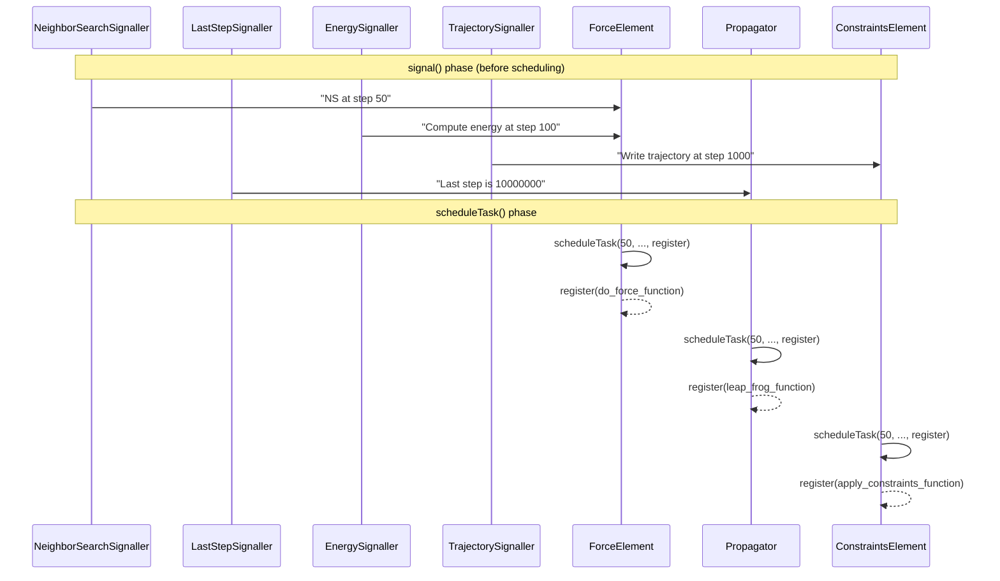
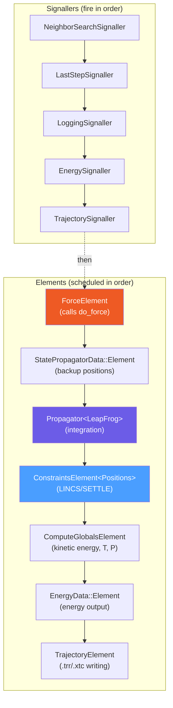

# Module 8: The Modular Simulator

> **Goal:** Understand the modern alternative to `do_md()` — a composable, element-based simulation architecture where each physics operation is an independent `ISimulatorElement` and the simulation step is assembled from these elements like building blocks. This is the future of GROMACS simulation architecture.

> **Prerequisites:** [Module 4 (MD Loop)](04-md-loop.md), [Module 7 (Integration & Constraints)](07-integration-constraints.md)

---

## 8.1 Why a Modular Simulator?

The legacy `do_md()` function (Module 4) is ~2200 lines of sequentially interleaved physics. Adding a new feature means carefully inserting code into the correct position within this monolithic function. The Modular Simulator solves this by decomposing the simulation step into independent, composable elements:

| Legacy (`do_md()`) | Modular Simulator |
|---------------------|-------------------|
| One ~2200-line function | Many small `ISimulatorElement` classes |
| Ordering encoded by line position | Ordering encoded by builder `add<>()` calls |
| Booleans control what runs | Each element decides via `scheduleTask()` |
| Adding features = modifying monolith | Adding features = writing a new element |
| Hard to test individual steps | Each element independently testable |

Both simulators receive identical `LegacySimulatorData`. The choice is made at runtime:

```cpp
// src/gromacs/mdrun/simulatorbuilder.cpp
auto simulator = simulatorBuilder.build(useModularSimulator);
//                                      ^^^^^^^^^^^^^^^^
// Determined by ModularSimulator::isInputCompatible()
```

---

## 8.2 Core Interfaces

All interfaces live in `src/gromacs/modularsimulator/modularsimulatorinterfaces.h`.

### Primitive Types

```cpp
using Step = int64_t;   // step number
using Time = double;    // simulation time

// A callable unit of work (zero arguments)
typedef std::function<void()> SimulatorRunFunction;

// A sink that accepts work units and queues them
typedef std::function<void(SimulatorRunFunction)> RegisterRunFunction;

// Called per step: element decides whether to queue work
typedef std::function<void(Step, Time, const RegisterRunFunction&)> SchedulingFunction;
```

### The ISimulatorElement Interface

Every physics operation implements this:

```cpp
class ISimulatorElement
{
public:
    // Called during scheduling: queue work for this (step, time)
    virtual void scheduleTask(Step, Time, const RegisterRunFunction&) = 0;

    // Called once before the first step
    virtual void elementSetup() = 0;

    // Called once after the last step
    virtual void elementTeardown() = 0;

    virtual ~ISimulatorElement() = default;
};
```

The key method is `scheduleTask()`. It does NOT execute work — it optionally enqueues `SimulatorRunFunction` objects via the `RegisterRunFunction` callback. This two-phase design (schedule, then execute) allows the algorithm to inspect and reorder the task queue.

### The ISignaller Interface

Signallers broadcast events (neighbor search step, energy step, last step, etc.) to subscribing elements:

```cpp
class ISignaller
{
public:
    virtual void signal(Step, Time) = 0;  // called once per step
    virtual void setup() = 0;
    virtual ~ISignaller() = default;
};

typedef std::function<void(Step, Time)> SignallerCallback;
```

---

## 8.3 The Signaller Pattern

Before elements schedule their work each step, signallers fire callbacks to inform elements about upcoming events:



### Five Concrete Signallers

| Signaller | What It Signals | Fires When |
|-----------|----------------|------------|
| `NeighborSearchSignaller` | NS step coming | `step % nstlist == 0` or `step == initStep` |
| `LastStepSignaller` | Simulation ending | `step == lastStep` or stop signal |
| `LoggingSignaller` | Log output step | `step % nstlog == 0` or last step |
| `EnergySignaller` | Energy/virial/FEP calc needed | `step % nstcalcenergy == 0` etc. |
| `TrajectorySignaller` | Trajectory writing | `step % nstxout == 0` etc. |

### Client Interfaces

Each element that needs to know about an event implements a client interface:

```cpp
class INeighborSearchSignallerClient {
protected:
    virtual std::optional<SignallerCallback> registerNSCallback() = 0;
};

class IEnergySignallerClient {
protected:
    // Separate callbacks for energy, virial, and FEP events
    virtual std::optional<SignallerCallback>
        registerEnergyCallback(EnergySignallerEvent event) = 0;
};

class ILastStepSignallerClient {
protected:
    virtual std::optional<SignallerCallback> registerLastStepCallback() = 0;
};
```

`★ Insight ─────────────────────────────────────`
The signaller pattern decouples "what to do" from "when to do it." In `do_md()`, every element checks `do_per_step()` itself. In the Modular Simulator, signallers compute these decisions once and push them to clients. This means an element like `ForceElement` doesn't need to know the value of `nstcalcenergy` — it just receives a callback saying "compute energy this step."
`─────────────────────────────────────────────────`

---

## 8.4 Key Elements

### ForceElement

Wraps `do_force()` as a simulator element:

```cpp
// src/gromacs/modularsimulator/forceelement.h
class ForceElement final :
    public ISimulatorElement,
    public ITopologyHolderClient,
    public INeighborSearchSignallerClient,
    public IEnergySignallerClient,
    public IDomDecHelperClient
{
    void scheduleTask(Step, Time, const RegisterRunFunction&) override;

    // Receives callbacks from signallers:
    std::optional<SignallerCallback> registerNSCallback() override;
    std::optional<SignallerCallback> registerEnergyCallback(EnergySignallerEvent) override;

private:
    // Internally tracks: next NS step, next energy step, next virial step...
    Step nextNSStep_;
    Step nextEnergyCalculationStep_;
    Step nextVirialCalculationStep_;

    // Dispatches to do_force() or relax_shell_flexcon()
    template<bool doShellFC>
    void run(Step step, Time time, unsigned int flags);
};
```

### Propagator (templated on integration stage)

```cpp
// src/gromacs/modularsimulator/propagator.h

enum class IntegrationStage {
    PositionsOnly,                          // x += v * dt
    VelocitiesOnly,                         // v += (F/m) * dt
    LeapFrog,                               // fused leap-frog step
    VelocityVerletPositionsAndVelocities,   // VV full + half step
    ScaleVelocities,                        // thermostat velocity scaling
    ScalePositions,                         // barostat position scaling
    Count
};

template<IntegrationStage integrationStage>
class Propagator final : public ISimulatorElement
{
public:
    Propagator(double timestep, StatePropagatorData*, const MDAtoms*, gmx_wallcycle*);

    void scheduleTask(Step, Time, const RegisterRunFunction&) override;

    // Thermostat/barostat connection points:
    ArrayRef<real> viewOnStartVelocityScaling();
    ArrayRef<real> viewOnEndVelocityScaling();
    Matrix3x3* viewOnPRScalingMatrix();
    PropagatorCallback velocityScalingCallback();
    PropagatorCallback positionScalingCallback();

private:
    // Inner run<> is templated on scaling parameters for zero-overhead dispatch
    template<NumVelocityScalingValues, ParrinelloRahmanVelocityScaling,
             NumVelocityScalingValues, NumPositionScalingValues>
    void run();
};
```

The Propagator's inner `run<>()` method has four template parameters for scaling modes, generating many specialized variants — the same branchless optimization as the legacy leap-frog (Module 7).

### ConstraintsElement

```cpp
// src/gromacs/modularsimulator/constraintelement.h
template<ConstraintVariable variable>  // position-and-velocity or velocity-only
class ConstraintsElement final :
    public ISimulatorElement,
    public IEnergySignallerClient,
    public ITrajectorySignallerClient,
    public ILoggingSignallerClient
{
    void scheduleTask(Step, Time, const RegisterRunFunction&) override;

private:
    void apply(Step step, bool calculateVirial, bool writeLog, bool writeEnergy);

    Step nextVirialCalculationStep_;
    Step nextEnergyWritingStep_;
    Step nextLogWritingStep_;
};
```

---

## 8.5 Data Objects

Three data objects provide typed access to simulation state. They are **not** `ISimulatorElement` themselves — each owns an inner `Element` class that handles I/O at the right moment:

### StatePropagatorData

```cpp
// src/gromacs/modularsimulator/statepropagatordata.h
class StatePropagatorData final
{
public:
    // Typed accessors — no raw pointer access to state
    ArrayRefWithPadding<RVec>       positionsView();
    ArrayRefWithPadding<const RVec> constPositionsView() const;
    ArrayRefWithPadding<RVec>       velocitiesView();
    ForceBuffersView&               forcesView();
    rvec*                           box();
    int                             localNumAtoms() const;

    // Inner element handles trajectory writing + checkpointing
    class Element;
    Element* element();

private:
    PaddedHostVector<RVec> x_, previousX_, v_;
    ForceBuffers f_;
    matrix box_, previousBox_;
};
```

### EnergyData

```cpp
// src/gromacs/modularsimulator/energydata.h
class EnergyData final
{
public:
    gmx_enerdata_t* enerdata();
    gmx_ekindata_t* ekindata();

    // Plugin-style energy contributions (thermostat, barostat register their conserved energy terms)
    void addConservedEnergyContribution(EnergyContribution&& contribution);

    void addToForceVirial(const tensor virial, Step step);
    void addToConstraintVirial(const tensor virial, Step step);

    class Element;
    Element* element();
};
```

---

## 8.6 The Algorithm Builder

The simulation step is assembled by calling `builder.add<Element>(...)` in the desired execution order:

```cpp
// src/gromacs/modularsimulator/simulatoralgorithm.h

class ModularSimulatorAlgorithmBuilder final {
public:
    ModularSimulatorAlgorithmBuilder(
        compat::not_null<LegacySimulatorData*> legacySimulatorData,
        std::unique_ptr<ReadCheckpointDataHolder> checkpointDataHolder);

    // Add an element to the call list (order = simulation order)
    template<typename Element, typename... Args>
    void add(Args&&... args);

    // Build the algorithm (can only call once)
    ModularSimulatorAlgorithm build();
};
```

### Element Factory Protocol

Every buildable element must implement a static factory:

```cpp
static ISimulatorElement* getElementPointerImpl(
    LegacySimulatorData*                    legacySimulatorData,
    ModularSimulatorAlgorithmBuilderHelper*  builderHelper,
    StatePropagatorData*                    statePropagatorData,
    EnergyData*                             energyData,
    FreeEnergyPerturbationData*             freeEnergyPerturbationData,
    GlobalCommunicationHelper*              globalCommunicationHelper,
    ObservablesReducer*                     observablesReducer,
    /* optional additional args */);
```

The factory creates the element, calls `builderHelper->storeElement(std::move(element))` (which takes ownership and auto-registers it with all applicable signallers), and returns the raw pointer.

### Auto-Registration

When `storeElement()` is called, the builder introspects the element's interface inheritance and registers it with all applicable systems:

```cpp
// If element inherits from INeighborSearchSignallerClient:
neighborSearchSignallerBuilder_.registerSignallerClient(element);

// If element inherits from IEnergySignallerClient:
energySignallerBuilder_.registerSignallerClient(element);

// If element inherits from ICheckpointHelperClient:
checkpointHelperBuilder_.registerClient(element);

// ... 9 infrastructure/signaller systems in total
```

This is done via `castOrNull<InterfaceType>(element)` — if the element doesn't implement the interface, it returns `nullptr` and the registration is silently skipped.

---

## 8.7 The Algorithm at Runtime

```cpp
// src/gromacs/modularsimulator/simulatoralgorithm.h

class ModularSimulatorAlgorithm final
{
    // Returns the next task from the queue (nullptr when step is done)
    const SimulatorRunFunction* getNextTask();

private:
    void populateTaskQueue();   // builds queue up to next NS step

    // Flat list of callable tasks
    std::vector<SimulatorRunFunction> taskQueue_;

    // Ownership vs calling (may differ!)
    std::vector<std::unique_ptr<ISimulatorElement>> elementsOwnershipList_;
    std::vector<ISimulatorElement*>                 elementCallList_;

    // Signallers fire before elements schedule
    std::vector<std::unique_ptr<ISignaller>> signallerList_;

    // The three data objects
    std::unique_ptr<StatePropagatorData>       statePropagatorData_;
    std::unique_ptr<EnergyData>                energyData_;
    std::unique_ptr<FreeEnergyPerturbationData> freeEnergyPerturbationData_;
};
```

The run loop (inside `ModularSimulator::run()`):

```
for each step:
    1. signallerList_[i]->signal(step, time)         // broadcast events
    2. for each element in elementCallList_:
         element->scheduleTask(step, time, register)  // elements queue work
    3. while (task = getNextTask()):
         task()                                        // execute queued work
```

---

## 8.8 Composing a Leap-Frog NVT Simulation

Here's how a basic simulation is composed from elements:



### Thermostat Connection

The thermostat doesn't appear as a separate element in the call list. Instead, it registers with the Propagator via `PropagatorConnection`:

```cpp
struct PropagatorConnection {
    PropagatorTag tag;                                     // e.g., "LeapFrogPropagator"
    std::function<ArrayRef<real>()> getViewOnStartVelocityScaling;
    std::function<PropagatorCallback()> getVelocityScalingCallback;
    // ... (position scaling, PR matrix, etc.)
};
```

The v-rescale thermostat writes scaling factors into the Propagator's velocity scaling array, and the Propagator applies them during its `run()` method. This decouples the thermostat implementation from the integration implementation.

---

## 8.9 Comparison with Legacy `do_md()`

| Aspect | `do_md()` | Modular Simulator |
|--------|-----------|-------------------|
| Step order | Hardcoded by line position | Encoded by `add<>()` calls |
| What runs each step | Boolean gates (`bCalcEner`, etc.) | `scheduleTask()` + signaller callbacks |
| Adding a thermostat | Edit monolith, insert at right position | Write element + register `PropagatorConnection` |
| Data access | Direct member access (`state_->x`) | Typed API (`statePropagatorData->positionsView()`) |
| Testing | Can't test individual phases | Each element testable in isolation |
| GPU integration | Interleaved CPU/GPU code | Element-level GPU abstraction possible |

---

## 8.10 The CompositeSimulatorElement

For grouping elements that should act as one:

```cpp
// src/gromacs/modularsimulator/compositesimulatorelement.h
class CompositeSimulatorElement final : public ISimulatorElement
{
public:
    CompositeSimulatorElement(
        std::vector<not_null<ISimulatorElement*>> elementCallList,
        std::vector<std::unique_ptr<ISimulatorElement>> elements,
        int frequency);

    void scheduleTask(Step, Time, const RegisterRunFunction&) override;
    // Delegates to all children
};
```

This is the **Composite pattern**: it lets a group of elements be treated as a single element, useful for Multi-Time-Stepping where slow-force elements run at reduced frequency.

---

## Exercises

### Exercise 8.1: Read the Core Interfaces
Open `src/gromacs/modularsimulator/modularsimulatorinterfaces.h`:
1. Find `ISimulatorElement`. What are its three virtual methods?
2. Find the three type aliases (`SimulatorRunFunction`, `RegisterRunFunction`, `SchedulingFunction`). What does each represent?
3. Find `IEnergySignallerClient`. What does `EnergySignallerEvent` enumerate?
4. What is `PropagatorConnection`? How many function members does it have?

### Exercise 8.2: Explore the ForceElement
Open `src/gromacs/modularsimulator/forceelement.h`:
1. What interfaces does `ForceElement` implement (list all base classes)?
2. What member variables track "next step to do X"?
3. How does `ForceElement` know when to compute energy? (Trace through the signaller callback.)

### Exercise 8.3: Understand the Builder
Open `src/gromacs/modularsimulator/simulatoralgorithm.h`:
1. Find `ModularSimulatorAlgorithmBuilder`. How does `add<Element>()` work?
2. Find `ModularSimulatorAlgorithm`. What is `taskQueue_`?
3. What is the difference between `elementsOwnershipList_` and `elementCallList_`? Why might they differ?
4. Find the `SignallerBuilder<Signaller>` template — what does `registerSignallerClient()` do?

### Exercise 8.4: Classify Module Files
List all files in `src/gromacs/modularsimulator/` and classify them as:
- Interface files
- Element implementations (physics)
- Thermostat/barostat elements
- Data objects
- Infrastructure helpers

### Exercise 8.5: Compare with Legacy
Trace how "compute energy on step 100" works in both architectures:
1. **Legacy**: Find where `bCalcEner` is set in `md.cpp`, and where it enters `do_force()`.
2. **Modular**: Trace from `EnergySignaller::signal()` → `ForceElement`'s callback → `ForceElement::scheduleTask()`.

---

## Key Takeaways

1. **The Modular Simulator decomposes `do_md()` into composable `ISimulatorElement` objects** — each responsible for one physics operation
2. **`scheduleTask()` queues work, it doesn't execute it** — this two-phase design (schedule → execute) enables inspection and reordering
3. **Signallers broadcast events** (NS, energy, last step, trajectory) to subscribing elements via callbacks, decoupling "what" from "when"
4. **Auto-registration** introspects element interfaces and registers them with all applicable signallers and infrastructure in one step
5. **Data objects** (`StatePropagatorData`, `EnergyData`) provide typed accessor APIs — no raw pointer access to simulation state
6. **Thermostats/barostats connect to Propagators** via `PropagatorConnection` — decoupling coupling algorithms from integration algorithms
7. **The builder pattern** (`add<Element>(...)` calls) makes the step ordering explicit and extensible

---

*Previous: [Module 7 — Integration and Constraints](07-integration-constraints.md)*
*Next: [Module 9 — Core Data Structures](09-data-structures.md) (Phase 3)*
