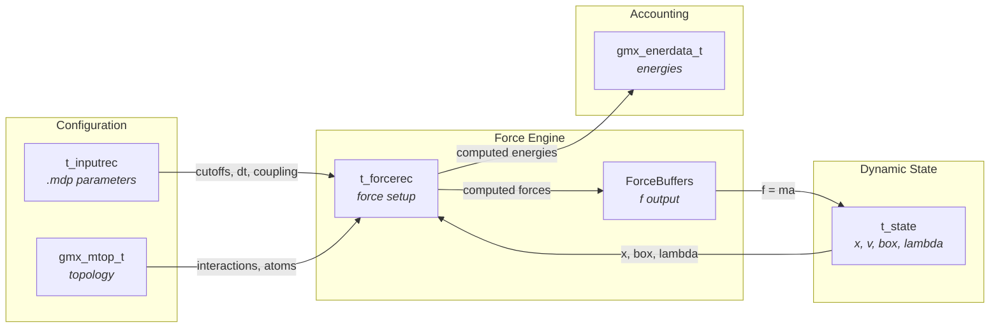
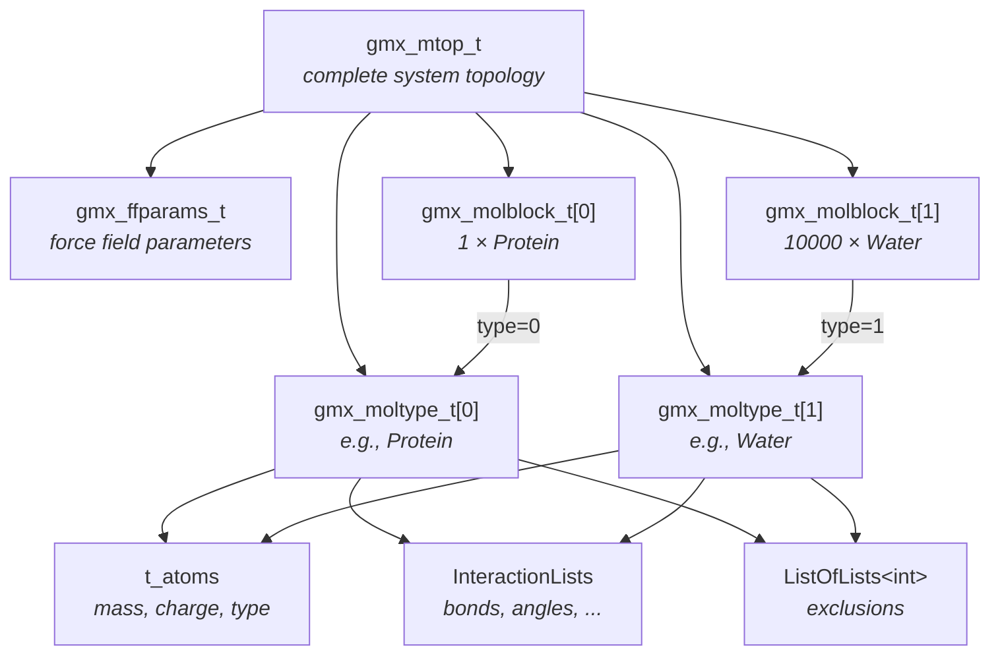
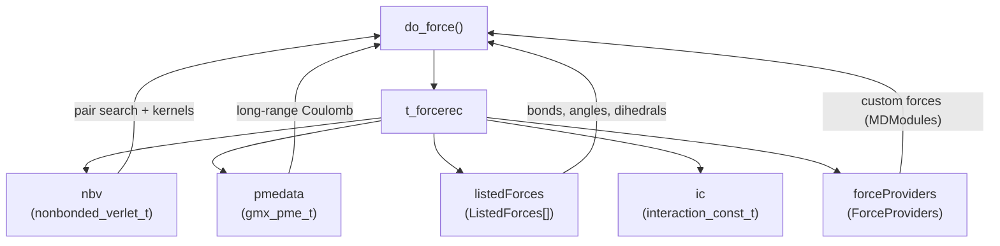
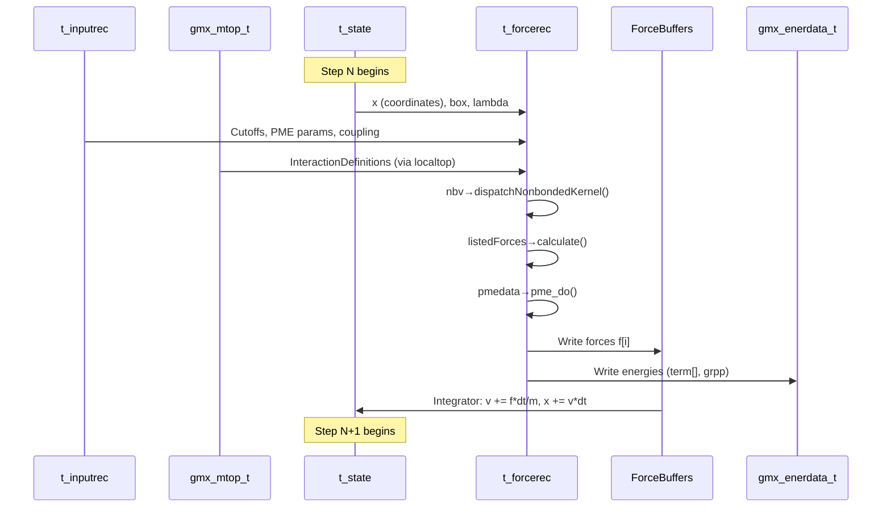

# Module 9: Core Data Structures

> **Prerequisites:** [Module 3 (Architecture)](03-architecture-overview.md), [Module 4 (MD Loop)](04-md-loop.md), [Module 5 (Force Calculation)](05-force-calculation.md)
> **Key files:** `src/gromacs/mdtypes/state.h`, `src/gromacs/mdtypes/forcerec.h`, `api/legacy/include/gromacs/topology/topology.h`, `api/legacy/include/gromacs/mdtypes/inputrec.h`, `src/gromacs/mdtypes/enerdata.h`, `src/gromacs/mdtypes/forcebuffers.h`

---

## 9.1 The Big Picture: Five Pillars of MD State

Every GROMACS simulation revolves around five core data structures. Together they define *what* the system is, *how* to simulate it, *where* particles are, *how* forces are computed, and *where* energy goes.



These structures flow through `do_force()` (Module 5) and the integrator (Module 7):

| Structure | Created by | Consumed by | Lifetime |
|-----------|-----------|-------------|----------|
| `t_inputrec` | `grompp` (from .mdp) | Everywhere | Entire simulation |
| `gmx_mtop_t` | `grompp` (from .top) | Force calculation, DD | Entire simulation |
| `t_state` | Checkpoint or initial config | Integrator, I/O | Updated every step |
| `t_forcerec` | `init_forcerec()` | `do_force()` | Entire simulation |
| `gmx_enerdata_t` | Runner setup | `do_force()`, logging | Reset each step |

---

## 9.2 t_state: The System Microstate

**File:** `src/gromacs/mdtypes/state.h` (lines 207-296)

The `t_state` holds the complete *microstate* of the simulation: positions, velocities, box vectors, and all auxiliary variables needed for thermostats and barostats. Think of it as a snapshot that, combined with the topology, fully defines the system at a point in time.

### Key Fields

```cpp
class t_state {
public:
    // ── Core atom data ──────────────────────────────────────────────
    PaddedHostVector<gmx::RVec> x;      // Coordinates [numAtoms_]
    PaddedHostVector<gmx::RVec> v;      // Velocities  [numAtoms_]
    PaddedHostVector<gmx::RVec> cg_p;   // Conjugate gradient search direction

    // ── Simulation box ──────────────────────────────────────────────
    matrix box;           // 3x3 matrix of box vectors (nm)
    matrix box_rel;       // Relative box shape (for preservation)
    matrix boxv;          // Box velocities (Parrinello-Rahman)

    // ── Pressure coupling state ─────────────────────────────────────
    matrix pres_prev;     // Pressure from previous step
    matrix svir_prev;     // Shake virial for pressure
    matrix fvir_prev;     // Force virial for pressure

    // ── Free energy ─────────────────────────────────────────────────
    gmx::EnumerationArray<FreeEnergyPerturbationCouplingType, real> lambda;

    // ── Thermostat state (Nose-Hoover chains) ───────────────────────
    std::vector<double> nosehoover_xi;    // NH coordinates
    std::vector<double> nosehoover_vxi;   // NH velocities
    std::vector<double> nhpres_xi;        // Pressure NH coordinates
    std::vector<double> nhpres_vxi;       // Pressure NH velocities
    std::vector<double> therm_integral;   // Work done by thermostat
    double baros_integral;                // Berendsen barostat integral
    real veta;                            // Trotter isotropic scaling
    real vol0;                            // Initial volume for MTTK

    // ── Kinetic energy ──────────────────────────────────────────────
    ekinstate_t ekinstate;                // Half-step and full-step Ekin

    // ── History for special algorithms ──────────────────────────────
    history_t hist;                                  // Restraint history
    std::shared_ptr<df_history_t> dfhist;            // Free-energy history
    std::shared_ptr<gmx::AwhHistory> awhHistory;     // AWH history

private:
    int numAtoms_;   // Number of atoms
    int flags_;      // Bit flags indicating which entries are present
    int ngtc;        // Temperature coupling groups
    int nnhpres;     // NH chains for barostat
    int nhchainlength;
    int fep_state;   // Alchemical state index
};
```

### StateEntry: Checkpoint Tracking

The `flags_` field uses `StateEntry` to track which components are present — essential for checkpoint I/O:

```cpp
enum class StateEntry : int {
    Lambda, Box, BoxRel, BoxV, PressurePrevious,
    Nhxi, ThermInt, X, V, SDxNotSupported,
    Cgp, LDRngNotSupported, LDRngINotSupported,
    DisreInitF, DisreRm3Tav, OrireInitF, OrireDtav,
    SVirPrev, Nhvxi, Veta, Vol0, Nhpresxi, Nhpresvxi,
    FVirPrev, FepState, MCRngNotSupported, MCRngINotSupported,
    BarosInt, PullComPrevStep,
    Count   // sentinel for EnumerationArray
};
```

### PaddedHostVector: SIMD-Safe Storage

Why `PaddedHostVector<RVec>` instead of `std::vector<RVec>`? SIMD kernels load data in lanes of 4-16 floats at a time. Near the end of an array, a SIMD load from the last real element would read past the allocation boundary. `PaddedVector` adds extra zeroed elements so this is safe:

```cpp
// src/gromacs/math/include/gromacs/math/paddedvector.h
template<typename T>
Index computePaddedSize(Index numElements) {
    if (numElements == 0) return 0;
    // Scatter access: might load starting from last element
    Index simdScatterAccessSize = numElements + 1;
    // Flat access: round up to SIMD width
    constexpr int maxSimdWidth = PaddingTraits<T>::maxSimdWidthOfBaseType;
    Index simdFlatAccessSize = (numElements + (maxSimdWidth - 1))
                             / maxSimdWidth * maxSimdWidth;
    return std::max(simdScatterAccessSize, simdFlatAccessSize);
}
```

`PaddedHostVector` is the CPU-side alias (as opposed to GPU pinned/device memory):

```
PaddedVector<RVec, Allocator<RVec, AlignedAllocationPolicy>>
     ↑ owns data        ↑ SIMD-aligned allocator
     │
     ├── size()          → actual number of atoms
     ├── paddedSize()    → size including SIMD padding
     └── arrayRefWithPadding() → ArrayRefWithPadding<RVec> view
```

### Global vs Local State

In parallel (domain decomposition) runs, two `t_state` objects exist:
- **`stateGlobal_`** — complete system state (exists only on rank 0)
- **`state_`** — local domain state (each rank's portion)

The integrator updates the local state. Coordinates are gathered to the global state only for I/O.

---

## 9.3 gmx_mtop_t: The Topology Hierarchy

**File:** `api/legacy/include/gromacs/topology/topology.h`

The molecular topology describes *what* the system is: which atoms exist, how they're bonded, and what force field parameters apply. GROMACS uses a three-level hierarchy to avoid duplicating data for identical molecules:



### Level 1: gmx_mtop_t (System Topology)

```cpp
struct gmx_mtop_t {
    char** name = nullptr;                           // Topology name
    gmx_ffparams_t ffparams;                         // All force field parameters
    std::vector<gmx_moltype_t> moltype;              // Molecule type definitions
    std::vector<gmx_molblock_t> molblock;            // Blocks of identical molecules
    bool bIntermolecularInteractions = false;
    std::unique_ptr<InteractionLists> intermolecular_ilist;
    int natoms = 0;                                  // Total atoms in system
    SimulationGroups groups;                          // Energy groups, T-coupling groups
    t_symtab symtab;                                 // String symbol table

    // Derived (computed by finalize())
    std::vector<MoleculeBlockIndices> moleculeBlockIndices;
};
```

### Level 2: gmx_moltype_t (Molecule Type)

Each unique molecule type is defined once. A protein with 100 residues is one `moltype`; a water molecule is another:

```cpp
struct gmx_moltype_t {
    char**                name;   // "Protein", "SOL", etc.
    t_atoms               atoms;  // Atom properties (mass, charge, type)
    InteractionLists      ilist;  // Bonded interactions (local atom indices)
    gmx::ListOfLists<int> excls;  // Non-bonded exclusion pairs
};
```

### Level 3: gmx_molblock_t (Molecule Block)

A block says "use molecule type X, repeated N times":

```cpp
struct gmx_molblock_t {
    int type = -1;                       // Index into mtop.moltype[]
    int nmol = 0;                        // Number of copies
    std::vector<gmx::RVec> posres_xA;   // Position restraint reference coords (state A)
    std::vector<gmx::RVec> posres_xB;   // Position restraint reference coords (state B)
};
```

**Example:** A typical solvated protein system:

| molblock | type | nmol | Description |
|----------|------|------|-------------|
| 0 | 0 (Protein) | 1 | Single protein chain |
| 1 | 1 (SOL) | 10000 | 10,000 water molecules |
| 2 | 2 (NA) | 50 | 50 sodium ions |
| 3 | 3 (CL) | 45 | 45 chloride ions |

The water topology is stored *once* in `moltype[1]`, not 10,000 times.

### InteractionLists and InteractionDefinitions

**File:** `api/legacy/include/gromacs/topology/idef.h`

Bonded interactions are stored as flat arrays of atom indices, grouped by interaction type:

```cpp
struct InteractionList {
    std::vector<int> iatoms;
    // Layout: [type_idx, atom1, atom2, type_idx, atom1, atom2, atom3, ...]
    // Number of atoms per entry depends on the interaction function
};

// One InteractionList per interaction function type
using InteractionLists = gmx::EnumerationArray<InteractionFunction, InteractionList>;
```

When the topology is distributed to domains, `InteractionLists` become `InteractionDefinitions`:

```cpp
class InteractionDefinitions {
public:
    const std::vector<t_iparams>& iparams;    // Parameter array (from ffparams)
    const std::vector<InteractionFunction>& functype;  // Function type per parameter
    InteractionLists il;                       // Interaction lists (local indices)
    std::vector<t_iparams> iparams_posres;     // Position restraint params
    std::vector<t_iparams> iparams_fbposres;   // Flat-bottom position restraints
    gmx::EnumerationArray<InteractionFunction, int> numNonperturbedInteractions;
    gmx_cmap_t cmap_grid;                      // Dihedral correction maps
};
```

### The t_iparams Union: All Force Field Parameters

Every bonded interaction type has its own parameter struct, packed into a single union:

```cpp
typedef union t_iparams {
    struct { real rA, krA, rB, krB; }                    harmonic;  // Bonds
    struct { real bm, kb; }                              fene;      // FENE bonds
    struct { real b0, kb, kcub; }                        cubic;     // Cubic bonds
    struct { real b0A, cbA, betaA, b0B, cbB, betaB; }   morse;     // Morse bonds
    struct { real thetaA, kthetaA, r13A, kUBA, ... }     u_b;       // Urey-Bradley
    struct { real phiA, cpA; int mult; real phiB, cpB; } pdihs;     // Proper dihedrals
    struct { real rbcA[NR_RBDIHS], rbcB[NR_RBDIHS]; }   rbdihs;    // Ryckaert-Bellemans
    struct { real c6, c12; }                             lj;        // LJ parameters
    struct { real dA, dB; }                              constr;    // Constraints
    struct { real doh, dhh; }                            settle;    // SETTLE (water)
    struct { real low, up1, up2, kfac; int type, ... }   disres;    // Distance restraints
    // ... many more
} t_iparams;
```

**Design insight:** The `A` and `B` suffixes support *free energy perturbation* — smoothly interpolating between two parameter sets via lambda.

### Atom Properties: t_atoms

```cpp
typedef struct t_atom {
    real m, q;              // Mass and charge (state A)
    real mB, qB;            // Mass and charge (state B, for FEP)
    unsigned short type;    // Atom type index (state A)
    unsigned short typeB;   // Atom type index (state B)
    ParticleType ptype;     // Atom, shell, virtual site, ...
    int resind;             // Residue index
    int atomnumber;         // Atomic number (element)
    char elem[4];           // Element name
} t_atom;

typedef struct t_atoms {
    int nr;                 // Number of atoms
    t_atom* atom;           // Array of atom properties
    char*** atomname;       // Atom names (pointers into symtab)
    char*** atomtype;       // Atom type names
    int nres;               // Number of residues
    t_resinfo* resinfo;     // Residue information
    bool haveMass;          // Flags for optional fields
    bool haveCharge;
    bool haveType;
} t_atoms;
```

---

## 9.4 t_inputrec: All Simulation Parameters

**File:** `api/legacy/include/gromacs/mdtypes/inputrec.h` (lines 387-651)

This enormous struct holds *every* parameter from the `.mdp` file. It's the "configuration object" for the entire simulation:

### Core Integration Parameters

```cpp
struct t_inputrec {
    // ── Integration ─────────────────────────────────────────────
    IntegrationAlgorithm eI = IntegrationAlgorithm::Default;
    int64_t nsteps = 0;          // Total steps to run
    int64_t init_step = 0;       // Starting step number
    double  init_t = 0;          // Starting time (ps)
    double  delta_t = 0;         // Timestep (ps)
    bool    useMts = false;      // Multiple time stepping
    std::vector<gmx::MtsLevel> mtsLevels;

    // ── Output frequencies ──────────────────────────────────────
    int nstlog = 0;              // Log file output frequency
    int nstxout = 0;             // Full-precision coordinate output
    int nstvout = 0;             // Velocity output
    int nstfout = 0;             // Force output
    int nstenergy = 0;           // Energy output
    int nstxout_compressed = 0;  // Compressed trajectory output
```

### Interaction Settings

```cpp
    // ── Neighbor searching ──────────────────────────────────────
    int  nstlist = 0;            // Pair list update frequency
    real rlist = 0;              // Pair list cutoff (nm)

    // ── Coulomb ─────────────────────────────────────────────────
    CoulombInteractionType coulombtype = CoulombInteractionType::Default;
    real rcoulomb = 0;           // Coulomb cutoff (nm)
    real epsilon_r = 0;          // Relative dielectric constant

    // ── Van der Waals ───────────────────────────────────────────
    VanDerWaalsType vdwtype = VanDerWaalsType::Default;
    real rvdw = 0;               // VdW cutoff (nm)

    // ── PME ─────────────────────────────────────────────────────
    int  nkx = 0, nky = 0, nkz = 0;  // PME grid dimensions
    int  pme_order = 0;               // PME interpolation order
    real ewald_rtol = 0;              // Real-space Ewald tolerance
```

### Coupling Parameters

```cpp
    // ── Temperature coupling ────────────────────────────────────
    TemperatureCoupling etc = TemperatureCoupling::Default;
    int nsttcouple = 0;

    // ── Pressure coupling ───────────────────────────────────────
    PressureCouplingOptions pressureCouplingOptions;

    // ── Constraints ─────────────────────────────────────────────
    ConstraintAlgorithm eConstrAlg = ConstraintAlgorithm::Default;
    int  nProjOrder = 0;         // LINCS projection order
    int  nLincsIter = 0;         // LINCS iterations
    real LincsWarnAngle = 0;     // Warning threshold

    // ── Group options (per-group T, acceleration, freeze) ───────
    t_grpopts opts;
```

### Special Algorithms (optional, managed by unique_ptr)

```cpp
    // ── Free energy perturbation ────────────────────────────────
    FreeEnergyPerturbationType efep = FreeEnergyPerturbationType::Default;
    std::unique_ptr<t_lambda> fepvals;

    // ── Pulling ─────────────────────────────────────────────────
    bool bPull = false;
    std::unique_ptr<pull_params_t> pull;

    // ── AWH (Accelerated Weight Histogram) ──────────────────────
    bool bDoAwh = false;
    std::unique_ptr<gmx::AwhParams> awhParams;

    // ── Enforced rotation ───────────────────────────────────────
    bool bRot = false;
    std::unique_ptr<t_rot> rot;
};
```

**Design pattern:** Optional sub-algorithms use `bool` + `unique_ptr` pairs. The bool is a quick check; the unique_ptr holds detailed parameters only if the feature is active.

### t_grpopts: Per-Group Settings

```cpp
struct t_grpopts {
    int    ngtc = 0;           // Number of temperature coupling groups
    int    nhchainlength = 0;  // Nose-Hoover chain length
    int    ngfrz = 0;          // Number of freeze groups
    int    ngener = 0;         // Number of energy groups
    real*  nrdf = nullptr;     // Degrees of freedom per group
    real*  ref_t = nullptr;    // Reference temperature per group
    real*  tau_t = nullptr;    // Coupling time constant per group
    ivec*  nFreeze = nullptr;  // Freeze directions (xyz) per group
    int*   egp_flags = nullptr; // Energy group pair flags (exclusions)
    std::vector<gmx::RVec> acceleration;  // Per-group acceleration
};
```

---

## 9.5 t_forcerec: Force Calculation Configuration

**File:** `src/gromacs/mdtypes/forcerec.h` (lines 130-282)

While `t_inputrec` holds *what* the user requested, `t_forcerec` holds the *runtime machinery* for force calculation. It's initialized once from the inputrec and topology, then used every step:

```cpp
struct t_forcerec {
    // ── Interaction parameters (derived from inputrec) ──────────
    std::unique_ptr<interaction_const_t> ic;  // Coulomb/VdW constants

    // ── Non-bonded engine ───────────────────────────────────────
    std::unique_ptr<gmx::nonbonded_verlet_t> nbv;  // Pair lists + kernels

    // ── Long-range electrostatics ───────────────────────────────
    gmx_pme_t* pmedata = nullptr;
    std::unique_ptr<CpuPpLongRangeNonbondeds> longRangeNonbondeds;

    // ── Bonded interactions ─────────────────────────────────────
    std::vector<ListedForces> listedForces;
    std::unique_ptr<gmx::ListedForcesGpu> listedForcesGpu;

    // ── Short-range parameters ──────────────────────────────────
    real rlist = 0;            // Neighbor list cutoff
    real fudgeQQ = 0;          // 1-4 Coulomb fudge factor

    // ── Non-bonded parameters (flattened from topology) ─────────
    int ntype = 0;
    bool haveBuckingham = false;
    std::vector<real> nbfp;           // LJ parameters: C6, C12 per type pair
    std::vector<real> ljpme_c6grid;   // LJ-PME C6 values

    // ── Charge sums (for Ewald/PME) ─────────────────────────────
    std::array<double, 2> qsum = {0};   // Total charge [state A, B]
    std::array<double, 2> q2sum = {0};  // Sum of q^2
    std::unique_ptr<DispersionCorrection> dispersionCorrection;

    // ── PBC ─────────────────────────────────────────────────────
    PbcType pbcType = PbcType::Xyz;
    std::vector<gmx::RVec> shift_vec;  // 27 periodic shift vectors

    // ── Force helper buffers ────────────────────────────────────
    std::vector<ForceHelperBuffers> forceHelperBuffers;

    // ── Atom info (per-atom flags) ──────────────────────────────
    std::vector<int32_t> atomInfo;  // Bit flags per atom

    // ── Extension points ────────────────────────────────────────
    gmx::ForceProviders* forceProviders = nullptr;

    // ── GPU resources ───────────────────────────────────────────
    gmx::StatePropagatorDataGpu* stateGpu = nullptr;
    gmx::DeviceStreamManager* deviceStreamManager = nullptr;
    std::unique_ptr<gmx::PmePpCommGpu> pmePpCommGpu;
    gmx::EnumerationArray<gmx::AtomLocality,
        std::unique_ptr<gmx::GpuForceReduction>> gpuForceReduction;
};
```

### How forcerec connects to do_force()



---

## 9.6 gmx_enerdata_t: Energy Accounting

**File:** `src/gromacs/mdtypes/enerdata.h` (lines 224-250)

All computed energies flow into this structure, organized by interaction type and energy group pairs:

```cpp
struct gmx_enerdata_t {
    // Per-interaction-type energy terms
    gmx::EnumerationArray<InteractionFunction, real> term = {0};

    // Energy group pair non-bonded energies (NxN matrix)
    gmx_grppairener_t grpp;

    // Free-energy derivatives (dV/dlambda)
    gmx::EnumerationArray<FreeEnergyPerturbationCouplingType, double> dvdl_lin = {0};
    gmx::EnumerationArray<FreeEnergyPerturbationCouplingType, double> dvdl_nonlin = {0};

    // Foreign lambda energy calculations
    ForeignLambdaTerms foreignLambdaTerms;
};
```

### Energy Group Pairs

```cpp
struct gmx_grppairener_t {
    int nener;  // numGroups * numGroups
    gmx::EnumerationArray<NonBondedEnergyTerms, std::vector<real>> energyGroupPairTerms;
};

enum class NonBondedEnergyTerms : int {
    CoulombSR,       // Short-range Coulomb
    LJSR,            // Short-range Lennard-Jones
    BuckinghamSR,    // Short-range Buckingham
    Coulomb14,       // 1-4 Coulomb
    LJ14,            // 1-4 Lennard-Jones
    Count
};
```

If you have 3 energy groups (protein, solvent, ions), the energy group pair matrix is 3x3 = 9 entries per energy term, giving you protein-protein, protein-solvent, protein-ion, etc. energies separately.

---

## 9.7 ForceBuffers: The Force Output Architecture

**File:** `src/gromacs/mdtypes/forcebuffers.h` (lines 59-203)

Forces are written through a three-layer architecture that separates ownership from access:

```
ForceBuffers          (owns PaddedHostVector<RVec>)
    └── ForceBuffersView  (non-owning access interface)
            ├── force()           → ArrayRef<RVec>
            ├── forceWithPadding() → ArrayRefWithPadding<RVec>
            └── forceMtsCombined() → ArrayRef<RVec>  (for MTS)

ForceHelperBuffers    (shift forces + direct virial contributions)
    ├── shiftForces_[]
    └── forceBufferForDirectVirialContributions_[]
```

### ForceBuffers (Owner)

```cpp
class ForceBuffers {
public:
    ForceBuffers(bool useForceMtsCombined, PinningPolicy pinningPolicy);

    const ForceBuffersView& view() const { return view_; }
    ForceBuffersView& view() { return view_; }
    void resize(int numAtoms);

private:
    PaddedHostVector<RVec> force_;             // Main force array
    PaddedHostVector<RVec> forceMtsCombined_;  // MTS combined forces
    ForceBuffersView view_;                     // Access interface
    bool useForceMtsCombined_;
};
```

### ForceBuffersView (Access)

```cpp
class ForceBuffersView {
public:
    // Normal force access
    ArrayRef<RVec> force() { return force_.unpaddedArrayRef(); }
    ArrayRefWithPadding<RVec> forceWithPadding() { return force_; }

    // Multiple time stepping force access
    ArrayRef<RVec> forceMtsCombined();
    ArrayRefWithPadding<RVec> forceMtsCombinedWithPadding();

private:
    ArrayRefWithPadding<RVec> force_;
    ArrayRefWithPadding<RVec> forceMtsCombined_;
    bool useForceMtsCombined_;
};
```

**Why this layering?** The `ForceBuffers` owner lives in the `Mdrunner`. The `ForceBuffersView` is passed to `do_force()`, which passes it to individual force calculation routines. GPU code can get the padded version for safe SIMD/GPU loads, while CPU bonded code gets the unpadded `ArrayRef`. Nobody takes ownership of someone else's buffer.

---

## 9.8 How It All Fits Together

Here is the complete data flow through one MD step, showing which structure provides what:



---

## 9.9 Exercises

### Exercise 1: Draw the Topology Hierarchy
For a system containing 1 lysozyme protein (1960 atoms), 7000 TIP3P water molecules (3 atoms each), and 8 Cl- ions:
1. How many `gmx_moltype_t` entries exist?
2. How many `gmx_molblock_t` entries exist?
3. What is `molblock[1].type` and `molblock[1].nmol`?
4. How many total atoms does `mtop.natoms` report?

### Exercise 2: Trace a Force Constant
Starting from `t_inputrec`, trace how a harmonic bond force constant (`harmonic.krA`) reaches the bonded force kernel:
1. Where are `t_iparams` stored in the topology?
2. How does `InteractionDefinitions` reference them?
3. How does `ListedForces::calculate()` find them?

### Exercise 3: Classify forcerec Fields
Group the fields of `t_forcerec` into categories:
- **Engines** (owned subsystems that compute forces)
- **Parameters** (numerical settings)
- **Buffers** (temporary storage)
- **GPU resources** (device-side handles)

### Exercise 4: StateEntry Accounting
Open `state.h` and:
1. Count how many `StateEntry` values exist
2. For a simple NVE simulation (no thermostat, no barostat, no FEP), which `StateEntry` flags would be set?
3. For an NPT simulation with Nose-Hoover + Parrinello-Rahman, which additional flags are needed?

### Exercise 5: Energy Group Matrix
If a simulation has `ngener = 4` energy groups (protein, lipid, water, ions):
1. How large is the `grpp.energyGroupPairTerms` for each `NonBondedEnergyTerms`?
2. Which index stores the protein-water LJ interaction energy?
3. Why is the matrix `ngener * ngener` rather than `ngener * (ngener+1) / 2`?

---

## 9.10 Key Takeaways

1. **Five pillars** — `t_inputrec`, `gmx_mtop_t`, `t_state`, `t_forcerec`, `gmx_enerdata_t` form the data backbone of every simulation
2. **PaddedVector** solves SIMD edge cases by adding zeroed padding elements
3. **Three-level topology** avoids storing 10,000 copies of water parameters
4. **t_iparams union** with A/B states makes free energy perturbation pervasive
5. **ForceBuffers layering** (owner → view → padded/unpadded) cleanly separates ownership from access
6. **Energy group pairs** enable detailed decomposition of interaction energies
7. **unique_ptr for optional features** — pull, AWH, FEP parameters are allocated only when needed
