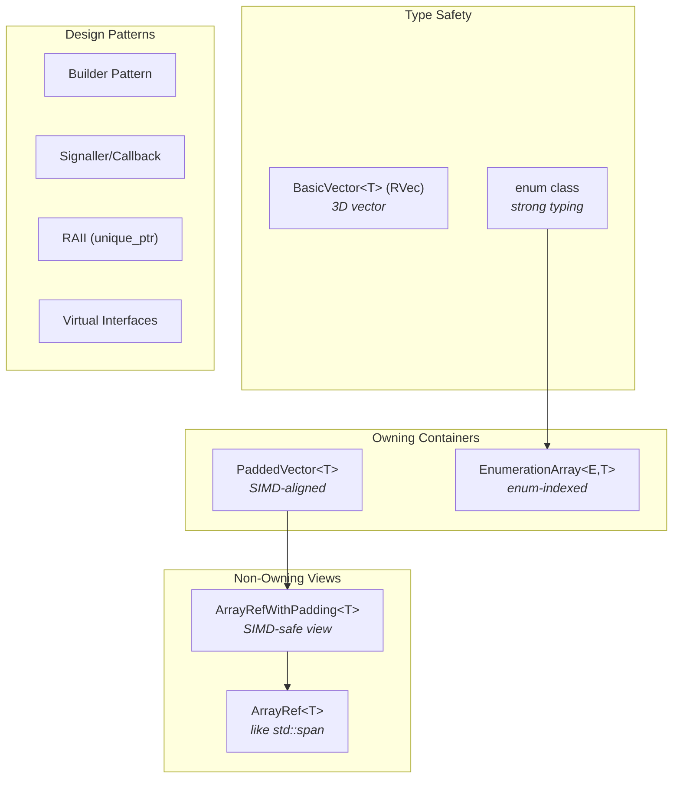

# Module 10: C++ Patterns and Idioms in GROMACS

> **Prerequisites:** [Module 3 (Architecture)](03-architecture-overview.md), [Module 9 (Data Structures)](09-data-structures.md)
> **Key files:** `api/legacy/include/gromacs/utility/arrayref.h`, `src/gromacs/math/include/gromacs/math/paddedvector.h`, `api/legacy/include/gromacs/utility/enumerationhelpers.h`, `api/legacy/include/gromacs/utility/vectypes.h`, `src/gromacs/mdrun/simulatorbuilder.h`

---

## 10.1 Overview: C++ Style in a Performance-Critical Codebase

GROMACS is a ~2M-line C++ codebase where *correctness*, *performance*, and *maintainability* must coexist. The codebase straddles two worlds: legacy C-style structures (`t_state`, `t_forcerec`) and modern C++ abstractions (`ArrayRef`, `PaddedVector`, builder patterns). Understanding these patterns is essential for navigating the code.



---

## 10.2 ArrayRef<T>: The Non-Owning View

**File:** `api/legacy/include/gromacs/utility/arrayref.h` (lines 130-293)

GROMACS predates C++20's `std::span`, so it has its own equivalent: `ArrayRef<T>`. It's a non-owning, lightweight view over contiguous data — just two pointers internally.

### Definition (Simplified)

```cpp
template<typename T>
class ArrayRef {
public:
    // Constructors — from anything contiguous
    ArrayRef() : begin_(nullptr), end_(nullptr) {}

    // From std::vector, PaddedVector, or any container with data() + size()
    template<typename U>
    ArrayRef(U&& o) : begin_(o.data()), end_(o.data() + o.size()) {}

    // From raw pointer pair
    ArrayRef(pointer begin, pointer end) : begin_(begin), end_(end) {}

    // From C array
    template<size_t count>
    ArrayRef(value_type (&array)[count]) : begin_(array), end_(array + count) {}

    // STL-like interface
    iterator begin() const { return iterator(begin_); }
    iterator end()   const { return iterator(end_); }
    size_type size() const { return end_ - begin_; }
    bool empty()     const { return begin_ == end_; }
    reference operator[](size_type n) const { return begin_[n]; }
    pointer data()   const { return begin_.data(); }

    // Subarray slicing
    ArrayRef subArray(size_type start, size_type count) const;

private:
    iterator begin_;
    iterator end_;
};
```

### Why Not Just Pass `std::vector<T>&`?

ArrayRef decouples the *interface* from the *storage*:

```cpp
// This function works with ANY contiguous source
void computeForces(ArrayRef<const RVec> positions,
                   ArrayRef<RVec>       forces);

// Can be called with:
std::vector<RVec> vec;
PaddedVector<RVec> padded;
RVec cArray[100];

computeForces(vec, forces);         // from std::vector
computeForces(padded, forces);      // from PaddedVector
computeForces(cArray, forces);      // from C array
```

### Real Usage: do_force() Signature

```cpp
// src/gromacs/mdlib/force.h (lines 109-137)
void do_force(FILE* log,
              // ...
              ArrayRefWithPadding<RVec>  coordinates,  // padded view of x
              ArrayRef<RVec>             velocities,   // unpadded view of v
              // ...
              ArrayRef<const real>       lambda,       // const view
              t_forcerec*                fr,
              // ...
              );
```

### Helper Functions

```cpp
// Construct from C pointer + size (common for legacy C APIs)
template<typename T>
ArrayRef<T> arrayRefFromArray(T* begin, size_t size) {
    return (begin != nullptr) ? ArrayRef<T>(begin, begin + size) : ArrayRef<T>{};
}

// Deep copy (when you actually need ownership)
template<typename T>
std::vector<T> copyOf(const ArrayRef<const T>& arrayRef) {
    return std::vector<T>(arrayRef.begin(), arrayRef.end());
}
```

---

## 10.3 BasicVector<T> and RVec: The 3D Vector Type

**File:** `api/legacy/include/gromacs/utility/vectypes.h` (lines 83-234)

Every atomic position, velocity, and force is an `RVec` — a 3D vector with full operator overloading:

```cpp
template<typename ValueType>
class BasicVector {
public:
    using RawArray = ValueType[DIM];  // DIM = 3

    // Constructors
    constexpr BasicVector(ValueType x, ValueType y, ValueType z) : x_{x, y, z} {}
    constexpr BasicVector(const RawArray x) : x_{x[XX], x[YY], x[ZZ]} {}

    // Indexing (XX=0, YY=1, ZZ=2)
    constexpr ValueType& operator[](size_t i) { return x_[i]; }
    constexpr ValueType operator[](size_t i) const { return x_[i]; }

    // Arithmetic
    constexpr BasicVector operator+(const BasicVector& right) const {
        return {x_[XX]+right[XX], x_[YY]+right[YY], x_[ZZ]+right[ZZ]};
    }
    constexpr BasicVector operator-(const BasicVector& right) const;
    constexpr BasicVector& operator+=(const BasicVector& right);
    constexpr BasicVector& operator-=(const BasicVector& right);
    constexpr BasicVector& operator*=(const ValueType& right);
    constexpr BasicVector operator/(const ValueType& right) const;

    // Vector operations
    constexpr ValueType dot(const BasicVector& right) const {
        return x_[XX]*right[XX] + x_[YY]*right[YY] + x_[ZZ]*right[ZZ];
    }
    constexpr BasicVector cross(const BasicVector& right) const {
        return {x_[YY]*right[ZZ] - x_[ZZ]*right[YY],
                x_[ZZ]*right[XX] - x_[XX]*right[ZZ],
                x_[XX]*right[YY] - x_[YY]*right[XX]};
    }
    constexpr ValueType norm2() const { return dot(*this); }
    constexpr ValueType norm()  const { return std::sqrt(norm2()); }
    constexpr BasicVector unitVector() const { return *this / norm(); }

    // C interoperability — implicit conversion to rvec (real[3])
    constexpr operator RawArray&() { return x_; }
    constexpr operator const RawArray&() const { return x_; }

private:
    RawArray x_;
};

// Key typedefs
typedef BasicVector<real>   RVec;   // Main type for positions, velocities, forces
typedef BasicVector<double> DVec;
typedef BasicVector<int>    IVec;
```

**Design insight:** The `operator RawArray&()` conversion lets `RVec` be passed directly to legacy C functions expecting `rvec` (which is just `real[3]`). This is critical for the gradual C→C++ migration.

---

## 10.4 PaddedVector<T>: SIMD-Aligned Container

**File:** `src/gromacs/math/include/gromacs/math/paddedvector.h` (lines 211-420)

`PaddedVector<T>` is the owning container for coordinate/force arrays. It extends `std::vector` with two key features:

1. **SIMD-aligned allocation** — memory starts at an alignment boundary
2. **Padding** — extra zeroed elements after the real data

### Why Padding Matters

SIMD instructions process 4-16 elements at once. When iterating over N atoms, the last SIMD load might extend past element N-1. Without padding, this causes a segfault or reads garbage:

```
Without padding:  [atom0][atom1][atom2][atom3][atom4]|INVALID MEMORY|
                                         ^^^^^^^^^^^^^^^^^^^^
                                         SIMD-4 load from atom3

With padding:     [atom0][atom1][atom2][atom3][atom4][0000][0000][0000]
                                         ^^^^^^^^^^^^^^^^^^^^
                                         SIMD-4 load from atom3 → safe!
```

### Key Interface

```cpp
template<typename T, typename Allocator = Allocator<T, AlignedAllocationPolicy>>
class PaddedVector {
public:
    // Size queries
    size_type size()       const;  // Actual data count
    size_type paddedSize() const;  // Including padding

    // Resize with automatic padding calculation
    void resizeWithPadding(const size_type newSize);
    void reserveWithPadding(const size_type newExtent);

    // Standard container interface (operates on unpadded range)
    pointer data() noexcept;
    iterator begin();
    iterator end();   // Points to unpaddedEnd_, NOT storage end!
    reference operator[](size_type n);

    // Get view types
    ArrayRefWithPadding<T> arrayRefWithPadding();
    // Returns [data, data+size, data+paddedSize] triple

    // Legacy C compat
    template<typename AlsoT = T>  // Only for RVec
    rvec* rvec_array() { return as_rvec_array(data()); }

private:
    storage_type storage_;       // std::vector with aligned allocator
    iterator     unpaddedEnd_;   // End of real data (before padding)
};
```

### ArrayRefWithPadding: The View

```cpp
template<typename T>
class ArrayRefWithPadding {
public:
    ArrayRefWithPadding(pointer begin, pointer end, pointer paddedEnd);

    // Get unpadded view (safe for normal iteration)
    ArrayRef<T> unpaddedArrayRef() { return {begin_, end_}; }

    // Get padded view (safe for SIMD loads near the end)
    ArrayRef<T> paddedArrayRef()   { return {begin_, paddedEnd_}; }

private:
    pointer begin_;      // Start of data
    pointer end_;        // End of real data
    pointer paddedEnd_;  // End of padded data
};
```

The caller chooses which view they need:
- **SIMD kernels** use `paddedArrayRef()` — guaranteed safe overreads
- **Scalar loops** use `unpaddedArrayRef()` — exact size

---

## 10.5 EnumerationArray<E, T>: Type-Safe Enum Indexing

**File:** `api/legacy/include/gromacs/utility/enumerationhelpers.h`

GROMACS has hundreds of enum values. `EnumerationArray` prevents the classic bug of using wrong enum as array index:

```cpp
template<typename EnumType, typename DataType, EnumType ArraySize = EnumType::Count>
struct EnumerationArray final {
    DataType m_elements[std::size_t(ArraySize)];

    // Type-safe indexing with enum
    DataType& operator[](const EnumType enumIndex) {
        GMX_ASSERT(std::size_t(enumIndex) < size(), "index out of range");
        return m_elements[std::size_t(enumIndex)];
    }

    // Also supports size_t indexing
    DataType& operator[](const std::size_t arrayIndex);

    // STL iteration
    iterator begin() { return &m_elements[0]; }
    iterator end()   { return &m_elements[size()]; }

    static constexpr EnumerationWrapperType keys() { return {}; }
    constexpr std::size_t size() const { return std::size_t(ArraySize); }
};
```

### Convention: The `Count` Sentinel

Every GROMACS enum class ends with `Count`:

```cpp
enum class NonBondedEnergyTerms : int {
    CoulombSR,
    LJSR,
    BuckinghamSR,
    Coulomb14,
    LJ14,
    Count       // ← sentinel, determines array size
};
```

### Usage Examples

```cpp
// Energy data uses enum-indexed arrays everywhere
gmx::EnumerationArray<InteractionFunction, real> term = {0};
gmx::EnumerationArray<FreeEnergyPerturbationCouplingType, double> dvdl_lin = {0};

// Type-safe access
term[InteractionFunction::Bonds] = 42.0;
dvdl_lin[FreeEnergyPerturbationCouplingType::Vdw] = 0.5;
// term[NonBondedEnergyTerms::LJSR] = 1.0;  // COMPILE ERROR: wrong enum!
```

### EnumerationWrapper: Range-Based For Over Enums

```cpp
template<typename EnumType, EnumType Last = EnumType::Count>
class EnumerationWrapper final {
public:
    using IteratorType = EnumerationIterator<EnumType, Last>;
    IteratorType begin() const { return IteratorType{}; }
    IteratorType end()   const { return IteratorType{Last}; }
};

// Iterate over all enum values
for (auto term : EnumerationWrapper<NonBondedEnergyTerms>{}) {
    // term is CoulombSR, LJSR, BuckinghamSR, Coulomb14, LJ14
    process(energies[term]);
}

// Or use keysOf() helper on an EnumerationArray
for (auto key : keysOf(enerd->term)) {
    if (enerd->term[key] != 0.0) { log(key); }
}
```

---

## 10.6 Strong Typing with Enum Classes

**File:** `api/legacy/include/gromacs/mdtypes/md_enums.h`

GROMACS uses `enum class` throughout to prevent accidental mixing of conceptually different integer codes:

```cpp
enum class TemperatureCoupling : int {
    No, Berendsen, NoseHoover, Yes, Andersen, AndersenMassive, VRescale,
    Count, Default = No
};

enum class PressureCoupling : int {
    No, Berendsen, ParrinelloRahman, Isotropic, Mttk, CRescale,
    Count, Default = No
};

enum class IntegrationAlgorithm : int {
    MD, Steep, CG, BD, SD2Removed, NM, LBFGS, TPI, TPIC, SD, VV, VVAK, Mimic,
    Count, Default = MD
};
```

### Why This Matters

```cpp
// Old C-style: silent bugs
int etc = 2;    // Is this TemperatureCoupling or PressureCoupling?
int epc = 2;
if (etc == epc) { /* Always true, but meaningless! */ }

// Modern GROMACS: compiler catches errors
TemperatureCoupling tc = TemperatureCoupling::NoseHoover;
PressureCoupling    pc = PressureCoupling::ParrinelloRahman;
// if (tc == pc) { }  // COMPILE ERROR: incompatible types
```

### Convention: `Default` and `enumValueToString()`

Every enum has a `Default` alias and a string conversion function:

```cpp
// In code: dispatch on enum value
if (ir->etc == TemperatureCoupling::VRescale) { ... }

// For logging/error messages
const char* enumValueToString(TemperatureCoupling enumValue);
// Returns "No", "Berendsen", "NoseHoover", "VRescale", etc.
```

---

## 10.7 Template Specialization for Zero-Overhead Abstraction

**Files:** `src/gromacs/mdlib/leapfrog_gpu.h`, `src/gromacs/mdlib/update_leapfrog.h`

The leap-frog integrator must handle several optional features: temperature scaling (none, single group, multiple groups) and Parrinello-Rahman velocity scaling (none, diagonal, anisotropic). Rather than runtime `if` statements in the innermost loop, GROMACS uses **template parameters** to generate specialized kernels at compile time:

```cpp
// Enum for compile-time specialization
enum class NumTempScaleValues {
    None     = 0,  // No temperature coupling
    Single   = 1,  // One T-coupling group
    Multiple = 2,  // Multiple groups (need group index)
    Count    = 3
};

enum class ParrinelloRahmanVelocityScaling {
    No,          // No PR scaling
    Diagonal,    // Diagonal scaling matrix
    Anisotropic, // Full 3x3 scaling matrix
    Count
};
```

### Runtime-to-Compile-Time Dispatch

```cpp
// At runtime, determine which specialization to use
NumTempScaleValues tempScaling = getTempScalingType(
    doTemperatureScaling, numTempScaleValues);

// Dispatch to the right compiled kernel
switch (tempScaling) {
    case NumTempScaleValues::None:
        launchLeapFrogKernel<NumTempScaleValues::None, ...>(...);
        break;
    case NumTempScaleValues::Single:
        launchLeapFrogKernel<NumTempScaleValues::Single, ...>(...);
        break;
    case NumTempScaleValues::Multiple:
        launchLeapFrogKernel<NumTempScaleValues::Multiple, ...>(...);
        break;
}
```

Inside the kernel, the template parameter eliminates dead code:

```cpp
template<NumTempScaleValues numTempScaleValues,
         ParrinelloRahmanVelocityScaling parrinelloRahmanScaling>
void updateMDLeapfrogSimple(/* ... */) {
    for (int a = 0; a < numAtoms; a++) {
        real lambda_i;
        if constexpr (numTempScaleValues == NumTempScaleValues::None) {
            lambda_i = 1.0;  // Compiler eliminates this branch entirely
        } else if constexpr (numTempScaleValues == NumTempScaleValues::Single) {
            lambda_i = lambdas[0];  // Direct access, no array lookup
        } else {
            lambda_i = lambdas[cTC[a]];  // Group-indexed lookup
        }
        // ... integration loop body
    }
}
```

**Result:** 3 × 3 = 9 specialized kernel functions, each with zero overhead from unused features. The compiler can vectorize the simple cases perfectly.

This same pattern appears in nbnxm SIMD kernels (Module 6), generating ~108 kernel variants from template combinations of electrostatics type, VdW type, and energy/virial output options.

---

## 10.8 The Builder Pattern

**File:** `src/gromacs/mdrun/simulatorbuilder.h`

GROMACS uses the Builder pattern to construct complex objects with many dependencies. The `SimulatorBuilder` collects typed component groups, then produces an opaque `ISimulator`:

### Typed Component Groups

Rather than passing 30+ raw pointers, related parameters are grouped into value types:

```cpp
struct SimulatorConfig {
    const MdrunOptions& mdrunOptions_;
    StartingBehavior    startingBehavior_;
    MdrunScheduleWorkload* runScheduleWork_;
};

struct SimulatorStateData {
    t_state*            globalState_p;
    t_state*            localState_p;
    ObservablesHistory* observablesHistory_p;
    gmx_enerdata_t*     enerdata_p;
    gmx_ekindata_t*     ekindata_p;
};

struct SimulatorEnv {
    FILE*                        fplog_;
    t_commrec*                   commRec_;
    const gmx_multisim_t*        multisimCommRec_;
    const MDLogger&              logger_;
    const gmx_output_env_t*      outputEnv_;
    ObservablesReducerBuilder*   observablesReducerBuilder_;
};

class TopologyData {
    const gmx_mtop_t& globalTopology_;
    gmx_localtop_t*   localTopology_;
    MDAtoms*           mdAtoms_;
};
```

### Builder with Overloaded `add()`

```cpp
class SimulatorBuilder {
public:
    void add(SimulatorStateData&& data)  { simulatorStateData_ = std::make_unique<SimulatorStateData>(data); }
    void add(SimulatorConfig&& config)   { simulatorConfig_ = std::make_unique<SimulatorConfig>(config); }
    void add(SimulatorEnv&& env)         { simulatorEnv_ = std::make_unique<SimulatorEnv>(env); }
    void add(TopologyData&& topo)        { topologyData_ = std::make_unique<TopologyData>(topo); }
    void add(Profiling&& profiling)      { profiling_ = std::make_unique<Profiling>(profiling); }
    // ... ~15 more add() overloads

    // Build the final product
    std::unique_ptr<ISimulator> build(bool useModularSimulator);

private:
    std::unique_ptr<SimulatorConfig>      simulatorConfig_;
    std::unique_ptr<SimulatorStateData>   simulatorStateData_;
    std::unique_ptr<SimulatorEnv>         simulatorEnv_;
    std::unique_ptr<Profiling>            profiling_;
    std::unique_ptr<TopologyData>         topologyData_;
    // ...
};
```

### Why This Pattern?

1. **Typed groups prevent mix-ups** — you can't accidentally swap `globalState` and `localState`
2. **Move semantics** — no ambiguity about ownership
3. **Incremental assembly** — components can be added in any order
4. **Opaque output** — returns `ISimulator` interface, hiding Legacy vs Modular choice

### Three-Layer Builder Chain

```
MdrunnerBuilder → Mdrunner → SimulatorBuilder → ISimulator
                     │                              │
                  (sets up)                    (returns either)
                  resources                  LegacySimulator
                                                  or
                                            ModularSimulator
```

---

## 10.9 Virtual Interfaces and Polymorphism

GROMACS uses virtual interfaces sparingly but effectively — at major architectural boundaries:

### ISimulator: Two Implementations

```cpp
// src/gromacs/mdrun/isimulator.h (lines 90-101)
class ISimulator {
public:
    virtual void run() = 0;
    virtual ~ISimulator() = default;
};

// Two concrete implementations:
class LegacySimulator : public ISimulator { void run() override; };
class ModularSimulator : public ISimulator { void run() override; };
```

### ISimulatorElement: Composable Step Components

```cpp
// src/gromacs/modularsimulator/modularsimulatorinterfaces.h
class ISimulatorElement {
public:
    virtual void scheduleTask(Step, Time, const RegisterRunFunction&) = 0;
    virtual void elementSetup() = 0;
    virtual void elementTeardown() = 0;
    virtual ~ISimulatorElement() = default;
};
```

### IForceProvider: Extension Point for Custom Forces

```cpp
// src/gromacs/mdtypes/iforceprovider.h (lines 174-188)
class IForceProvider {
public:
    virtual void calculateForces(const ForceProviderInput& input,
                                 ForceProviderOutput*      output) = 0;
protected:
    ~IForceProvider() {}  // Non-virtual destructor — managed externally
};

// Manager that dispatches to all registered providers
class ForceProviders {
public:
    void addForceProvider(IForceProvider* provider, const std::string& name = "");
    void calculateForces(const ForceProviderInput& input,
                         ForceProviderOutput*      output) const;
private:
    class Impl;
    std::unique_ptr<Impl> impl_;  // Pimpl pattern
};
```

**Design insight:** `IForceProvider::~IForceProvider()` is `protected`, not `virtual`. The providers are not owned through this interface — they're managed by MDModules. This prevents accidental `delete` through the base pointer.

---

## 10.10 RAII and unique_ptr Throughout

GROMACS uses `std::unique_ptr` pervasively for resource management:

### In SimulatorBuilder (ownership transfer)
```cpp
std::unique_ptr<SimulatorConfig>           simulatorConfig_;
std::unique_ptr<SimulatorStateData>        simulatorStateData_;
std::unique_ptr<StopHandlerBuilder>        stopHandlerBuilder_;
std::unique_ptr<BoxDeformationHandle>      boxDeformation_;
// ... ~15 unique_ptr members
```

### In t_forcerec (subsystem lifetime)
```cpp
std::unique_ptr<interaction_const_t>              ic;
std::unique_ptr<gmx::nonbonded_verlet_t>          nbv;
std::unique_ptr<DispersionCorrection>              dispersionCorrection;
std::unique_ptr<gmx::ListedForcesGpu>              listedForcesGpu;
std::unique_ptr<gmx::PmePpCommGpu>                 pmePpCommGpu;
```

### Pimpl Pattern (compilation firewall)
```cpp
class ForceProviders {
private:
    class Impl;
    std::unique_ptr<Impl> impl_;  // Hidden implementation
};
```

**Benefits:**
- **No memory leaks** — impossible to forget `delete`
- **Exception-safe** — cleanup happens even if an exception propagates
- **Clear ownership** — `unique_ptr` documents single ownership; raw pointers mean "borrowed"

---

## 10.11 The Signaller/Callback Pattern

**File:** `src/gromacs/modularsimulator/modularsimulatorinterfaces.h`

The modular simulator uses a publish-subscribe pattern where *signallers* notify *clients* before each step:

### Type Definitions

```cpp
using Step = int64_t;
using Time = double;

// The fundamental callback type
typedef std::function<void(Step, Time)> SignallerCallback;

// For registering work in the task queue
typedef std::function<void()> SimulatorRunFunction;
typedef std::function<void(SimulatorRunFunction)> RegisterRunFunction;
```

### Interface Pair: Signaller + Client

```cpp
class ISignaller {
public:
    virtual void signal(Step, Time) = 0;
    virtual void setup() = 0;
    virtual ~ISignaller() = default;
};

// Each signaller type has a corresponding client interface
class INeighborSearchSignallerClient {
protected:
    virtual std::optional<SignallerCallback> registerNSCallback() = 0;
};

class ILastStepSignallerClient {
protected:
    virtual std::optional<SignallerCallback> registerLastStepCallback() = 0;
};
```

### Builder Connects Signallers to Clients

```cpp
template<typename Signaller>
class SignallerBuilder final {
public:
    void registerSignallerClient(typename Signaller::Client* client);

    template<typename... Args>
    std::unique_ptr<Signaller> build(Args&&... args);

private:
    std::vector<typename Signaller::Client*> signallerClients_;
};
```

### Flow

```
1. Builder phase:
   builder.registerSignallerClient(propagator);
   builder.registerSignallerClient(forceElement);
   auto signaller = builder.build(nstlist, initStep, initTime);

2. Runtime (each step):
   signaller->signal(step, time);
       → calls all registered callbacks
           → clients schedule work via RegisterRunFunction
```

The `std::optional<SignallerCallback>` return allows clients to opt out — if a client doesn't need neighbor search notifications, it returns `std::nullopt`.

---

## 10.12 Pattern Summary Table

| Pattern | File | Purpose | Example |
|---------|------|---------|---------|
| `ArrayRef<T>` | arrayref.h | Non-owning view | `do_force()` parameters |
| `ArrayRefWithPadding<T>` | arrayrefwithpadding.h | SIMD-safe view | Coordinate passing |
| `PaddedVector<T>` | paddedvector.h | SIMD-aligned storage | `t_state::x`, `t_state::v` |
| `BasicVector<T>` (RVec) | vectypes.h | 3D vector type | Positions, forces |
| `EnumerationArray<E,T>` | enumerationhelpers.h | Enum-indexed array | Energy terms |
| `EnumerationWrapper<E>` | enumerationhelpers.h | Enum range iteration | `for (auto e : EnumerationWrapper<Foo>{})` |
| `enum class` | md_enums.h | Strong typing | `TemperatureCoupling`, `PressureCoupling` |
| Template specialization | leapfrog_gpu.h | Zero-overhead dispatch | `NumTempScaleValues` |
| Builder | simulatorbuilder.h | Complex construction | SimulatorBuilder |
| `ISimulator` | isimulator.h | Simulator polymorphism | Legacy vs Modular |
| `IForceProvider` | iforceprovider.h | Force extension point | MDModules forces |
| `ISimulatorElement` | modularsimulatorinterfaces.h | Composable steps | Propagator, ForceElement |
| `SignallerBuilder<T>` | signallers.h | Callback registration | NS, Energy signallers |
| `unique_ptr` + RAII | throughout | Lifetime management | `t_forcerec::nbv` |
| Pimpl | iforceprovider.h | Compilation firewall | `ForceProviders::Impl` |

---

## 10.13 Exercises

### Exercise 1: ArrayRef Construction
Given these declarations:
```cpp
std::vector<RVec> positions(100);
PaddedVector<RVec> paddedPositions(100);
real lambdas[4] = {0.0, 0.1, 0.5, 1.0};
```
Write the code to create `ArrayRef` views of each. Which conversions are implicit?

### Exercise 2: Find EnumerationArray Usage
Search the codebase (`src/gromacs/mdtypes/`) for `EnumerationArray` declarations. List five different enum types used as indices and describe what data they index.

### Exercise 3: Trace the Builder Chain
Starting from `Mdrunner::mdrunner()` in `runner.cpp`:
1. Find where `SimulatorBuilder` is created
2. List all the `add()` calls in order
3. Find where `build()` is called
4. What determines whether `LegacySimulator` or `ModularSimulator` is created?

### Exercise 4: Template Kernel Counting
In the nbnxm module (`src/gromacs/nbnxm/kernels_simd_4xm/`):
1. How many template parameters do the SIMD kernels use?
2. How many unique kernel instantiations exist?
3. What is the compile-time vs runtime trade-off?

### Exercise 5: Ownership Audit
For `t_forcerec` in `forcerec.h`:
1. List all `unique_ptr` members (owned resources)
2. List all raw pointer members (borrowed references)
3. For each raw pointer, identify who owns the pointed-to object

---

## 10.14 Key Takeaways

1. **ArrayRef decouples interface from storage** — pass views, not containers
2. **PaddedVector prevents SIMD boundary violations** — extra zeroed elements after real data
3. **EnumerationArray + enum class = type-safe, iterable arrays** — the `Count` sentinel is the key convention
4. **Template specialization eliminates runtime branches** — 9 leap-frog kernels, ~108 nbnxm kernels
5. **Builder pattern manages 30+ dependencies** — typed groups prevent parameter mix-ups
6. **Virtual interfaces only at major boundaries** — ISimulator, ISimulatorElement, IForceProvider
7. **unique_ptr documents ownership** — raw pointer = "borrowed", unique_ptr = "owned"
8. **Signaller/callback enables extensibility** — new elements can subscribe without modifying signallers
