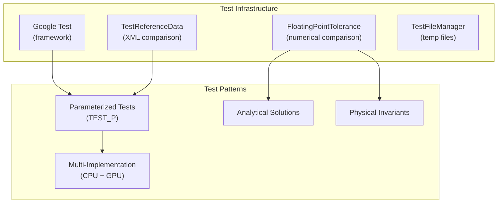
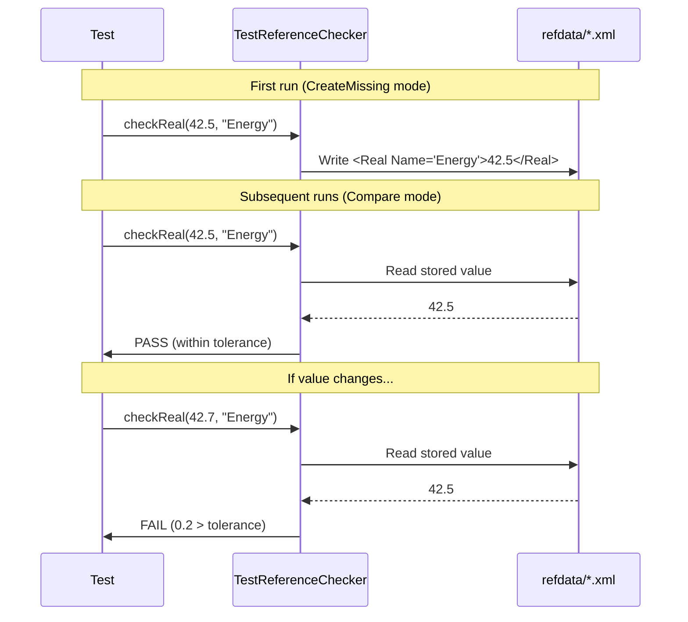
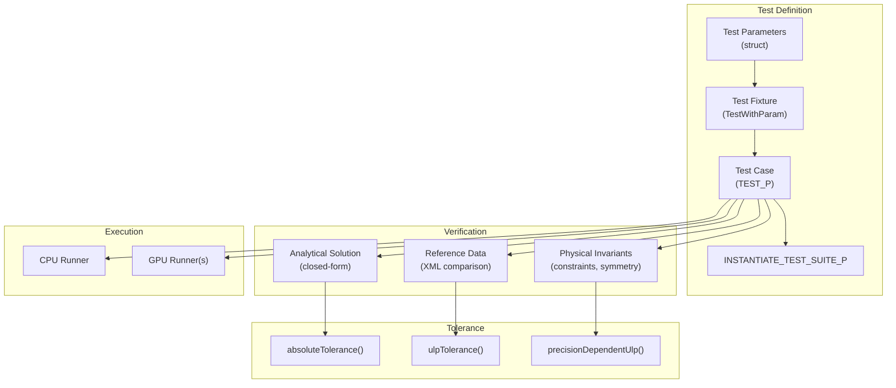

# Module 11: Testing Infrastructure

> **Prerequisites:** [Module 7 (Integration & Constraints)](07-integration-constraints.md), [Module 10 (C++ Patterns)](10-cpp-patterns.md)
> **Key files:** `src/testutils/include/testutils/refdata.h`, `src/testutils/include/testutils/testasserts.h`, `src/testutils/include/testutils/testfilemanager.h`, `src/gromacs/mdlib/tests/leapfrog.cpp`, `src/gromacs/mdlib/tests/settle.cpp`

---

## 11.1 Testing Philosophy: Trust the Numbers

Molecular dynamics is a numerical discipline. A subtle bug in the leap-frog integrator or a wrong sign in a constraint force can produce plausible-looking but physically wrong trajectories. GROMACS addresses this with a comprehensive testing infrastructure built on three pillars:

1. **Reference data comparison** — store known-good outputs as XML, compare every test run
2. **Analytical solution testing** — for simple cases with closed-form solutions
3. **Physical invariant testing** — verify constraints are satisfied, virial is symmetric, energy is conserved



---

## 11.2 Test Organization

### Directory Structure

Every GROMACS module has a `tests/` subdirectory:

```
src/gromacs/
├── mdlib/
│   ├── update.cpp
│   ├── constr.cpp
│   └── tests/
│       ├── CMakeLists.txt
│       ├── leapfrog.cpp              ← test source
│       ├── leapfrogtestdata.cpp      ← test data setup
│       ├── leapfrogtestrunners.cpp   ← CPU runner
│       ├── leapfrogtestrunners_gpu.cpp ← GPU runner
│       ├── settle.cpp
│       ├── settletestdata.cpp
│       ├── settletestrunners.cpp
│       └── refdata/                  ← XML reference data
│           ├── WithParameters_LeapFrogTest_SimpleIntegration_0.xml
│           ├── WithParameters_LeapFrogTest_SimpleIntegration_1.xml
│           └── ...
├── nbnxm/
│   └── tests/
│       ├── CMakeLists.txt
│       └── ...
└── ...
```

### CMake Registration

Tests are compiled and registered via `gmx_add_unit_test()`:

```cmake
# src/gromacs/mdlib/tests/CMakeLists.txt
gmx_add_unit_test(MdlibUnitTest mdlib-test HARDWARE_DETECTION
    CPP_SOURCE_FILES
        calc_verletbuf.cpp
        calcvir.cpp
        constr.cpp
        leapfrog.cpp
        leapfrogtestdata.cpp
        leapfrogtestrunners.cpp
        settle.cpp
        settletestdata.cpp
        settletestrunners.cpp
        shake.cpp
        updategroups.cpp
        vsite.cpp
    GPU_CPP_SOURCE_FILES
        leapfrogtestrunners_gpu.cpp
        settletestrunners_gpu.cpp
        )
target_link_libraries(mdlib-test PRIVATE mdlib math)
```

**Key details:**
- `HARDWARE_DETECTION` enables GPU test discovery at runtime
- `GPU_CPP_SOURCE_FILES` are compiled only when GPU support is enabled
- The test executable is named `mdlib-test`
- CTest discovers all `TEST_P` and `TEST_F` cases automatically

### Test Labeling

```cmake
# src/testutils/TestMacros.cmake
gmx_register_gtest_test(NAME EXENAME
    INTEGRATION_TEST  # 120-240s timeout
    SLOW_TEST         # 480s timeout
    QUICK_GPU_TEST    # GPU test < 10s
    SLOW_GPU_TEST     # GPU test > 10s
    MPI_RANKS 4       # Run with 4 MPI ranks
)
```

Labels allow selective test execution:
```bash
ctest -L UnitTest           # Fast unit tests only
ctest -L IntegrationTest    # Integration tests
ctest -L QUICK_GPU_TEST     # Quick GPU tests
```

---

## 11.3 TestReferenceData: XML-Based Regression Testing

**File:** `src/testutils/include/testutils/refdata.h`

The reference data system is GROMACS's most distinctive testing feature. Instead of hand-coding expected values, tests write outputs to XML on first run, then verify against those stored values on subsequent runs.

### How It Works



### Mode Enumeration

```cpp
enum class ReferenceDataMode : int {
    Compare,        // Normal: compare against stored XML
    CreateMissing,  // Create XML if missing, compare if exists
    UpdateChanged,  // Update values that don't match
    UpdateAll,      // Overwrite all stored values
    Count
};
```

**Workflow:**
1. Write test with `checkReal()`, `checkVector()`, etc.
2. First run: `ctest` with `-DGMX_TEST_UPDATE=ON` creates XML files
3. Commit XML files to version control
4. Subsequent runs compare against committed XML
5. If algorithm changes intentionally: re-run with update mode

### Class Interface

```cpp
class TestReferenceData {
public:
    TestReferenceData();  // Uses global mode (Compare by default)
    TestReferenceChecker rootChecker();
};

class TestReferenceChecker {
public:
    // ── Scalar checks ──────────────────────────────────────────
    void checkBoolean(bool value, const char* id);
    void checkInteger(int value, const char* id);
    void checkFloat(float value, const char* id);
    void checkDouble(double value, const char* id);
    void checkReal(float value, const char* id);   // Adapts to precision
    void checkReal(double value, const char* id);
    void checkString(const std::string& value, const char* id);

    // ── Vector checks ──────────────────────────────────────────
    void checkVector(const float value[3], const char* id);
    void checkVector(const double value[3], const char* id);
    void checkVector(const BasicVector<double>& value, const char* id);

    // ── Sequence checks ────────────────────────────────────────
    template<class Iterator>
    void checkSequence(Iterator begin, Iterator end, const char* id);

    template<typename T>
    void checkSequenceArray(size_t length, const T* values, const char* id);

    // ── Compound (nested) structures ───────────────────────────
    TestReferenceChecker checkCompound(const char* type, const char* id);
    TestReferenceChecker checkSequenceCompound(const char* id, size_t length);

    // ── Tolerance control ──────────────────────────────────────
    void setDefaultTolerance(const FloatingPointTolerance& tolerance);
};
```

### Example XML Output

```xml
<?xml version="1.0"?>
<ReferenceData>
  <Sequence Name="FinalPositions">
    <Int Name="Length">1</Int>
    <Atom>
      <Real Name="XX">0</Real>
      <Real Name="YY">6.5</Real>
      <Real Name="ZZ">0</Real>
    </Atom>
  </Sequence>
  <Sequence Name="FinalVelocities">
    <Int Name="Length">1</Int>
    <Atom>
      <Real Name="XX">0</Real>
      <Real Name="YY">0</Real>
      <Real Name="ZZ">0</Real>
    </Atom>
  </Sequence>
</ReferenceData>
```

---

## 11.4 FloatingPointTolerance: Comparing Inexact Numbers

**File:** `src/testutils/include/testutils/testasserts.h` (lines 374-565)

Floating-point comparison in MD is subtle. Exact equality is meaningless — different compiler optimizations, SIMD widths, or GPU architectures produce slightly different results. GROMACS provides a rich tolerance system:

### Tolerance Class

```cpp
class FloatingPointTolerance {
public:
    FloatingPointTolerance(
        float    singleAbsoluteTolerance,
        double   doubleAbsoluteTolerance,
        float    singleRelativeTolerance,
        double   doubleRelativeTolerance,
        uint64_t singleUlpTolerance,
        uint64_t doubleUlpTolerance,
        bool     bSignMustMatch);

    bool isWithin(const FloatingPointDifference& difference) const;
    std::string toString(const FloatingPointDifference& difference) const;

private:
    float    singleAbsoluteTolerance_;
    double   doubleAbsoluteTolerance_;
    float    singleRelativeTolerance_;
    double   doubleRelativeTolerance_;
    uint64_t singleUlpTolerance_;     // Units in Last Place
    uint64_t doubleUlpTolerance_;
    bool     bSignMustMatch_;
};
```

### Tolerance Factory Functions

```cpp
// Absolute tolerance — difference must be < tolerance
static inline FloatingPointTolerance absoluteTolerance(double tolerance) {
    return FloatingPointTolerance(float(tolerance), tolerance,
                                  0.0, 0.0,
                                  UINT64_MAX, UINT64_MAX, false);
}

// ULP tolerance — difference in Units in Last Place
static inline FloatingPointTolerance ulpTolerance(uint64_t ulpDiff) {
    return FloatingPointTolerance(0.0, 0.0, 0.0, 0.0,
                                  ulpDiff, ulpDiff, false);
}

// Relative tolerance (with magnitude scaling)
FloatingPointTolerance relativeToleranceAsFloatingPoint(
    double magnitude, double tolerance);

// Precision-dependent: different tolerances for float vs double
FloatingPointTolerance relativeToleranceAsPrecisionDependentUlp(
    double magnitude,
    uint64_t singleUlpDiff,    // e.g., 80 ULP for float
    uint64_t doubleUlpDiff);   // e.g., 380 ULP for double

// Default for typical MD values
static inline FloatingPointTolerance defaultRealTolerance() {
    return relativeToleranceAsUlp(1.0, detail::g_defaultUlpTolerance);
}
```

### ULP (Units in Last Place) Explained

ULP measures the distance between two floating-point numbers in terms of representable values:

```
Value A:  1.0000000000000000  (exact)
Value B:  1.0000000000000002  (1 ULP away in double)
Value C:  1.0000000000000004  (2 ULP away)

For float (32-bit): 1 ULP ≈ 1.19e-7 at magnitude 1.0
For double (64-bit): 1 ULP ≈ 2.22e-16 at magnitude 1.0
```

ULP tolerance is scale-invariant — it works equally well for energies of 1000 kJ/mol and forces of 0.001 kJ/(mol·nm).

### Assertion Macros

```cpp
EXPECT_REAL_EQ_TOL(expected, actual, tolerance)   // Soft failure
ASSERT_REAL_EQ_TOL(expected, actual, tolerance)    // Hard failure
EXPECT_REAL_EQ(expected, actual)                   // Default tolerance
```

### Choosing the Right Tolerance

| Scenario | Tolerance | Example |
|----------|-----------|---------|
| Same algorithm, same precision | 0-4 ULP | Comparing CPU results |
| Same algorithm, different SIMD | 10-100 ULP | SSE vs AVX |
| GPU vs CPU | 80-380 ULP | CUDA vs reference |
| Accumulated over N steps | absoluteTolerance(N × eps) | Integration tests |
| Physical constraints | relativeToleranceAsPrecisionDependentUlp | SETTLE bond lengths |

---

## 11.5 Case Study: Leap-Frog Integrator Test

**File:** `src/gromacs/mdlib/tests/leapfrog.cpp` (282 lines)

This test demonstrates all the patterns: parameterized testing, analytical comparison, reference data, and multi-implementation testing.

### Test Parameters

```cpp
struct LeapFrogTestParameters {
    int  numAtoms;          // 1, 10, 100, 300
    real timestep;          // 0.001, 0.0005 ps
    int  numSteps;          // 1, 10, 100
    rvec v;                 // Initial velocity
    rvec f;                 // Constant force
    int  numTCoupleGroups;  // 0, 1, 2, 10
    int  nstpcouple;        // 0 (off) or non-zero
};

const LeapFrogTestParameters parametersSets[] = {
    { 1, 0.001, 1, {0,0,0}, {0,0,0},       0, 0 },   // Trivial: no motion
    { 1, 0.001, 1, {0,0,0}, {-3.0,2.0,-1.0}, 0, 0 }, // Single atom, constant force
    { 1, 0.001, 1, {1.0,0,0}, {0,0,0},     0, 0 },   // Uniform velocity
    // ... 16 total combinations
    {300, 0.0005, 100, {0,0,0}, {2.0,0,0}, 10, 2},    // Large: 300 atoms, 10 T-groups
};
```

### Test Fixture

```cpp
class LeapFrogTest : public ::testing::TestWithParam<LeapFrogTestParameters> {
public:
    TestReferenceData    refData_;
    TestReferenceChecker checker_;

    LeapFrogTest() : checker_(refData_.rootChecker()) {}

    // Check positions and velocities against XML reference data
    void testAgainstReferenceData(const LeapFrogTestData& testData) {
        TestReferenceChecker finalPositionsRef(
            checker_.checkSequenceCompound("FinalPositions", testData.numAtoms_));
        for (int i = 0; i < testData.numAtoms_; i++) {
            const gmx::RVec& xPrime = testData.xPrime_[i];
            TestReferenceChecker xPrimeRef(
                finalPositionsRef.checkCompound("Atom", nullptr));
            xPrimeRef.checkReal(xPrime[XX], "XX");
            xPrimeRef.checkReal(xPrime[YY], "YY");
            xPrimeRef.checkReal(xPrime[ZZ], "ZZ");
        }
        // Same pattern for velocities...
    }
};
```

### Analytical Solution Testing

For the simple case (no thermostat, constant force), the exact solution is known:

```cpp
static void testAgainstAnalyticalSolution(
        FloatingPointTolerance tolerance,
        const LeapFrogTestData& testData,
        const real totalTime) {
    for (int i = 0; i < testData.numAtoms_; i++) {
        for (int d = 0; d < DIM; d++) {
            real x0 = testData.x0_[i][d];
            real v0 = testData.v0_[i][d];
            real f  = testData.f_[i][d];
            real im = testData.inverseMasses_[i];

            // Kinematic equations: x = x0 + v0*t + 0.5*a*t^2
            real xAnalytical = x0 + v0*totalTime + 0.5*f*totalTime*totalTime*im;
            real vAnalytical = v0 + f*totalTime*im;

            EXPECT_REAL_EQ_TOL(xAnalytical, testData.xPrime_[i][d], tolerance);
            EXPECT_REAL_EQ_TOL(vAnalytical, testData.v_[i][d], tolerance);
        }
    }
}
```

### Multi-Implementation Testing

The same test runs on both CPU and every available GPU:

```cpp
TEST_P(LeapFrogTest, SimpleIntegration) {
    // Build runner list: CPU + all available GPUs
    std::vector<std::unique_ptr<ILeapFrogTestRunner>> runners;
    runners.emplace_back(std::make_unique<LeapFrogHostTestRunner>());

    if (GpuConfigurationCapabilities::Update) {
        for (const auto& testDevice :
             getTestHardwareEnvironment()->getTestDeviceList()) {
            runners.emplace_back(
                std::make_unique<LeapFrogDeviceTestRunner>(*testDevice));
        }
    }

    for (const auto& runner : runners) {
        LeapFrogTestParameters parameters = GetParam();

        SCOPED_TRACE(formatString(
            "Testing on %s with %d atoms for %d timesteps...",
            runner->hardwareDescription().c_str(),
            parameters.numAtoms, parameters.numSteps));

        auto testData = std::make_unique<LeapFrogTestData>(/*...*/);
        runner->integrate(testData.get(), parameters.numSteps);

        FloatingPointTolerance tolerance =
            absoluteTolerance(parameters.numSteps * 0.000005);

        // Analytical check (only for simple cases without coupling)
        if (parameters.numTCoupleGroups == 0 && parameters.nstpcouple == 0) {
            testAgainstAnalyticalSolution(tolerance, *testData, totalTime);
        }

        // Reference data check (all cases)
        checker_.setDefaultTolerance(tolerance);
        testAgainstReferenceData(*testData);
    }
}

INSTANTIATE_TEST_SUITE_P(WithParameters, LeapFrogTest,
                         ::testing::ValuesIn(parametersSets));
```

**Test matrix:** 16 parameter sets × (1 CPU + N GPUs) = comprehensive coverage.

---

## 11.6 Case Study: SETTLE Constraint Test

**File:** `src/gromacs/mdlib/tests/settle.cpp` (401 lines)

SETTLE is the analytical constraint algorithm for rigid water molecules. Its test demonstrates physical invariant checking:

### Parameters

```cpp
struct SettleTestParameters {
    int         numSettles;        // 1 to 17 water molecules
    bool        updateVelocities;  // Also constrain velocities?
    bool        calcVirial;        // Compute virial contribution?
    std::string pbcName;           // "PBCXYZ" or "PBCNone"
};
```

### Physical Invariant: Bond Length Constraints

After SETTLE, all O-H and H-H distances must be exact:

```cpp
static void checkConstrainsSatisfied(
        const int numSettles,
        const FloatingPointTolerance tolerance,
        const SettleTestData& testData) {
    for (int i = 0; i < numSettles; ++i) {
        const auto& posO  = testData.xPrime_[i * 3 + 0];
        const auto& posH1 = testData.xPrime_[i * 3 + 1];
        const auto& posH2 = testData.xPrime_[i * 3 + 2];

        EXPECT_REAL_EQ_TOL(testData.dOH_ * testData.dOH_,
                           distance2(posO, posH1), tolerance)
            << formatString("for water %d. ", i);
        EXPECT_REAL_EQ_TOL(testData.dOH_ * testData.dOH_,
                           distance2(posO, posH2), tolerance);
        EXPECT_REAL_EQ_TOL(testData.dHH_ * testData.dHH_,
                           distance2(posH1, posH2), tolerance);
    }
}
```

### Physical Invariant: Virial Symmetry

The virial tensor must be symmetric (conservation of angular momentum):

```cpp
static void checkVirialSymmetric(
        const bool calcVirial,
        const FloatingPointTolerance tolerance,
        const SettleTestData& testData) {
    for (int d = 0; d < DIM; ++d) {
        for (int dd = 0; dd < DIM; ++dd) {
            // Virial should be zero if not calculated
            EXPECT_TRUE(calcVirial == (0. != testData.virial_[d][dd]));

            // Virial must be symmetric: V[i][j] == V[j][i]
            if (calcVirial) {
                EXPECT_REAL_EQ_TOL(testData.virial_[d][dd],
                                   testData.virial_[dd][d], tolerance);
            }
        }
    }
}
```

### Precision-Dependent Tolerance

SETTLE tolerance accounts for the fact that single-precision and double-precision have different ULP scales:

```cpp
real dOH = testData->dOH_;
FloatingPointTolerance tolerance =
    relativeToleranceAsPrecisionDependentUlp(
        dOH * dOH,   // magnitude: squared bond length
        80,           // single-precision: 80 ULP
        380);         // double-precision: 380 ULP
```

The double-precision tolerance is larger because SETTLE's analytical solution involves more operations (sqrt, division) that accumulate ULP errors.

---

## 11.7 Test Data Setup: Separation of Concerns

GROMACS separates test data setup from test logic into dedicated `*testdata.cpp` files:

```
leapfrog.cpp          ← Test logic (fixtures, assertions)
leapfrogtestdata.cpp  ← Test data construction (atoms, masses, forces)
leapfrogtestrunners.cpp  ← CPU runner implementation
leapfrogtestrunners_gpu.cpp  ← GPU runner implementation
```

### Runner Interface Pattern

```cpp
// Abstract runner (allows CPU and GPU implementations)
class ILeapFrogTestRunner {
public:
    virtual ~ILeapFrogTestRunner() = default;
    virtual void integrate(LeapFrogTestData* testData, int numSteps) = 0;
    virtual std::string hardwareDescription() const = 0;
};

// CPU implementation
class LeapFrogHostTestRunner : public ILeapFrogTestRunner {
    void integrate(LeapFrogTestData* testData, int numSteps) override {
        // Call the actual leap-frog function directly
    }
    std::string hardwareDescription() const override { return "CPU"; }
};

// GPU implementation (one per available device)
class LeapFrogDeviceTestRunner : public ILeapFrogTestRunner {
    const TestDevice& testDevice_;
    void integrate(LeapFrogTestData* testData, int numSteps) override {
        // Upload to GPU, run kernel, download results
    }
    std::string hardwareDescription() const override {
        return testDevice_.description();
    }
};
```

---

## 11.8 TestFileManager: Temporary File Handling

**File:** `src/testutils/include/testutils/testfilemanager.h`

For tests that produce output files (trajectories, checkpoints, etc.):

```cpp
class TestFileManager {
public:
    // Create unique temporary file path per test
    std::filesystem::path getTemporaryFilePath(const std::filesystem::path& suffix);

    // Track generated files for cleanup
    void manageGeneratedOutputFile(const std::filesystem::path& filename);

    // Access test input data
    static std::filesystem::path getInputFilePath(const std::filesystem::path& filename);
    static std::filesystem::path getTestSimulationDatabaseDirectory();
};
```

Temporary files are automatically cleaned up when the `TestFileManager` destructor runs — RAII in action.

---

## 11.9 SCOPED_TRACE: Debugging Failed Tests

When a parameterized test fails, you need to know *which* parameter combination caused it. `SCOPED_TRACE` adds context:

```cpp
SCOPED_TRACE(formatString(
    "Testing %s with %d SETTLEs, %s, %svelocities and %scalculating the virial.",
    runner->hardwareDescription().c_str(),
    numSettles,
    pbcName.c_str(),
    updateVelocities ? "with " : "without ",
    calcVirial ? "" : "not "));
```

On failure, the output includes the full description:

```
Failure at settle.cpp:200
Expected: dOH * dOH
Which is: 0.009112
To be equal to: distance2(positionO, positionH1)
Which is: 0.009115
Testing GPU (NVIDIA RTX 4090) with 17 SETTLEs, PBCXYZ, with velocities and calculating the virial.
```

---

## 11.10 Summary: Testing Patterns at a Glance



---

## 11.11 Exercises

### Exercise 1: Read the XML Reference Data
Navigate to `src/gromacs/mdlib/tests/refdata/` and:
1. Open `WithParameters_LeapFrogTest_SimpleIntegration_0.xml`
2. What values are stored? How do they map to `checkSequenceCompound` calls in the test?
3. Open a few more numbered XML files — what changes between parameter sets?

### Exercise 2: Add a Test Case (Thought Experiment)
Suppose you implement a new integration algorithm (e.g., Stormer-Verlet). Design a test:
1. What parameters would you vary?
2. What analytical solution would you compare against?
3. What physical invariants would you check?
4. What tolerance would you use for 100 steps at dt=0.001?

### Exercise 3: Trace FloatingPointTolerance
In `testasserts.h`:
1. Find the `isWithin()` method — how does it combine absolute, relative, and ULP tolerances?
2. A comparison passes if *any* of the three tolerance types is satisfied. Why?
3. Why does SETTLE use `relativeToleranceAsPrecisionDependentUlp` while leap-frog uses `absoluteTolerance`?

### Exercise 4: GPU Test Coverage
In `leapfrogtestrunners_gpu.cpp`:
1. How does the GPU runner transfer data to/from the device?
2. What happens if no GPU is available?
3. How does `getTestHardwareEnvironment()` discover GPUs?

### Exercise 5: Create Missing Reference Data
If you add a new parameter set to `parametersSets[]` in `leapfrog.cpp`:
1. What happens when you run the test? (Hint: `ReferenceDataMode::CreateMissing`)
2. Where does the new XML file appear?
3. How do you verify the new reference data is correct before committing?

---

## 11.12 Key Takeaways

1. **Three verification strategies** — analytical solutions, XML reference data, and physical invariants complement each other
2. **Reference data = regression testing** — XML files capture known-good outputs; any unintentional change triggers failure
3. **ULP tolerance is scale-invariant** — works for energies of 1000 and forces of 0.001 equally well
4. **Precision-dependent tolerance** — single and double precision get different ULP budgets
5. **Multi-implementation testing** — same test runs on CPU and every available GPU automatically
6. **Runner pattern** — abstracts hardware behind `ITestRunner` interface, enabling CPU/GPU polymorphism
7. **SCOPED_TRACE** — critical for debugging parameterized test failures
8. **Test data separation** — `*testdata.cpp` files keep test logic clean
9. **Physical invariants** — constraint satisfaction, virial symmetry, energy conservation are testable properties
