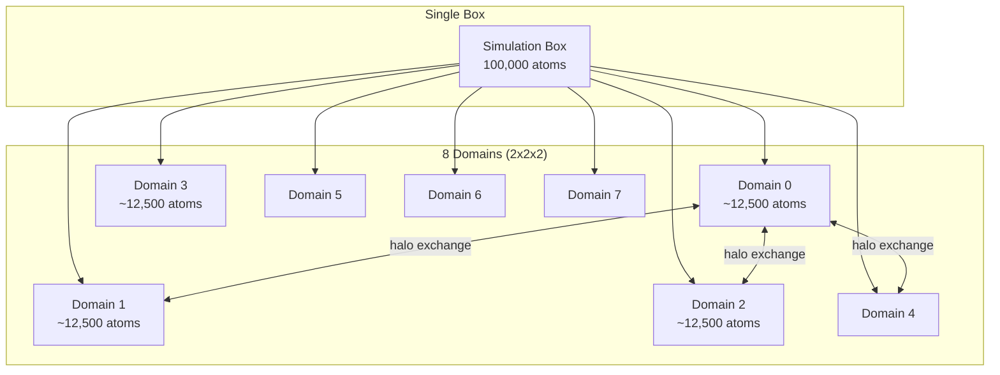
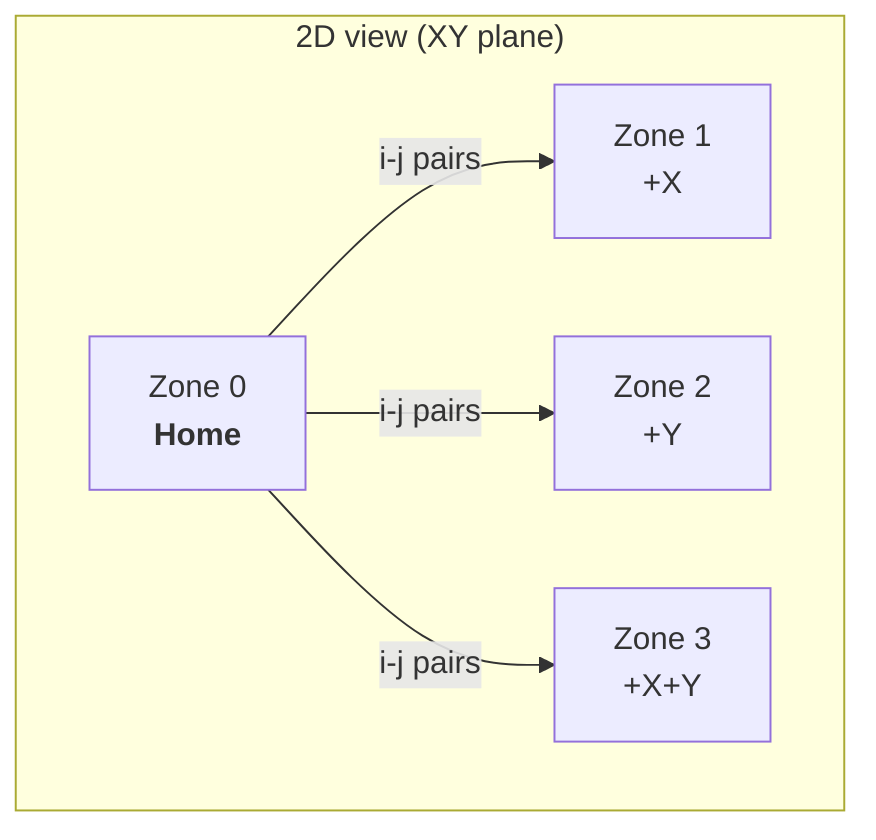
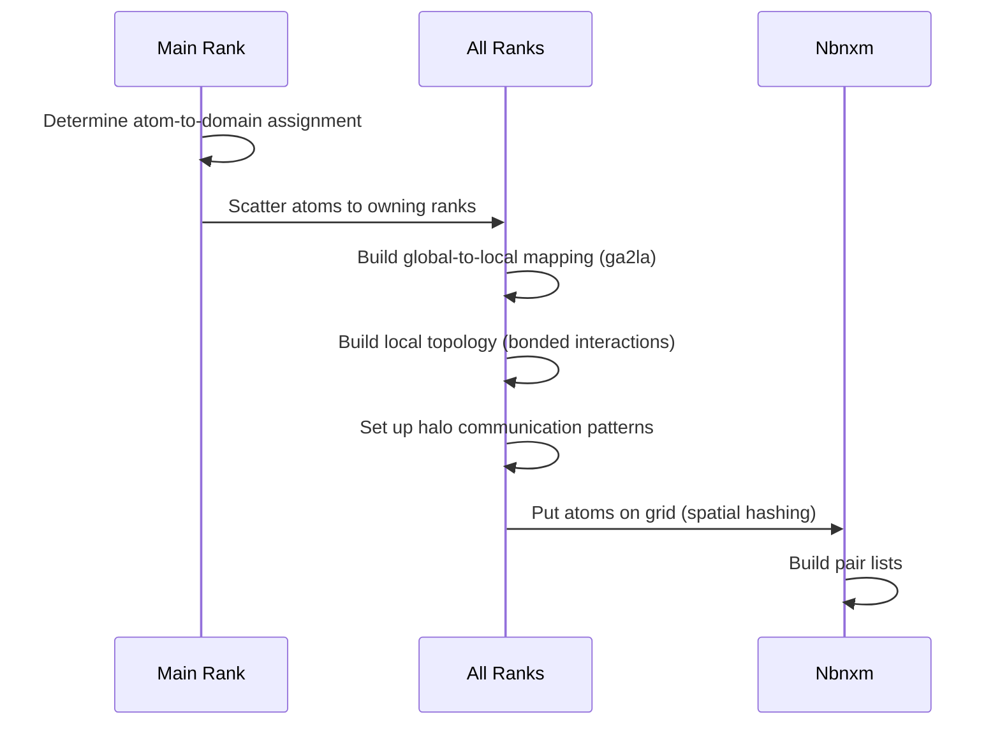
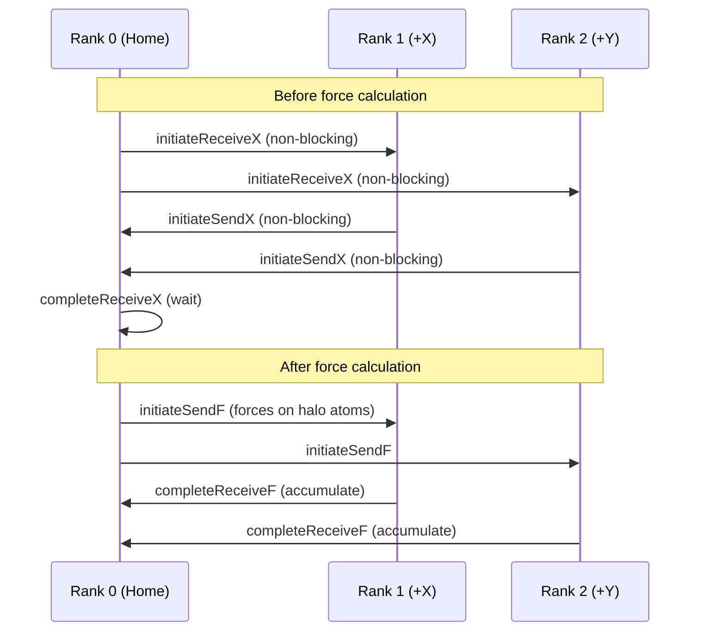
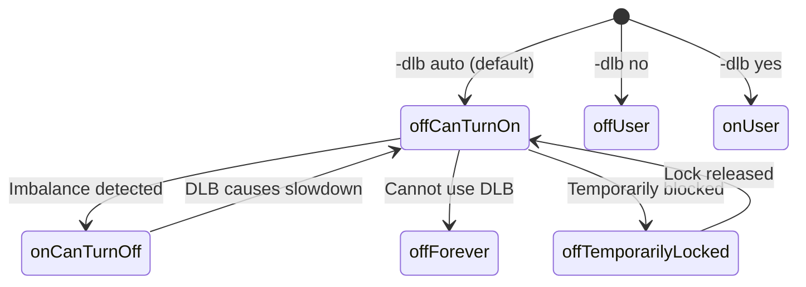
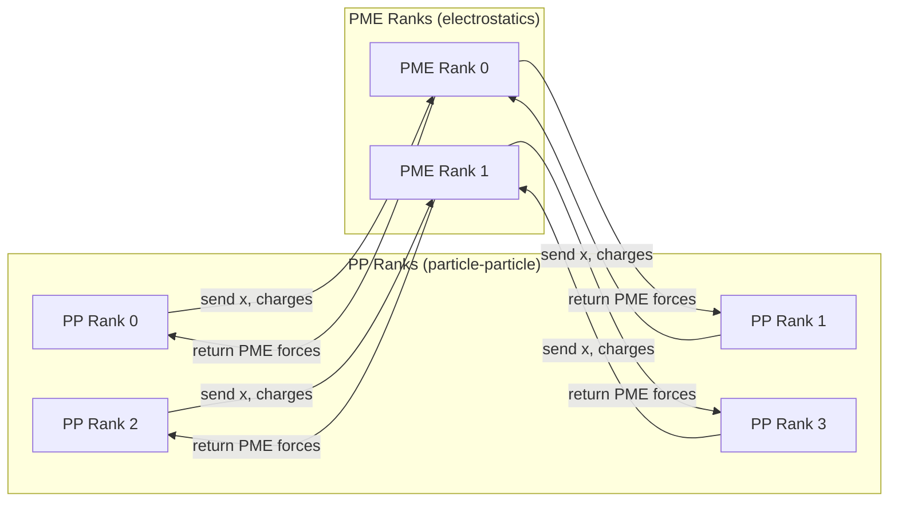
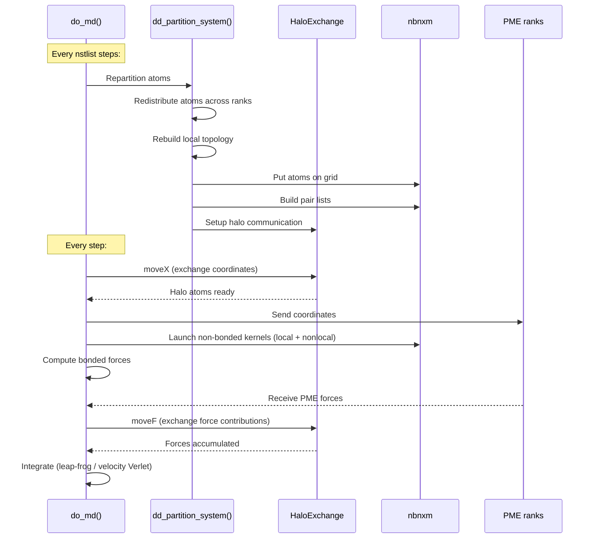

# Module 12: Domain Decomposition and MPI Parallelism

> **Prerequisites:** [Module 4 (MD Loop)](04-md-loop.md), [Module 5 (Force Calculation)](05-force-calculation.md), [Module 9 (Data Structures)](09-data-structures.md)
> **Key files:** `src/gromacs/domdec/domdec_struct.h`, `src/gromacs/domdec/partition.h`, `src/gromacs/domdec/haloexchange.h`, `src/gromacs/domdec/ga2la.h`, `src/gromacs/ewald/pme_pp.h`, `src/gromacs/mdtypes/commrec.h`

---

## 12.1 The Problem: Scaling MD to Thousands of Cores

A single CPU core can simulate ~10,000 atoms at ~10 ns/day. A typical biomolecular system has 100,000-1,000,000+ atoms. To achieve useful simulation timescales, GROMACS distributes the work across many MPI ranks using **spatial domain decomposition** — dividing the simulation box into regions, each handled by one rank.



**Key challenge:** Non-bonded forces have a cutoff radius. Atoms near domain boundaries need information about atoms in neighboring domains — this is the **halo** (or ghost zone).

---

## 12.2 The gmx_domdec_t Structure

**File:** `src/gromacs/domdec/domdec_struct.h` (lines 115-222)

This is the central domain decomposition object, held by every MPI rank:

```cpp
struct gmx_domdec_t {
    // ── Duty assignment ─────────────────────────────────────────
    bool hasPPDuty = true;          // Does this rank compute particle-particle?
    bool hasPmeDuty = true;         // Does this rank compute PME?

    // ── Grid geometry ───────────────────────────────────────────
    int nnodes = 1;                 // Total DD nodes
    gmx::IVec numCells = {0,0,0};  // Grid dimensions (e.g., {4,4,2})
    int ndim = 0;                   // Number of decomposed dimensions (1-3)
    gmx::IVec dim = {0,0,0};       // Which dimensions are decomposed
    gmx::IVec ci = {0,0,0};        // This rank's cell index in grid

    // ── Neighbor topology ───────────────────────────────────────
    int neighbor[DIM][2] = {};      // [dimension][forward/backward]

    // ── Zone system ─────────────────────────────────────────────
    gmx::DomdecZones zones;         // 8-zone system for interactions

    // ── Atom bookkeeping ────────────────────────────────────────
    int numHomeAtoms = 0;
    gmx::FastVector<int> globalAtomIndices;  // Global indices of all local atoms
    std::unique_ptr<gmx_ga2la_t> ga2la;      // Global-to-local mapping

    // ── Atom distribution (main rank only) ──────────────────────
    std::unique_ptr<AtomDistribution> ma;

    // ── Communication ───────────────────────────────────────────
    std::unique_ptr<gmx::HaloExchange> haloExchange;
    std::unique_ptr<gmx_domdec_comm_t> comm;
    gmx::IVec numPulses = {0,0,0};

    // ── GPU halo exchange ───────────────────────────────────────
    std::vector<std::unique_ptr<gmx::GpuHaloExchange>> gpuHaloExchange[DIM];

    // ── Tracking ────────────────────────────────────────────────
    int64_t ddp_count = 0;          // Partition counter for state tracking
};
```

### Decomposition Geometry

GROMACS supports 1D, 2D, and 3D decomposition depending on the number of MPI ranks:

| Ranks | Grid | `ndim` | `dim` | Example |
|-------|------|--------|-------|---------|
| 4 | 4x1x1 | 1 | {0,-,-} | 4 slabs along X |
| 8 | 4x2x1 | 2 | {0,1,-} | 4x2 columns |
| 32 | 4x4x2 | 3 | {0,1,2} | Full 3D grid |

The decomposition creates a Cartesian grid. Each rank owns a rectangular region of space.

---

## 12.3 The Zone System: Eight Shells of Neighbors

**File:** `src/gromacs/domdec/domdec_zones.h` (lines 65-196)

In 3D decomposition, each domain can have up to 7 neighboring zones (plus itself = 8 total). The zone concept is key to organizing non-bonded pair list construction:



```cpp
static constexpr int sc_maxNumZones = 8;      // 2^3 for 3D
static constexpr int sc_maxNumIZones = 4;     // Half: i-zones

class DomdecZones {
public:
    int numZones() const { return num_; }
    int numIZones() const { return numIZones_; }
    Range<int> atomRange(int zone) const;       // Atom index range per zone
    const IVec& shift(int zone) const;          // PBC shift for this zone
    Range<int> jAtomRange(int iZone) const;     // j-atoms for pair lists

private:
    std::array<int, sc_maxNumZones + 1> atomRanges_;
    std::array<IVec, sc_maxNumZones> shifts_;
    std::array<Range<int>, sc_maxNumIZones> jZoneRanges_;
};
```

### Atom Order in Local State

Atoms are arranged in a specific order within the local state arrays:

```
[───── Home atoms ─────][── Zone 1 ──][── Zone 2 ──]...[── Vsite ──][── Constr ──]
  ^                       ^                                ^            ^
  atomRange(Home)         atomRange(Zones)                 Vsites       Constraints
```

```cpp
class DDAtomRanges {
public:
    enum class Type : int {
        Home,        // Owned by this rank
        Zones,       // Halo atoms for non-bonded
        Vsites,      // Extra atoms for virtual sites
        Constraints, // Extra atoms for constraints
        Number
    };
    int start(Type rangeType) const;
    int end(Type rangeType) const;
};
```

---

## 12.4 Global-to-Local Atom Mapping

**File:** `src/gromacs/domdec/ga2la.h` (lines 54-180)

Every rank needs to translate between global atom indices (from the topology) and local indices (in the rank's arrays). The `gmx_ga2la_t` provides fast lookup:

```cpp
class gmx_ga2la_t {
public:
    struct Entry {
        int la;    // Local atom index
        int cell;  // Zone (0=home, 1-7=halo zones)
    };

    gmx_ga2la_t(int numAtomsTotal, int numAtomsLocal);

    void insert(int a_gl, const Entry& value);
    const Entry* find(int a_gl) const;       // Returns nullptr if not here
    const int* findHome(int a_gl) const;     // Returns local index if home

private:
    // Adaptively uses direct vector (small systems) or hash map (large)
    std::variant<std::vector<Entry>, gmx::HashedMap<Entry>> data_;
};
```

**Usage pattern:** When building local topology (bonded interactions), the code looks up each atom in the interaction by global index. If all atoms are local (home or halo), the interaction is included in this rank's computation.

---

## 12.5 Partitioning: dd_partition_system()

**File:** `src/gromacs/domdec/partition.h` (lines 112-132)

Every `nstlist` steps, the system is repartitioned to redistribute atoms among domains:

```cpp
void dd_partition_system(
    FILE*                     fplog,
    const gmx::MDLogger&      mdlog,
    int64_t                   step,
    gmx_domdec_t*             dd,
    bool                      bMainState,    // Use global state from main rank?
    t_state*                  state_global,   // Complete state (main rank only)
    const gmx_mtop_t&         top_global,     // Full topology
    const t_inputrec&         inputrec,
    // ... more params ...
    t_state*                  state_local,    // Output: local state
    gmx::ForceBuffers*        f,              // Output: resized force buffer
    gmx::MDAtoms*             mdAtoms,        // Output: local atom data
    gmx_localtop_t*           top_local,      // Output: local topology
    t_forcerec*               fr,             // Updated: pair lists, grids
    // ...
    );
```

### Partitioning Algorithm



### When Repartitioning Happens

In `do_md()` (md.cpp):

```cpp
// Every nstlist steps (typically 10-20)
const bool bNStList = (ir->nstlist > 0 && step % ir->nstlist == 0);

if (haveDDAtomOrdering(*cr_)) {
    dd_partition_system(fpLog_, mdLog_, step, cr_->dd,
                        bMainState, stateGlobal_, topGlobal_, *ir,
                        /* ... */
                        state_, &f, mdAtoms_, top_, fr_,
                        /* ... */);
}
```

---

## 12.6 Halo Exchange: Sharing Boundary Atoms

**File:** `src/gromacs/domdec/haloexchange.h` (lines 88-173)

Before force calculation, each rank needs coordinates of atoms in neighboring domains that fall within the interaction cutoff. After force calculation, force contributions on halo atoms must be sent back.

```cpp
class HaloExchange {
public:
    HaloExchange(PbcType pbcType);

    void setup(gmx_domdec_t* dd, t_state* localState,
               const gmx_ddbox_t& ddbox, t_forcerec* fr, bool cellsChanged);

    // ── Coordinate exchange (before force calculation) ──────────
    void initiateReceiveX(ArrayRef<RVec> x);       // Post non-blocking receives
    void initiateSendX(const matrix box, ArrayRef<RVec> x);  // Post non-blocking sends
    void completeReceiveX();                        // Wait for receives
    void completeSendX();                           // Wait for sends
    void moveX(const matrix box, ArrayRef<RVec> x); // Blocking version

    // ── Force exchange (after force calculation) ────────────────
    void initiateReceiveF();
    void initiateSendF(ArrayRef<const RVec> f);
    void completeReceiveF(ArrayRef<RVec> forces, ArrayRef<RVec> shiftForces);
    void completeSendF();
    void moveF(ArrayRef<RVec> f, ArrayRef<RVec> shiftForces);

private:
    std::vector<DomainPairComm> domainPairComm_;   // One per halo domain
    HaloMpiRequests mpiCoordinateRequests_;
    HaloMpiRequests mpiForceRequests_;
};
```

### Direct Communication Model

From the header documentation:

> The algorithm uses **direct communication** between the home domain and all domains in the halo (up to 7 zones). Each `DomainPairComm` handles communication with one neighboring domain independently, enabling overlap of all communication.



### Low-Level Communication Primitives

**File:** `src/gromacs/domdec/domdec_network.h` (lines 60-114)

```cpp
// Send/receive along one DD dimension
template<typename T>
void ddSendrecv(const gmx_domdec_t* dd,
                int ddDimensionIndex,
                int direction,          // dddirForward or dddirBackward
                gmx::ArrayRef<T> sendBuffer,
                gmx::ArrayRef<T> receiveBuffer);

// Collective operations on DD communicator
void dd_bcast(const gmx_domdec_t* dd, int nbytes, void* data);
void dd_scatter(const gmx_domdec_t* dd, int nbytes, const void* src, void* dest);
void dd_gather(const gmx_domdec_t* dd, int nbytes, const void* src, void* dest);
```

---

## 12.7 Atom Locality and Interaction Locality

**File:** `src/gromacs/mdtypes/locality.h` (lines 51-97)

These enums are used throughout the force calculation pipeline to distinguish between local and halo work:

```cpp
enum class AtomLocality : int {
    Local    = 0,  // Home atoms only
    NonLocal = 1,  // Halo atoms (from neighboring domains)
    All      = 2,  // Both
    Count    = 3
};

enum class InteractionLocality : int {
    Local    = 0,  // Interactions between local atoms only
    NonLocal = 1,  // Interactions involving halo atoms
    Count    = 2
};
```

**Usage in GPU code:** The non-bonded GPU kernels run in two streams — `Local` and `NonLocal`. This allows overlap:

```
Stream 1 (Local):     [H2D local x] → [NB kernel local] → [D2H local f]
Stream 2 (NonLocal):  [Halo exchange] → [H2D nonlocal x] → [NB kernel nonlocal] → [D2H f]
```

---

## 12.8 Dynamic Load Balancing

**File:** `src/gromacs/domdec/domdec_internal.h` (lines 263-287), `src/gromacs/domdec/dlb.h`

If atoms are unevenly distributed (e.g., a protein in one corner, solvent everywhere), some domains will have more work. Dynamic Load Balancing (DLB) adjusts domain boundaries to equalize load:

```cpp
enum class DlbState {
    offUser,              // User disabled with -dlb no
    offForever,           // Runtime condition prevents DLB
    offCanTurnOn,         // Auto mode, currently off
    offTemporarilyLocked, // Temporarily locked off
    onCanTurnOff,         // Auto mode, currently on
    onUser,               // User enabled with -dlb yes
    Count
};
```

### DLB Transitions



### Load Measurement

```cpp
typedef struct domdec_load {
    float sum = 0;       // Sum of load across ranks in this dimension
    float max = 0;       // Maximum load (determines wall-clock time)
    float cvol_min = 0;  // Minimum cell volume (relative)
    float mdf = 0;       // PP time during which PME can overlap
    float pme = 0;       // PME-only rank load
} domdec_load_t;
```

DLB adjusts cell boundaries (`cellFrac`) so that the most loaded rank gets a smaller volume and the least loaded rank gets more.

---

## 12.9 PME-PP Rank Separation

**File:** `src/gromacs/ewald/pme_pp.h` (lines 68-120)

For large systems, PME electrostatics can be offloaded to dedicated ranks that do nothing but PME. The remaining ranks handle particle-particle (PP) interactions:



### Communication Functions

```cpp
// PP → PME: send charges and parameters (once per repartitioning)
void gmx_pme_send_parameters(gmx_domdec_t* dd,
                             const interaction_const_t& interactionConst,
                             bool bFreeEnergy_q, bool bFreeEnergy_lj,
                             ArrayRef<const real> chargeA, ArrayRef<const real> chargeB,
                             /* ... */);

// PP → PME: send coordinates (every step)
void gmx_pme_send_coordinates(t_forcerec* fr, gmx_domdec_t* dd,
                              const matrix box, ArrayRef<const RVec> x,
                              real lambda_q, real lambda_lj,
                              bool computeEnergyAndVirial, int64_t step,
                              bool useGpuPmePpComms,
                              /* ... */);

// PME → PP: receive computed forces
void gmx_pme_receive_f(PmePpCommGpu* pmePpCommGpu, gmx_domdec_t* dd,
                       ForceWithVirial* forceWithVirial,
                       real* energy_q, real* energy_lj,
                       real* dvdlambda_q, real* dvdlambda_lj,
                       /* ... */);

// PP → PME: signal simulation end
void gmx_pme_send_finish(gmx_domdec_t* dd);
```

The PP-PME pipeline overlaps with PP short-range work:

```
PP rank:   [send x to PME] → [short-range NB + bonded] → [receive PME forces] → [integrate]
PME rank:  [receive x]     → [spread → FFT → convolve → FFT → gather]   → [send forces]
```

---

## 12.10 The Communication Record: t_commrec

**File:** `src/gromacs/mdtypes/commrec.h` (lines 47-70)

Every rank holds a `t_commrec` that provides MPI communicator access:

```cpp
struct t_commrec {
    t_commrec(const gmx::MpiComm& mpiCommMySim,
              const gmx::MpiComm& mpiCommMyGroup,
              gmx_domdec_t* domdec);

    bool isSimulationMainRank() const { return commMySim.rank() == 0; }

    const gmx::MpiComm& commMySim;    // All ranks in the simulation
    const gmx::MpiComm& commMyGroup;  // Just PP ranks or just PME ranks
    gmx_domdec_t* dd;                  // Domain decomposition (nullptr if serial)
};
```

### MpiComm Wrapper

**File:** `src/gromacs/utility/mpicomm.h` (lines 61-100)

```cpp
class MpiComm {
public:
    explicit MpiComm(MPI_Comm comm);
    MpiComm(SingleRank);  // For serial runs (comm() returns MPI_COMM_NULL)

    int rank() const;
    int size() const;
    MPI_Comm comm() const;

    // Hierarchical reduction
    void sumReduce(ArrayRef<double> sendBuffer, ArrayRef<double> recvBuffer) const;
};
```

### Thread-MPI vs Library MPI

GROMACS supports two MPI implementations:
- **Thread-MPI** (`GMX_THREAD_MPI=ON`, default): Multiple threads within one process, using a lightweight MPI implementation. Used for single-node runs.
- **Library MPI** (`GMX_MPI=ON`): Real MPI (OpenMPI, MPICH, etc.) for multi-node runs.

The same code works with both — `MpiComm` wraps the difference.

---

## 12.11 Complete DD Flow in One MD Step



---

## 12.12 Exercises

### Exercise 1: Count Communication
For a 4x4x2 = 32 rank simulation:
1. How many zones does each rank have?
2. How many halo exchanges occur per step (coordinate + force)?
3. What is the maximum number of atoms a rank might need to store (home + all halo zones)?

### Exercise 2: Trace dd_partition_system
In `src/gromacs/domdec/partition.cpp`, find `dd_partition_system()`:
1. Identify where atoms are scattered to ranks
2. Where is the local topology rebuilt?
3. Where are pair lists triggered for rebuild?

### Exercise 3: Understand ga2la
In `src/gromacs/domdec/ga2la.h`:
1. Under what conditions does it use a direct vector vs hash map?
2. Why is the `cell` field needed in `Entry`?
3. Where in the codebase is `findHome()` called?

### Exercise 4: PME-PP Load Ratio
The `dd_pme_f_ratio()` function returns the PME/PP load ratio. Find it in `dlb.h`:
1. What ratio means PME and PP are balanced?
2. How does GROMACS use this to decide the number of PME ranks?
3. What happens when `mdrun -npme` is explicitly set?

### Exercise 5: DLB in Practice
Run (or read the log from) a GROMACS simulation with `-dlb auto`:
1. At what step does DLB typically activate?
2. What log messages indicate DLB state changes?
3. What is the `DD cell size` reported in the log?

---

## 12.13 Key Takeaways

1. **Spatial domain decomposition** divides the box into rectangular cells, one per MPI rank
2. **Eight-zone system** organizes halo atoms for non-bonded pair list construction
3. **Repartitioning every nstlist steps** redistributes atoms and rebuilds pair lists
4. **Global-to-local mapping** (ga2la) translates topology indices to rank-local indices
5. **Non-blocking halo exchange** overlaps communication with computation
6. **PME-PP separation** dedicates ranks to long-range electrostatics, overlapping with short-range work
7. **Dynamic Load Balancing** adjusts domain boundaries to equalize work per rank
8. **AtomLocality/InteractionLocality** enums are used throughout to split local vs non-local work
9. **Thread-MPI vs Library MPI** — same code, different backends for single-node vs multi-node
