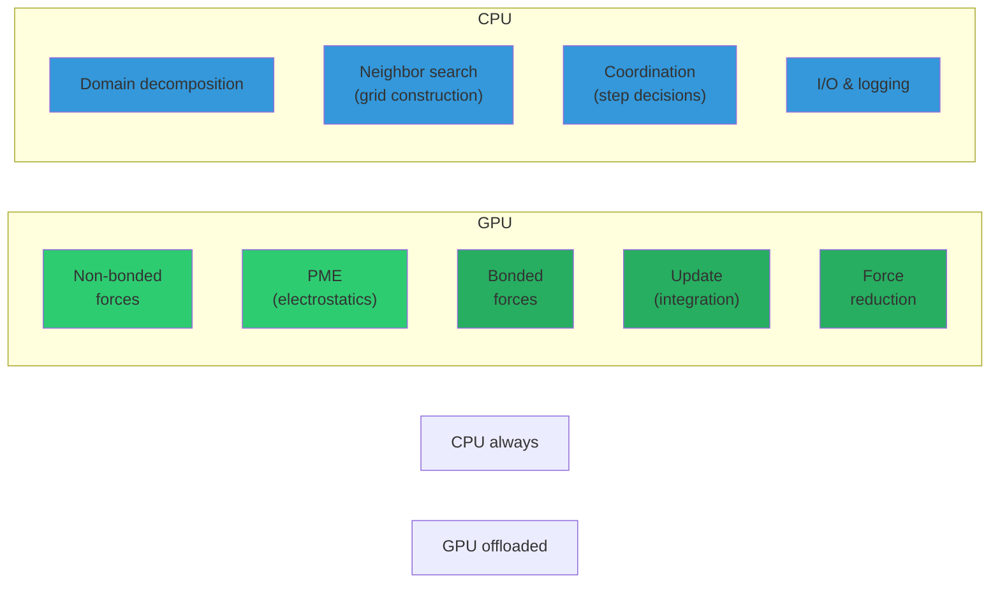
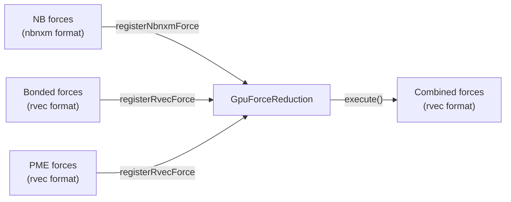
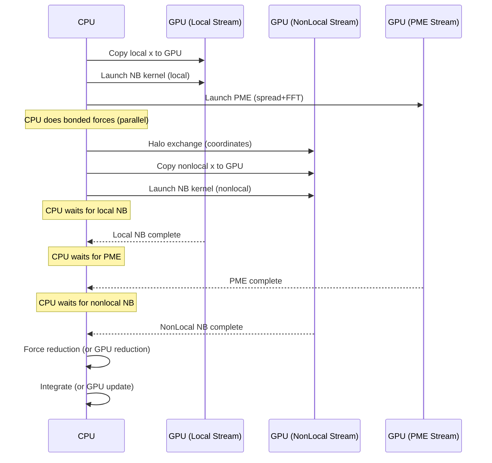

# Module 13: GPU Acceleration

> **Prerequisites:** [Module 5 (Force Calculation)](05-force-calculation.md), [Module 6 (nbnxm)](06-nbnxm-nonbonded.md), [Module 12 (Parallelism)](12-parallelism.md)
> **Key files:** `src/gromacs/gpu_utils/devicebuffer.h`, `src/gromacs/gpu_utils/device_stream_manager.h`, `src/gromacs/gpu_utils/gpueventsynchronizer.h`, `src/gromacs/mdtypes/state_propagator_data_gpu.h`, `src/gromacs/nbnxm/nbnxm_gpu.h`, `src/gromacs/mdlib/gpuforcereduction.h`

---

## 13.1 GPU Offloading Strategy

GROMACS offloads the most compute-intensive parts to GPU while keeping coordination logic on CPU:



### What Runs Where

**File:** `src/gromacs/mdtypes/simulation_workload.h` (lines 176-197)

```cpp
struct SimulationWorkload {
    bool useGpuNonbonded = false;            // Short-range NB on GPU
    bool useGpuBonded = false;               // Bonds, angles, dihedrals on GPU
    bool useGpuUpdate = false;               // Leap-frog integration on GPU
    bool useGpuXBufferOpsWhenAllowed = false; // Keep coordinates GPU-resident
    bool useGpuFBufferOpsWhenAllowed = false; // Keep forces GPU-resident
    bool useGpuHaloExchange = false;          // GPU-direct halo exchange
    // ...
};
```

### GPU-Resident Mode

In the traditional offload model, data moves H2D/D2H every step. With GPU-resident mode (`useGpuUpdate` + buffer ops), coordinates, velocities, and forces stay on GPU across multiple steps — transfers only happen for I/O or repartitioning:

```
Traditional:  CPU x → [H2D] → GPU NB → [D2H] → CPU f → integrate → repeat
GPU-resident: GPU x → GPU NB → GPU f → GPU integrate → GPU x → ... (no transfers!)
                                    ↓ (only when needed)
                              [D2H] → CPU for I/O
```

---

## 13.2 DeviceBuffer<T>: Cross-Platform Memory

**File:** `src/gromacs/gpu_utils/devicebuffer.h`

`DeviceBuffer<T>` is a type alias that maps to the appropriate GPU memory handle per backend:

```cpp
// Backend selection (lines 57-67)
#if GMX_GPU_CUDA
#    include "gromacs/gpu_utils/devicebuffer.cuh"     // T*
#elif GMX_GPU_HIP
#    include "gromacs/gpu_utils/devicebuffer_hip.h"   // T*
#elif GMX_GPU_OPENCL
#    include "gromacs/gpu_utils/devicebuffer_ocl.h"   // cl_mem
#elif GMX_GPU_SYCL
#    include "gromacs/gpu_utils/devicebuffer_sycl.h"  // sycl::buffer wrapper
#endif
```

### Key Operations

```cpp
// Allocate GPU memory
template<typename ValueType>
void allocateDeviceBuffer(DeviceBuffer<ValueType>* buffer,
                          size_t numValues,
                          const DeviceContext& deviceContext);

// Free GPU memory
template<typename ValueType>
void freeDeviceBuffer(DeviceBuffer<ValueType>* buffer);

// Host-to-Device copy
template<typename ValueType>
void copyToDeviceBuffer(DeviceBuffer<ValueType>* buffer,
                        const ValueType* hostBuffer,
                        size_t startingOffset,
                        size_t numValues,
                        const DeviceStream& deviceStream,
                        GpuApiCallBehavior transferKind,  // Sync or Async
                        CommandEvent* timingEvent);

// Device-to-Host copy
template<typename ValueType>
void copyFromDeviceBuffer(ValueType* hostBuffer,
                          DeviceBuffer<ValueType>* buffer,
                          size_t startingOffset,
                          size_t numValues,
                          const DeviceStream& deviceStream,
                          GpuApiCallBehavior transferKind,
                          CommandEvent* timingEvent);

// Reallocate with growth tracking
template<typename ValueType>
void reallocateDeviceBuffer(DeviceBuffer<ValueType>* buffer,
                            size_t numValues,
                            int* currentNumValues,
                            int* currentMaxNumValues,
                            const DeviceContext& deviceContext);
```

### CUDA Backend Example

```cpp
// devicebuffer.cuh (lines 61-76)
template<typename ValueType>
void allocateDeviceBuffer(DeviceBuffer<ValueType>* buffer,
                          size_t numValues,
                          const DeviceContext& /* deviceContext */) {
    cudaError_t stat = cudaMalloc(buffer, numValues * sizeof(ValueType));
    gmx::checkDeviceError(stat, "Allocation of the device buffer failed.");
}
```

---

## 13.3 DeviceStreamManager: GPU Stream Orchestration

**File:** `src/gromacs/gpu_utils/device_stream_manager.h` (lines 59-134)

GPU operations execute asynchronously in **streams** (CUDA) or **queues** (SYCL/OpenCL). GROMACS uses multiple streams to overlap independent work:

```cpp
enum class DeviceStreamType : int {
    NonBondedLocal,        // Local non-bonded work
    NonBondedNonLocal,     // Non-local non-bonded work
    Pme,                   // PME computation
    PmePpTransfer,         // PME↔PP data transfer
    UpdateAndConstraints,  // Integration + LINCS/SETTLE
    Count
};

class DeviceStreamManager {
public:
    DeviceStreamManager(const DeviceInformation& deviceInfo,
                        SimulationWorkload simulationWork,
                        bool useTiming);

    const DeviceInformation& deviceInfo() const;
    const DeviceContext& context() const;
    const DeviceStream& stream(DeviceStreamType streamToGet) const;
    const DeviceStream& bondedStream() const;
    bool streamIsValid(DeviceStreamType streamToCheck) const;
};
```

### Stream Overlap Pattern

```
Time →
Stream: NonBondedLocal     [──── NB kernel (local) ────][──── D2H f ────]
Stream: NonBondedNonLocal          [── halo xfer ──][── NB kernel (nonlocal) ──][── D2H f ──]
Stream: Pme                [──── PME spread+FFT ────][── convolve ──][── gather ──]
Stream: UpdateAndConstraints                                                      [── integrate ──]
```

The key insight: while the GPU computes local non-bonded forces, the CPU can do halo exchange. Then the nonlocal kernel starts on its stream.

---

## 13.4 GpuEventSynchronizer: CPU-GPU Coordination

**File:** `src/gromacs/gpu_utils/gpueventsynchronizer.h` (lines 55-210)

Events are the synchronization primitives between GPU streams and between CPU and GPU:

```cpp
class GpuEventSynchronizer {
public:
    // Mark a point in a GPU stream
    void markEvent(const DeviceStream& deviceStream);

    // CPU blocks until this event completes
    void waitForEvent();

    // Another GPU stream waits for this event (no CPU involvement)
    void enqueueWaitEvent(const DeviceStream& deviceStream);
};
```

### Usage Pattern

```cpp
// Producer stream marks an event when coordinates are ready
coordinatesReadyOnDevice->markEvent(nonBondedLocalStream);

// Consumer stream waits for it before starting PME
coordinatesReadyOnDevice->enqueueWaitEvent(pmeStream);

// CPU waits for forces to be ready before accessing results
forcesReadyOnDevice->waitForEvent();
```

### Consumption Counting

Events have min/max consumption counts for correctness checking:

```cpp
GpuEventSynchronizer(int minConsumptionCount, int maxConsumptionCount);
// Default: exactly 1 consumer per markEvent call
// Throws if: marked again before consumed, or consumed too many times
```

---

## 13.5 StatePropagatorDataGpu: GPU-Resident State

**File:** `src/gromacs/mdtypes/state_propagator_data_gpu.h` (lines 120-400)

This class manages the GPU copies of coordinates, velocities, and forces — the GPU equivalent of `t_state`:

```cpp
class StatePropagatorDataGpu {
public:
    StatePropagatorDataGpu(const DeviceStreamManager& deviceStreamManager,
                           GpuApiCallBehavior transferKind,
                           int allocationBlockSizeDivisor,
                           bool useNvshmem,
                           bool useGpuFBufferOpsWhenAllowed,
                           gmx_wallcycle* wcycle);

    // ── Coordinate management ───────────────────────────────────
    DeviceBuffer<RVec> getCoordinates();
    void copyCoordinatesToGpu(ArrayRef<const RVec> h_x,
                              AtomLocality atomLocality,
                              int expectedConsumptionCount = 1);
    GpuEventSynchronizer* getCoordinatesReadyOnDeviceEvent(
        AtomLocality atomLocality,
        const SimulationWorkload& simulationWork,
        const StepWorkload& stepWork);

    // ── Velocity management ─────────────────────────────────────
    DeviceBuffer<RVec> getVelocities();
    void copyVelocitiesToGpu(ArrayRef<const RVec> h_v,
                             AtomLocality atomLocality);

    // ── Force management ────────────────────────────────────────
    DeviceBuffer<RVec> getForces();
    void copyForcesToGpu(ArrayRef<const RVec> h_f,
                         AtomLocality atomLocality);
    void copyForcesFromGpu(ArrayRef<RVec> h_f,
                           AtomLocality atomLocality);
    void clearForcesOnGpu(AtomLocality atomLocality,
                          GpuEventSynchronizer* dependency);

    // ── Synchronization events ──────────────────────────────────
    GpuEventSynchronizer* getLocalForcesReadyOnDeviceEvent(
        StepWorkload stepWork, SimulationWorkload simulationWork);
    GpuEventSynchronizer* fReducedOnDevice(AtomLocality atomLocality);
    GpuEventSynchronizer* fReadyOnDevice(AtomLocality atomLocality);
};
```

### When to Create GPU State

```cpp
inline bool needStateGpu(SimulationWorkload simulationWorkload) {
    return simulationWorkload.haveGpuPmeOnPpRank()
        || simulationWorkload.useGpuXBufferOpsWhenAllowed
        || simulationWorkload.useGpuFBufferOpsWhenAllowed
        || simulationWorkload.useGpuHaloExchange
        || simulationWorkload.useGpuUpdate;
}
```

---

## 13.6 GPU Non-Bonded Architecture

**File:** `src/gromacs/nbnxm/nbnxm_gpu.h` (lines 79-284)

The GPU non-bonded pipeline mirrors the CPU pipeline (Module 6) but runs asynchronously:

### Pipeline Steps

```cpp
// Step 1: Copy coordinates to GPU (async)
void gpu_copy_xq_to_gpu(NbnxmGpu* nb,
                         const nbnxn_atomdata_t* nbdata,
                         AtomLocality aloc);

// Step 2: Launch non-bonded kernel (async)
void gpu_launch_kernel(NbnxmGpu* nb,
                       const StepWorkload& stepWork,
                       InteractionLocality iloc);

// Step 3: Launch pruning kernel (async, periodic)
void gpu_launch_kernel_pruneonly(NbnxmGpu* nb,
                                 InteractionLocality iloc,
                                 int numParts);

// Step 4: Copy forces back (async)
void gpu_launch_cpyback(NbnxmGpu* nb,
                         nbnxn_atomdata_t* nbatom,
                         const StepWorkload& stepWork,
                         AtomLocality aloc);

// Step 5: Check/wait for completion
bool gpu_try_finish_task(NbnxmGpu* nb,
                          const StepWorkload& stepWork,
                          AtomLocality aloc,
                          real* e_lj, real* e_el,
                          ArrayRef<RVec> shiftForces,
                          GpuTaskCompletion completionKind);
```

### NbnxmGpu Structure (CUDA)

**File:** `src/gromacs/nbnxm/cuda/nbnxm_cuda_types.h` (lines 66-141)

```cpp
struct NbnxmGpu {
    const DeviceContext* deviceContext_;
    bool bUseTwoStreams = false;       // Local + NonLocal streams

    NBAtomDataGpu* atdat = nullptr;    // Atom coordinates/charges on GPU
    NBParamGpu* nbparam = nullptr;     // LJ parameters, Ewald coefficients

    // Pair lists per interaction locality
    EnumerationArray<InteractionLocality,
        std::unique_ptr<GpuPairlist>> plist;

    // Staging buffers for energy/shift forces (GPU → CPU)
    NBStagingData nbst;

    // GPU streams
    EnumerationArray<InteractionLocality,
        const DeviceStream*> deviceStreams;

    // Synchronization events
    GpuEventSynchronizer nonlocal_done;
    GpuEventSynchronizer misc_ops_and_local_H2D_done;

    // Work flags
    EnumerationArray<InteractionLocality, bool> haveWork;
};
```

---

## 13.7 GPU Force Reduction

**File:** `src/gromacs/mdlib/gpuforcereduction.h` (lines 62-128)

When multiple GPU kernels produce forces (NB, bonded, PME), they must be combined. `GpuForceReduction` does this entirely on GPU, avoiding D2H transfers:

```cpp
class GpuForceReduction {
public:
    GpuForceReduction(const DeviceContext& deviceContext,
                      const DeviceStream& deviceStream,
                      gmx_wallcycle* wcycle);

    // Register force buffers to reduce
    void registerNbnxmForce(DeviceBuffer<RVec> forcePtr);
    void registerRvecForce(DeviceBuffer<RVec> forcePtr);

    // Add synchronization dependency
    void addDependency(GpuEventSynchronizer* dependency);

    // Configure reduction parameters
    void reinit(DeviceBuffer<RVec>    baseForcePtr,
                int                   numAtoms,
                ArrayRef<const int>   cell,       // nbnxm→rvec reordering
                int                   atomStart,
                bool                  accumulate,
                GpuEventSynchronizer* completionMarker = nullptr);

    // Execute the reduction kernel
    void execute();
};
```

### Force Reduction Flow



The nbnxm format uses a different atom ordering than the rvec format (cluster-based vs sequential), so the reduction kernel also handles the reordering via the `cell` index array.

---

## 13.8 Backend Comparison

GROMACS supports four GPU backends with a shared abstraction layer:

| Feature | CUDA | HIP | SYCL | OpenCL |
|---------|------|-----|------|--------|
| Vendor | NVIDIA | AMD | Intel/multi | Multi |
| Language | CUDA C++ | HIP C++ | SYCL C++ | C + kernels |
| Stream type | cudaStream_t | hipStream_t | sycl::queue | cl_command_queue |
| Event type | cudaEvent_t | hipEvent_t | sycl::event | cl_event |
| Memory | cudaMalloc | hipMalloc | sycl::malloc_device | clCreateBuffer |
| NbnxmGpu file | `nbnxm/cuda/` | `nbnxm/hip/` | `nbnxm/sycl/` | `nbnxm/opencl/` |
| Kernel dispatch | Template | Template | Template | cl_kernel pointers |
| Timing support | Full | Full | Limited | Full |

### Abstraction Strategy

The `NbnxmGpu` structure is defined separately per backend but shares the same field names:

```cpp
// All backends have:
struct NbnxmGpu {
    const DeviceContext* deviceContext_;
    NBAtomDataGpu* atdat;
    NBParamGpu* nbparam;
    EnumerationArray<InteractionLocality, std::unique_ptr<GpuPairlist>> plist;
    EnumerationArray<InteractionLocality, const DeviceStream*> deviceStreams;
    GpuEventSynchronizer nonlocal_done;
    EnumerationArray<InteractionLocality, bool> haveWork;
    // ...
};
```

The API functions (`gpu_launch_kernel`, `gpu_copy_xq_to_gpu`, etc.) are declared in `nbnxm_gpu.h` with `GPU_FUNC_QUALIFIER` and implemented per backend.

---

## 13.9 The GPU/CPU Overlap Pipeline

Here's how a full MD step overlaps GPU and CPU work:



**Key optimization:** While the GPU processes local non-bonded interactions, the CPU simultaneously:
1. Computes bonded forces
2. Performs MPI halo exchange
3. Launches nonlocal GPU work

This overlap is what makes GPU acceleration effective even when the GPU is not dramatically faster — it hides latency.

---

## 13.10 Exercises

### Exercise 1: Stream Dependencies
Draw the dependency graph for a single MD step with `useGpuNonbonded=true`, `useGpuBonded=true`, `useGpuUpdate=false`:
1. Which operations can run in parallel?
2. Where are the synchronization points?
3. What transfers happen between CPU and GPU?

### Exercise 2: Compare NbnxmGpu Across Backends
Open the `NbnxmGpu` definition in all four backends:
- `src/gromacs/nbnxm/cuda/nbnxm_cuda_types.h`
- `src/gromacs/nbnxm/hip/nbnxm_hip_types.h`
- `src/gromacs/nbnxm/sycl/nbnxm_sycl_types.h`
- `src/gromacs/nbnxm/opencl/nbnxm_ocl_types.h`

List the differences. Why does OpenCL have `cl_kernel` arrays while others don't?

### Exercise 3: Trace GPU Force Flow
Starting from `do_force()` in `sim_util.cpp`:
1. Find where `gpu_copy_xq_to_gpu` is called
2. Find where `gpu_launch_kernel` is called
3. Find where `gpu_try_finish_task` is called
4. What happens between launch and finish?

### Exercise 4: GPU-Resident Mode
With `useGpuUpdate=true` and `useGpuXBufferOpsWhenAllowed=true`:
1. How many H2D coordinate transfers happen per step?
2. When does a D2H transfer actually occur?
3. What triggers a forced D2H sync?

### Exercise 5: GpuEventSynchronizer Correctness
Why does `GpuEventSynchronizer` track consumption counts?
1. What happens if you mark an event twice without consuming?
2. What happens if two streams consume the same event (max=1)?
3. When would you use `maxConsumptionCount > 1`?

---

## 13.11 Key Takeaways

1. **Selective offloading** — NB, PME, bonded, and update can each independently run on GPU
2. **GPU-resident mode** eliminates H2D/D2H transfers for coordinates and forces between steps
3. **DeviceBuffer<T>** abstracts CUDA/HIP/SYCL/OpenCL memory behind a common interface
4. **Multiple GPU streams** enable overlap of independent GPU operations
5. **GpuEventSynchronizer** provides cross-stream and CPU-GPU synchronization with consumption counting
6. **StatePropagatorDataGpu** manages the GPU copies of x, v, f with per-locality events
7. **GpuForceReduction** combines NB, bonded, and PME forces entirely on GPU
8. **Four backends** (CUDA, HIP, SYCL, OpenCL) share the same algorithmic structure via per-backend `NbnxmGpu`
9. **CPU/GPU overlap** is the key performance strategy — hide GPU latency with CPU work
